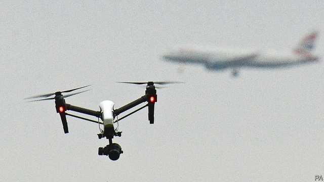

###### Sky news

# Drones piloted by climate-change activists target Heathrow 

 

> print-edition iconPrint edition | Britain | Jun 15th 2019 

IT USED TO take some effort to shut down an airport. A quarter of a century ago the Irish Republican Army (IRA) fired mortar rounds into Heathrow on three separate days over the course of a week. It failed to make much of a dent. Nothing exploded, nobody died and the airport was closed for only a few hours. A plane carrying the queen touched down between two attacks. 

No more. Just as modern-day organisers of a coup may be better off seizing a popular Instagram account than the national broadcaster, so too have the barriers to entry collapsed for shutting down the busiest airport in Europe. This summer Extinction Rebellion, a climate-change pressure group, may well achieve what the IRA failed to do, using nothing more than a drone of the sort available for under £100 ($127) on Amazon. The first “non-violent direct action” will be on June 18th, followed by another ten days of action starting on July 1st. 

What can be done to avert the cancellation of 1,300 flights carrying 220,000 passengers a day? Not a lot. Heathrow tried a detection system after drone sightings shut down Gatwick airport for several days before Christmas. This could help avoid the embarrassing state of affairs at Gatwick, where nobody was quite sure whether there really was a drone (there probably was, say experts). But removing the offending object from the sky is trickier. 

The Centre for the Study of the Drone, at Bard College in New York state, recently counted at least 235 counter-drone systems on the market or under development, which promise to detect, track or intercept the machines. The technology for this ranges from the high-tech, such as radio jamming or electronic hijacking, to the decidedly low-tech, using nets, projectiles or even eagles. But “in an environment like Heathrow your options are limited to electronic measures,” says Arthur Holland Michel, who wrote the report. Blasting the things out of the sky would put people in danger. Jamming is not ideal either, since most drones operate on the same radio frequency as consumer Wi-Fi, and use the same GPS as everyone else. 

And that is just the tip of the autonomous iceberg. Modern drones are not just “low and slow devices”, says Anna Jackman of Royal Holloway, University of London, but are capable of speeds up to 160mph. Moreover they can be adapted by hobbyists both benign and malicious. Examples of DIYmodifications include graffiti sprays, grabbing claws, firework launchers, flame-throwers, tasers, handguns and chainsaws. James Rogers of the University of Southern Denmark points to an environmental activist who landed a drone carrying radioactive material on the Japanese prime minister’s residence. It sat there for nearly two weeks before it was discovered. 

Even unmodified, drones can be made harder to tackle with the application of a little imagination. Modern drones can fly pre-set paths, obviating the need to communicate with an operator. Moreover, if taking out a single drone is hard, taking out a dozen—or a hundred—could be near-impossible. “You only need to have a few more drones than you have counter-measures and the drones have won the battle,” says Mr Michel. 

If technological measures do not present an obvious solution to the problem, legal ones might. Experts advocate harsher punishments for drone operators who intrude on sensitive sites such as airports, arguing that a catastrophic accident is a matter of “when, not if”. If the threat of long prison terms and large fines does not deter protesters who believe they are saving the planet, the danger of unwittingly killing a few hundred people might. The risk, like the equipment, is sky-high. ◼ 

