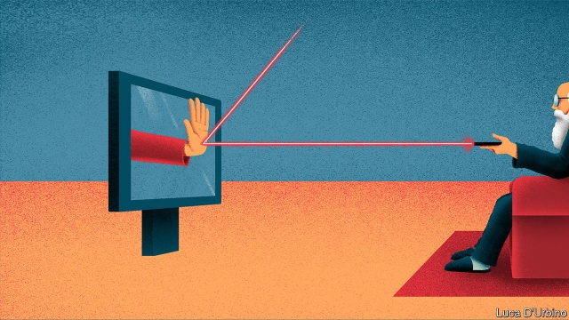

###### Grannies v Auntie

# Rich over-75s will no longer get the BBC for nothing. Good 

 

> print-edition iconPrint edition | Britain | Jun 15th 2019 

ON JUNE 10TH the BBC announced that next year most over-75s will have to pay to watch television like everyone else. Cue an outbreak of hysteria. Charities complained that the decision would leave lonely old folk with nothing to fill the day. A petition urging the BBC to reconsider raced to 350,000 signatures. Newspapers published letters from pensioners vowing to go to prison rather than cough up £154.50 ($196.80) a year for a TV licence. “Boycott is surely one of the most effective ways of challenging this,” argued one. “So come on, all you oldies: let’s flood the prisons!” 

The licence fee has long roused oddly strong emotions. It dates back to 1923, when the Wireless Telegraphy Act introduced a charge of 10 shillings (about £20 in today’s money) to listen to the radio. Last year it raised £3.8bn, equivalent to three-quarters of the BBC’s income, with most of the rest coming from its commercial activities. Since a blanket exemption for over-75s was introduced by Labour in 2001, its cost has been met by the government. But the Tories have decided to shift responsibility to the BBC from June next year. 

The organisation says that to foot the bill, which is estimated to reach £745m by 2021-22, it would probably have to scrap four TV channels, as well as national and local radio stations. Instead it will continue the giveaway only for households where at least one person is poor enough to receive pension top-ups, which covers about a fifth of pensioners. 

Conservative leadership candidates have vociferously defended the right of well-off OAPs to watch TV for nothing (unsurprisingly, since they make up so much of the Tory party). But the plan hardly came as a surprise. When the decision to pass responsibility for the bill to the BBC was taken in 2015, Sir Christopher Bland, a former BBC chairman, described it as “the worst form of dodgy Whitehall accounting”. It was clear that the oldies’ exemption was unsustainable. Costs will continue to rise as the population ages, leaving younger viewers of all income levels footing the bill for a service given free of charge to some of its heaviest users. 

Ministers want the BBC to be more commercially minded in its battle for eyeballs with American behemoths like Apple, Amazon and Netflix (which last year spent $12bn on programmes). Expecting it simultaneously to act as an arm of the welfare state, redistributing from young to old, never made much sense. Not that it will be any consolation to the burghers of Middle England, preparing for a stint behind bars.◼ 

