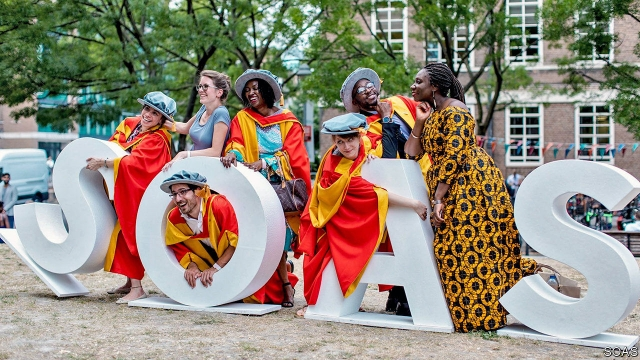

###### Sending out an SOS

# SOAS, one of Britain’s most unusual universities, is in trouble 

 

> print-edition iconPrint edition | Britain | Jun 13th 2019 

FOR YOUNG folk in search of a grounding in Austronesian languages, say, or perhaps Sinhalese or Tibetan, London’s School of Oriental and African Studies (SOAS) has long been the place to go. Founded in 1916 to train colonial administrators, military officers and the odd spy, the university came to be home to scholars with knowledge of the most obscure corners of the globe, as well as experts on rising countries like China and India. Its academics have composed the Swazi national anthem and written sweeping histories of the Meiji restoration; they have also been killed by the Khmers Rouges. In the words of a former director, “They must have formed the single biggest bunch of eccentrics in Europe.” 

Today 4,345 students from more than 130 countries study courses ranging from global pop music to accounting and finance. Since the 1960s the erstwhile colonial training centre has been a hub of radical politics (a recent campaign by students sought to “decolonise our minds” by changing the curriculum). It also represents a type of university—small, specialist and focused on languages—that has struggled in recent years. Since 2016 SOAS’s undergraduate admissions have fallen by 37%. In a warning seen by Times Higher Education, the school’s director wrote at the end of last year that without action SOAS would “exhaust [its] cash reserves” in another two years. 

It is not that the university is frozen in time. There has been growth over the past two decades in the number of students taking degrees in social sciences and law, which have the advantage of being cheap to teach, and can thus subsidise niche language courses. Nevertheless, while uptake of languages such as Japanese, Chinese and Arabic has risen, some less popular ones have fallen by the wayside. As Ian Brown, a SOAS expert on South-East Asia, notes in a history of the university, there are no longer teaching posts in Bengali, Punjabi or Tamil, and social scientists do not need to master a non-Western language, as was once expected. 

The main problem is that SOAS has struggled in a more competitive environment. The old system of state grants helped support universities that did a lot of language teaching. Nowadays in England most of their funding comes from tuition fees, and since 2015 universities have been free to recruit as many students as they want. In the words of an internal SOAS memo, rival institutions “went growth-mad”, with King’s College and Queen Mary University London hoovering up students. SOAS initially responded by lowering its admission standards to attract more applicants. It has since changed tack, raising the bar in order to maintain its position in league tables. Insiders say the school has been slow to tap donors to make up the shortfall. “It’s not a terribly capitalist institution,” is the verdict of one. 

The university promises measures to turn things round, including investments in the estate, better teaching and more overseas education. It says that applications for next year are looking perkier. Yet after last year’s disastrous admissions cycle, an extra £2.6m ($3.3m) had to be cut from academic staffing costs by 2021-22, on top of planned cuts of £3.4m since 2017-18. 

If things don’t improve, SOAS may have to lay on fewer courses, or perhaps even be absorbed by another institution. “There’s no way of teaching languages like Burmese or Zulu profitably,” accepts Justin Watkins, a linguistics professor at the university. But if the school ends up going under, “something will have been lost that will be very hard to reacquire.” ◼ 

