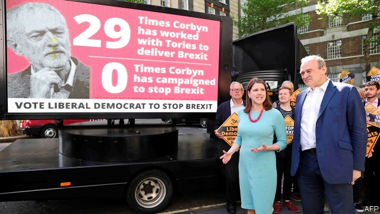

###### The centre holds

# The Lib Dems are back. Who will lead them? 

 

> print-edition iconPrint edition | Britain | Jun 15th 2019 

FOR THE first time in almost a decade, life as a Liberal Democrat is good. The party posted its best-ever European election result on May 23rd, scooping up 16 MEPs. It seems to have seen off Change UK, a challenger to its centrist crown. The party zips along near the top of the polls. Can it last? 

The task of keeping the boom going will fall to Jo Swinson, the Glasgow-based deputy leader, or Sir Ed Davey, the party’s home-affairs spokesman (both pictured). While Conservative candidates tear strips off each other, Lib Dem hustings are marked by agreement. Both candidates want to position the Lib Dems as an anti-Brexit party with an enthusiastically green agenda—which it already is. Both served in the coalition government with the Tories in 2010-15. Sir Ed is a bit more experienced; Ms Swinson a bit better with the media. They agree on the destination and route for the party. They just disagree over who should be driving. 

In some ways, the party’s improved standing is a return to normal. The Lib Dems trotted along at roughly 20% in the polls for much of the noughties and parts of the 1990s. It was their slump to margin-of-error-bothering lows after 2010 that was the odd period. 

But a few things are different from previous surges. Cleggmania—when Britain fell briefly in love with Nick Clegg, the party’s then-leader, in one mad spring in 2010—was not sustainable. Nor was the boost from opposing the Iraq war, when peacenik refugees from Labour flooded the party. This time defectors are from the moderate left and right, says Sir Ed. “It is much more sustainable in terms of the underlying philosophy.” 

The Conservatives and Labour have abandoned the centre. Although this gap has existed since at least 2015, when Jeremy Corbyn became Labour’s leader and the Tories called the Brexit referendum, the Lib Dems have only recently taken advantage of it. Fierce local campaigning at the beginning of May (a Lib Dem leaflet in Sunderland revelled in the fact a former Labour councillor was a paedophile) laid the foundations for a breakthrough in the European election later that month, helped by a proportional voting system. Decent showings in elections boost credibility, says Tim Farron, a former leader. After the European vote, one poll put the Lib Dems top, for the first time in nine years. 

These strong showings have undermined Change UK’s claim that the Lib Dems are irredeemably tainted by their time in government. Voters have either forgiven or forgotten. Any sins of the coalition are overshadowed by the far bigger cock-ups made by the Tories when they governed alone, as Ms Swinson argues. If Brexit causes an eruption in the party system (see article), the Lib Dems will be well placed. 

First-past-the-post remains the biggest obstacle. The job of the new leader will be to smash through the 25% ceiling, above which vote-share starts to translate into big seat gains. After 2015 there was only a narrow path back to relevance for the Lib Dems, but they walked it. Going beyond their historical role as the third party will prove trickier still.◼ 

