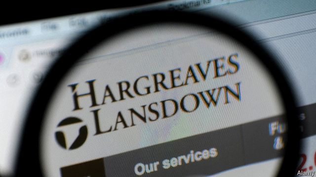
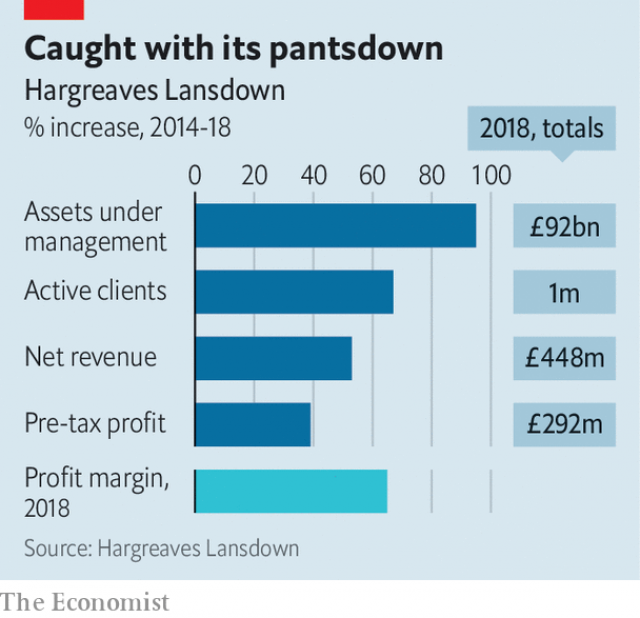

###### Not out of the woods

# The Woodford affair ensnares middle England’s favourite fund supermarket 

 

> print-edition iconPrint edition | Britain | Jun 15th 2019 

PETER HARGREAVES, the billionaire co-founder of Hargreaves Lansdown (HL), Britain’s biggest retail-investment platform, is a frequent commentator on subjects ranging from Margaret Thatcher’s legacy to regulation to Brexit (he was one of the Leave campaign’s biggest funders). But he is keeping shtum about the biggest crisis to have struck the firm he and Stephen Lansdown started in Bristol in 1981. He no longer works at HL but has a 32% stake. 

HL has been such a loyal backer of Neil Woodford, a fallen star fund-manager, that its fortunes are tied to him. At the end of March its customers owned about £2bn ($3.3bn) of the £10.6bn Mr Woodford had under management, mostly in the Woodford Equity Income Fund (WEIF), which has long featured on HL’s “Wealth 150” favourite-fund list. HL customers are also exposed through multi-manager funds. 

Now investors cannot get out of WEIF. Playing for time to fix his portfolio, Mr Woodford on June 3rd suspended redemptions. Eventually HL customers may take losses. Chris Hill, HL’s boss, apologised to clients at the weekend as shares in the firm, a FTSE 100 company with a market value of £9bn, continued to fall. The price is down by nearly a fifth this month. 

How many of HL’s 1.1m well-heeled customers are trapped is unknown, but it is something that Nicky Morgan, chair of the Treasury select committee, is demanding to know. This week she sent Mr Hill a list of information requests. These probe the central mystery of why WEIF was still on the favourite-fund list until last week, though it had been doing badly since late 2017 and was an obvious dog. 

The official line is that Mark Dampier, HL’s head of research, believed Mr Woodford would turn things around. But the suspicion is that discounts and possibly commissions also played a role. Mr Woodford’s sticker price was an annual 0.75% fee on total funds managed, but he charged HL 0.6%. That is still hefty—active asset management is expensive—but the discount left room for HL to take its own cut of 0.45% on top. This fee is the basis for HL’s extraordinary profit margin of 65%. 

In January HL decided to cut its Wealth 150 to 60 funds and call it “Wealth 50”. The obvious thing to do was to dump WEIF in the cull, but after Mr Woodford slashed his fee again, to 0.5%, Mr Dampier kept him. That now looks like investor neglect. Ms Morgan has peppered HL with questions about the discount it got from Mr Woodford. Best-buy lists will come under scrutiny again. The Financial Conduct Authority said in March that no new rules were needed, but that conclusion now looks wrong. 

 

For a firm that under Messrs Hargreaves and Lansdown prided itself on slick marketing, its crisis-handling has been cack-handed. It does not look good that Mr Dampier and his wife sold £5.6m of HL shares in May. Another poor bit of timing was sending customers out-of-date marketing material this weekend praising Mr Woodford with no mention of the WEIF suspension. 

It will probably take more than that to drive lots of customers away. Mr Hill has explained HL’s rapid growth (see chart) as down to the fact that as people take on managing money for retirement, they lack the knowledge, confidence and ability to do it easily. HL’s customer service is trusted—humans rather than automated systems answer the phone. Rival retail investment firms may now snap up some market share. But with its juicy profit margin HL can afford to lose some disgruntled investors and motor on. ◼ 

