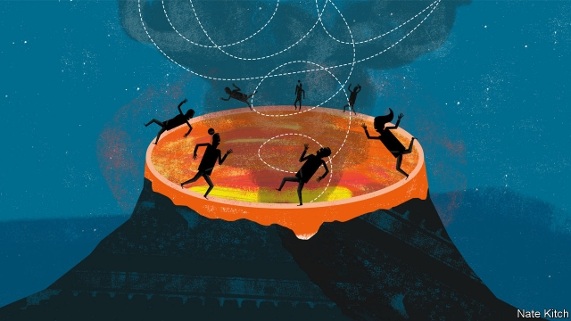

###### Bagehot

# The question is not who will lead the Conservative Party, but whether it will survive 

 

> print-edition iconPrint edition | Britain | Jun 13th 2019 

THERE ARE few things that Britain’s Conservatives relish more than a leadership election. For candidates, it is a chance to talk about their favourite subject—themselves. For MPs and party members, it is an opportunity to trade their votes for favours or flattery. But the brighter Tories recognise that this is a leadership election with a difference: this time they are dancing on the edge of a volcano. The natural party of government for much of the past century-and-a-half could face catastrophe, in the form of an internal split or a wipeout in the next election. 

The party’s recent electoral performance has been disastrous. It saw its vote-share crumble to 9% in the European election last month and then came third in the Peterborough by-election. It is polling below 20%. Any honeymoon the next party leader enjoys is sure to be brief, for the Conservatives run a minority government that is trying to push through a complicated and controversial divorce bill in the face of profound divisions in their own ranks, not to mention the country, and mounting impatience in Brussels. The next prime minister could face a vote of no confidence within a month and a general election within a year. 

The one thing Conservatives agree on is that they must see Brexit through if they are to survive, not just as a government but as a serious party. But doing so will take a heavy toll. Boris Johnson has pledged to get Britain out by October 31st. This could well mean a no-deal Brexit that plunges the country into chaos and destroys the party’s remaining reputation for competence. Other candidates have promised to keep negotiating with the EU if necessary. But this could amount to the continuation of Mayism by other means—trying to wring concessions out of an adamantine Brussels, wrangling with implacable ultra-Brexiteer Tory MPs, and watching activists defect to Nigel Farage’s Brexit Party. 

The Conservatives are beginning to realise that they could face not just an electoral setback but an extinction event. Having been one of the great beneficiaries of the British electoral system, they could suddenly become its victim. Under first-past-the-post, once you fall below a certain threshold—about a quarter of the vote—your number of seats collapses. Britain could soon have four viable parties that can each command roughly that share. The Conservatives in particular could see their supporters jumping ship for the Brexit Party on one side and the Remain-supporting Liberal Democrats on the other. Not that long ago when Conservatives talked about “Canada” they meant a free-trade deal. Now they are just as likely to be referring to the election of 1993 that saw the Canadian Conservative Party wiped out. 

The combination of Brexit and the leadership contest is reinforcing the party’s biggest weaknesses: that it is the party of elderly homeowners in the south-east who did well out of the 1980s. For all his faults, David Cameron did a good job of detoxifying the party and recruiting bright young candidates who looked more like modern England. Brexit has acted as a Chernobyl of toxicity by giving airtime to the likes of Jacob Rees-Mogg and John Redwood. Various thinkers have tried to galvanise conservatism for a post-Thatcher age by showing that it has solutions to things like market failure and rampant greed. But the candidates have thumbed their noses at all this effort by putting so much emphasis on tax cuts for the well-off. 

The leadership election is turning into a machine for maximising the conflict between the party and the country at large. Conservative members (who number 160,000) are 97% white, 71% male and overwhelmingly affluent. The members who are solidifying behind Mr Johnson, the most likely winner, are even more unrepresentative. A new study by Tim Bale, of Queen Mary University of London, shows that Mr Johnson’s supporters are a fringe of a fringe: 85% support no-deal, compared with 66% of party members and 25% of the population. It’s not just the tail that is wagging the dog, but the very tip of the tail. 

In Parliament, the Boris surge is being driven less by the self-interest of the affluent than by the panic of the petrified. MPs are coalescing around him not because they like or trust him but because they fear that they will otherwise be crushed by the Brexit Party or the Labour Party. ConservativeHome, a news site for activists, endorsed Mr Johnson “on a wing and a prayer” for much the same reason. But his electoral magic will have to be potent indeed if it is to overcome not just his obvious moral failings but also the fact that his views are so far outside the mainstream. 

The panic is infecting more than just the leadership election. In 2016 Michael Anton, an American conservative, wrote a provocative essay dubbing the forthcoming presidential contest the “Flight 93 election”. He argued that, just as the passengers on the hijacked United plane in 2001 had no choice but to storm the cockpit, conservatives had no choice but to embrace Donald Trump, in order to avoid a victory by establishment Republicans (who were all sell-outs) or Hillary Clinton (who represented an existential threat to the republic). 

Leading British Conservatives have started to talk like Mr Anton. Hard-Brexiteers are so worried about an establishment plot to block Brexit that they are embracing extreme tactics, such as suspending Parliament, and denouncing civil servants. A few months ago Mr Johnson was recorded at a private dinner salivating over the idea of Mr Trump “doing Brexit”. “He’d go in bloody hard…There’d be all sorts of breakdowns, all sorts of chaos. Everyone would think he’d gone mad. But actually you might get somewhere.” Now even more moderate Conservatives such as Jeremy Hunt and Rory Stewart have taken to talking about what the Conservatives can learn from Mr Trump. A panicking party seems primed to bring about “all sorts of breakdowns” and “all sorts of chaos”. Whether this will “actually get somewhere” is another matter. ◼ 

