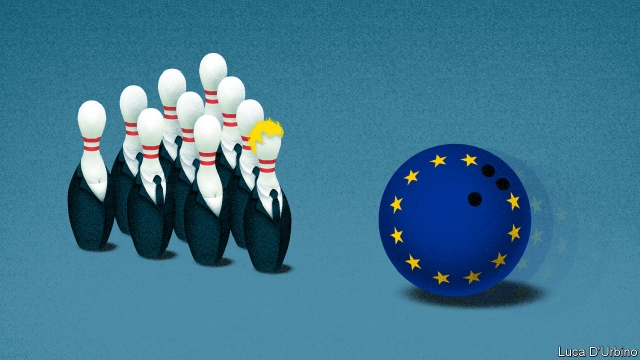

###### Dealers and no-dealers

# Tory candidates are misleading people about a no-deal Brexit 

 

> print-edition iconPrint edition | Britain | Jun 13th 2019 

FULLY TEN leadership candidates faced a first ballot of Conservative MPs as we went to press. In hopes of being one of the final two to go through to a vote by party members, they are vying to promise the most extravagant tax and spending plans. But the immediate challenge for the winner, who will take office in late July, will be Brexit, which is due to happen three months later. And here the promises vary from instant renegotiation of Britain’s exit deal to withdrawing with no deal at all. 

The timing is tight. Parliament is likely to go into recess just after the new prime minister is installed, and the European Union will go on holiday. MPs come back in September, but for less than two weeks before their party conferences. Brussels will be preoccupied with getting a new commission approved by the European Parliament by November 1st. A summit of EU leaders on October 17th-18th will come just a fortnight before the Brexit deadline. 

The EU has made clear that it will not reopen the withdrawal agreement, which includes the backstop to avert a hard border in Ireland. Even so, most Tory leadership candidates promise a swift renegotiation, and many are talking of a time limit to the backstop. Although a new prime minister would be listened to politely, it is fanciful to expect the EU to abandon the Irish—especially for a mistrusted hardliner such as Boris Johnson, the early favourite. That raises the chances of no-deal. 

And here two misconceptions kick in. The first is the claim that Parliament is sure to prevent a no-deal Brexit. A majority of MPs have voted against the idea. In March backbenchers even took control of the agenda to call for an extension. The speaker of the Commons, John Bercow, is willing to change the usual rules if necessary. Somehow or other, the argument goes, Westminster would stop a prime minister who is bent on leaving without a deal. 

This may turn out to be correct, but it is not a certainty. No-deal is the default option in the absence of other action before October 31st. Any further extension of the deadline also requires the unanimous approval of EU governments. Charles Grant of the Centre for European Reform, a think-tank, believes they may agree, but adds that some exasperated leaders just want Brexit out of the way, deal or no deal. 

Hardline leadership candidates like Dominic Raab have suggested suspending Parliament until November to stop it interfering. The attorney-general is reported to have called this unconstitutional but not illegal. Yet most candidates have condemned it as too anti-democratic to be a serious proposal. What is more, suspension is a royal prerogative, and no serious leader would want to draw the queen into political controversy. 

Still, there are limits to what MPs can do. The March gambit—taking over the parliamentary timetable to pass a law demanding another extension—relied on there being legislation or an amendable motion before MPs. Brexiteers believe they can avoid both. On June 12th Labour lost by 11 votes an attempt to secure a day to try to block no-deal by law. It may have another go, but a new prime minister could deny it the necessary debating time. 

The nuclear option might be a vote of no confidence in the prime minister. Yet any such vote is likely only in late October, after the EU summit. It might not be carried, as Tory MPs fear an election (see article). Even if it were, the Fixed-term Parliaments Act allows 14 days for a new prime minister to try to form a new government. If no one could do so, the outgoing prime minister could defer the date of a new election beyond October 31st. Hannah White of the Institute for Government, another think-tank, concludes that, though MPs may do their utmost to stop no-deal, a determined prime minister might thwart them. 

This brings in the second big misconception, which is that no-deal would soon lead to friendly talks on a speedy free-trade agreement similar to Canada’s, during which both sides could agree not to impose trade barriers. This is highly unlikely. A no-deal Brexit in October would be acrimonious, especially if a new prime minister refused to pay the £39bn ($50bn) that Britain has agreed it owes. That would scupper hopes for a series of “mini-deals” to reduce disruption, as some candidates promise. 

Any bid to start trade negotiations would see the EU putting all the demands in the withdrawal agreement back on the table as preconditions. It would also be impossible to exploit the rules of the World Trade Organisation that can allow trade barriers to be avoided. The WTO’s non-discrimination provisions permit this only if both parties agree and are well on the way to forming a new customs union or free-trade deal, neither of which would be the case after a no-deal Brexit. 

No-deal also has serious legal implications. Britain would become a third country. That not only implies tariffs and non-tariff barriers, but also falling out of most of the EU’s regulatory agencies. Membership of the Europol crime-fighting agency would lapse, as would eligibility to use the European Arrest Warrant. Replacing any of these would be time-consuming. 

And there is a treaty obstacle. So far Brexit negotiations have come under Article 50, allowing a deal to be agreed by a majority of EU governments and approved only by the European Parliament. Once Britain is a third country, any negotiations would fall under a different provision, probably Article 218, which requires not just unanimous agreement but also ratification by all national and several regional parliaments. After Britain had repudiated the negotiated withdrawal agreement, the temptation for one of these bodies to reject any replacement deal would be large. 

The risk of a no-deal Brexit under a new prime minister is greater than many think, and the consequences more serious. Any would-be Tory leader should acknowledge this. The worry is that many of them don’t even seem to realise it.◼ 

