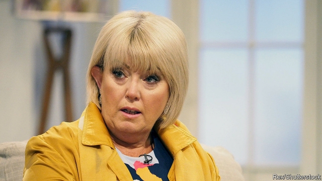

###### Court in the middle

# Victims get a bigger role in prosecuting those who wronged them 

 

> print-edition iconPrint edition | Britain | Jun 15th 2019 

HELEN NEWLOVE’S legal education came quickly. In the weeks after her husband, Garry, was kicked and beaten to death outside their house by a gang of teenagers in 2007, an “endless stream” of police officers and lawyers came to call on her. By the time the case reached court, she had reached a discomfiting conclusion. The prosecutor represented the Crown. Five defence barristers represented the defendants. But, she recalled in a recent speech, “no one represented me and my daughters”. She shared waiting rooms and a canteen with the defendants’ families; her daughters, who witnessed the fatal assault, were told not to show emotion when they gave evidence in case it swayed the jury. “It’s very cold, very clinical,” she says. 

Until the 19th century, victims of crime had three roles in English and Welsh courts: complainant, witness and prosecutor. They were responsible for hiring their own lawyers. Then the police began to pursue offenders themselves. “There was a move away from private vengeance to public prosecution,” says Pamela Cox of Essex University. “Victims disappeared from the courtroom, except to be called as witnesses for the state.” 

The pendulum is beginning to swing back. In the past two decades, successive governments have expanded the role of victims, allowing them to make statements at sentencing about the impact of the crime and handing them more rights to challenge decisions such as parole for prisoners. Last September the government published the first ever “victims strategy”, promising a law to enshrine their rights. Many of the reforms have been championed by Lady Newlove, who was given a peerage in 2010 and has held the new post of victims’ commissioner for the past seven years. On June 24th she will be succeeded by Vera Baird, a former solicitor-general. “We’re putting the victim [at] the table again,” Lady Newlove says. 

Plenty of the changes in the strategy are uncontroversial. Few could quibble with attempts to ensure that police and prosecutors inform victims of developments in their case. In one survey, only a little more than a third of victims felt that had happened. Offering tours of the court before a trial starts and providing separate waiting areas for the defence and prosecution ought to make the process less daunting. Lady Newlove wants victim-liaison staff from different authorities to share office space, so that traumatised people do not have to keep repeating their stories. 

Other reforms raise more questions. Victims are banned from expressing their views on an appropriate sentence in their personal statements, but some defence briefs worry that judges will nevertheless be swayed by emotional accounts. “Judges are only human,” says Sarah Vine, a criminal-law barrister. Some doubt that victims should take part in parole hearings, since they are not qualified to assess how likely a prisoner is to reoffend. There is also a risk in applying the label too loosely. Police have been rebuked for referring to complainants as victims before the accused is tried. It “implicitly presumes guilt on the part of the defendant,” says Ms Vine. 

Yet protecting defendants’ rights does not require victims to be silent. Evidence from several jurisdictions that now allow personal statements suggests their introduction did not lead to harsher sentences. But victims who make a statement are more satisfied with the process than those who do not, suggesting that paying them more attention will increase the perceived legitimacy of the justice system. “It makes the person human, instead of being a case file,” says Lady Newlove. The court must be fair, but it need not be cold. ◼ 

