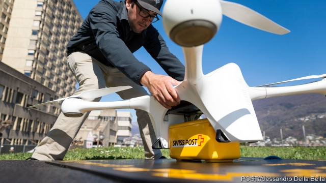

###### Flying start

# Drone deliveries are advancing in health care 

 

> print-edition iconPrint edition | Business | Jun 15th 2019 

A  FEW YEARS ago Jeff Bezos made a prediction. By 2018 his e-commerce empire, Amazon, would be delivering items by drone. Prime Air has yet to launch. But startups are making progress—mostly in health care, where they are vying to tap into a lucrative, $70bn global market in health-care logistics. As they deal with regulators and investors, these firms are charting the course for other aerial deliveries. 

One of the best known is Zipline, based in San Francisco. It took off in Rwanda in 2016, where it is now a national on-demand medical drone network, delivering 150 medical products, mostly blood and vaccines, to hard-to-reach places. Maternal mortality rates are declining thanks to the delivery of blood. Other firms have used drones to supply medicines in Bhutan, Malawi and Papua New Guinea. Patients in many Swiss hospitals can receive results on the day a sample is taken. Zipline is expanding into Ghana and, later this year, into North Carolina, an American state with many out-of-the-way rural medical facilities. It wants to serve 700m people in the next three to four years. 

For governments and regulators nervous about allowing drones to roam the skies, health-care deliveries offer a compelling reason to give it a go. Drones can fall out of the sky, collide with other air traffic, create perceived privacy concerns and make a noise. All this is hard to justify when they are delivering a light bulb. When they carry life-saving medicines the calculation is different. It is also easier, says Ben Marcus, founder of AirMap, a drone-technology firm, because health-care deliveries typically happen between a limited number of fixed sites, not to and from innumerable doorsteps. 

Like most fast-growing startups, drone firms are coy about profitability but say they are generating revenue. Investors look convinced. On May 17th Zipline announced $190m in new financing, which values it at $1.2bn. Like its competitors, it sees lucrative opportunities. For one thing, medical parcels are lightweight but valuable, so drone costs would make up a relatively small portion of the final bill. Drones can also replace the stocks of expensive medicines hospitals keep just in case they are needed, by flying them quickly to hospital beds from a central hub. Lightweight electric drones are likely to be less expensive than car or motorcycle couriers, and faster. Andreas Raptopoulos, boss of Matternet, another drone-delivery firm, thinks that this could save hospitals millions in lab and pharmacy costs. 

The prospect of such efficiency gains (as well as eco-friendliness) was factor in the partnership between Swiss Post and Matternet. Drones now serve three cities in Switzerland. Swiss Post says journeys of 45 minutes have been reduced to flights of a few minutes only. Matternet is, like Zipline, moving into North Carolina, where the local transport authority has championed drone delivery. UPS, a big delivery company, is using Matternet’s drones to replace some courier cars to move medical samples across the state. UPS lags behind Swiss Post in drone delivery, but hopes that experience in health care will lay the groundwork for national expansion. 

The future of drone deliveries of all kinds in America, and elsewhere, rests with regulators. In less developed countries the skies are empty and permission to fly can be granted by a single person. In developed countries, with their more crowded airspace and thicker rule books, everything takes longer. 

The buzz in America stems from a pilot programme by the Federal Aviation Administration (FAA), which is using it to help develop a regulatory framework. As part of the project, Zipline is expected next week to announce its plans for health-care deliveries directly to the consumer. Some expect that by the time the FAA pilot ends in November 2020, Mr Bezos will finally have his way. ◼ 

