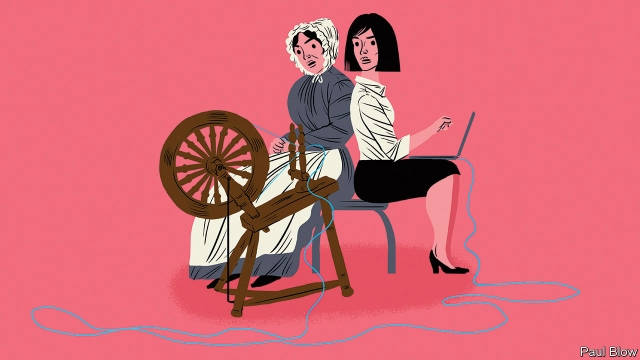

###### Bartleby

# For the future, look to the past 

 

> print-edition iconPrint edition | Business | Jun 13th 2019 

THE DEBATE about the future of work tends to divide commentators into two camps. The optimistic case is that technology may cause temporary disruption but will ultimately result in economic growth and thus more jobs. Combine harvesters reduced the need for agricultural labourers and personal computers eliminated the typing pool, but the displaced workers found other jobs in the end. 

The pessimists argue that new technology, even if it does not cause mass unemployment, will create a “digital divide”. The future will resemble a high-tech Downton Abbey, with the skilled elite lording it over the rest. Unskilled workers will be delivering pizzas to, and cleaning the bathrooms of, the likes of Elon Musk and Tim Cook. 

A new report* from the consultants at McKinsey veers towards the optimistic camp. It predicts that men and women will be roughly equally affected by automation over the next decade, with 21% of working males and 20% of females losing their jobs by 2030. In the developed world, McKinsey estimates that men will tend to lose machine-operating jobs and women will lose clerical and service roles. But new jobs will be created, if not necessarily for the same people. Women will find work in the expanding health-care industry and men in the professional, scientific and technical fields (a higher proportion of men than women have science degrees). 

Not all of these jobs will be well paid, especially for women, says McKinsey—just as, according to left-wing critics, the jobs boom of recent years has been in low-paid work (though data suggest that high-paying ones also rose fast). On the bright side, discouraged workers have rejoined the labour market as the economy has boomed and technology has made it easier for employers to find workers (and vice versa). 

How much of this low-paid work is the result of the gig economy? Not much so far; it represents about only 1% of American employment. But in their book, “Ghost Work”, Mary Gray and Siddharth Suri forecast that what they call “on-demand work” will reach 60% of the global workforce by 2055. They define this category to include those who work for temporary staffing agencies, have short-term contracts or who accept work from employers through websites or apps. 

All this makes it sound as if the future of jobs will look like the past. Before the days of the factory and the office, many workers were part of a “putting-out system”, in which merchants hired them to undertake specific tasks, such as spinning or weaving, for which they were paid a piece rate. The attraction to employers is that such work is cheap. The authors quote one marketing executive as saying that “We can save up to 40% by not paying benefits or allocating office space.” Furthermore, in two of the main markets where on-demand workers toil, America and India, they have little access to the legal protections associated with formal employment. A digital Downton Abbey, in other words. 

However, the new forms of employment have a plus side. Many workers in emerging markets relish the opportunity to work at home and at times of their choosing. They are only expecting to supplement their family’s other sources of income. On some platforms, workers are identified by a sequence of letters and numbers, meaning that they are free from discrimination on the grounds of age, religion or sex. 

Workers may also look to the past to find a way to organise themselves. Some have set up online forums which share information on the most reliable employers. Ms Gray and Mr Suri suggest that these could be expanded to create the equivalent of medieval guilds which could enable workers to learn new skills. Such guilds could also act as a repository for employees’ work records. At the moment, it is as hard—or harder—to transfer your work rating from one online platform to another as it is to wrest your user data from Facebook. Lack of interoperability means workers have to start each contract from scratch. 

Responsible employers could pledge only to use workers from guilds and to apply minimum standards on issues such as prompt payment. They will benefit from more reliable and skilful employees. That way, if the workers of the world unite, everyone may gain. 

* “The future of women at work: Transitions in the age of automation” 

