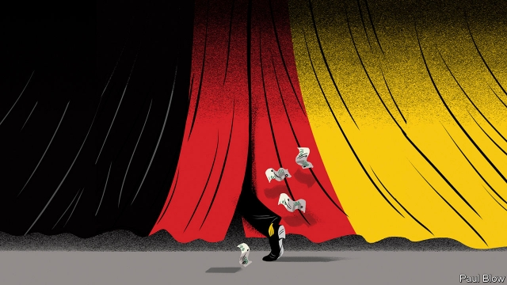
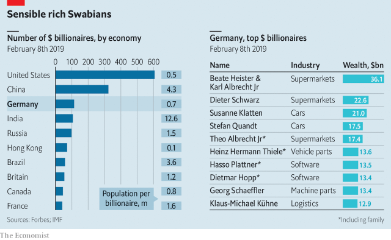

###### The life of tycoons

# Germany’s business barons are finding it harder to keep a low profile 

 

> print-edition iconPrint edition | Business | Jun 15th 2019 

IF THEY think their ranking on rich lists is too low, American tycoons fume. German ones kick up a fuss when theirs looks suspiciously high, explains Heinz Dürr. When a magazine called him a billionaire a few years ago, Mr Dürr rang the editor to remonstrate. The reporters had double-counted his ownership of Homag, a maker of wood-processing machines that Dürr, his family’s mechanical-engineering firm, bought in 2014. Plutocrats have reached the top of politics in America and Italy, while in Asia the super-rich often display their wealth in ostentatious style. Germany’s magnates love to shun the limelight. 

The country is hardly short of super-rich people. It has the most of any country after America and China. In February Forbes, a magazine which tracks such things, counted 114 German dollar billionaires, more than double the number in Britain (see chart). This equates to one for every 727,000 Germans, not a world away from America’s tally of one for every 539,000 (though it has 607 in total). The German Institute for Economic Research, a think-tank, estimates that the combined assets of the richest 45 Germans are roughly the same as those of the entire poorer half of the country. 

That such figures are a surprise to many is testament to the persistence of attitudes outlined by Mr Dürr. German business barons have guarded their privacy more jealously than those from elsewhere. Almost everyone knows what Jeff Bezos, the boss of Amazon, looks like. Most French people will recognise Bernard Arnault, the luxury-goods magnate who is France’s richest man. Neither the German nor English Wikipedia page for Dieter Schwarz, who controls Lidl and Kaufland, two supermarket chains, shows his photograph. And good luck with finding a snap of the Albrechts, owners of Aldi, a discount grocer, or the Reimanns, a super-rich clan that controls JAB, a privately held conglomerate that owns Krispy Kreme, Panera Bread and a host of other consumer-goods brands. 

 

“We do not want to get noticed,” says Nicola Leibinger-Kammüller, boss of Trumpf, one of the world’s biggest makers of machine tools, which her father, Berthold Leibinger, bought from its heirless founder, Christian Trumpf. A devout Lutheran, Ms Leibinger-Kammüller, her father and her two siblings worked out a family code of conduct that members of the third generation sign when they turn 16. It covers succession and the sale of shares in the firm, but also guidelines for religious tolerance, modesty and respect for others. 

A third of German entrepreneurial families have similar rules, according to a study by the WHU Otto Beisheim School of Management and PwC, a consultancy. The constitution of the Reimanns enshrines secrecy, reportedly obliging family members to sign a charter at the age of 18 whereby they pledge to stay away from day-to-day workings of the family business, shun social media, avoid being photographed in public and turn down interviews. 

Several factors account for this anonymity. One is the nature of the tycoons’ businesses. In America many vast fortunes have been made in finance or technology. Many rich Germans owe their success to staid businesses where progress happens not through headline-grabbing disruptive leaps but unremarkable incremental tinkering. Over half the riches of the country’s billionaires comes from dull endeavours such as retailing, manufacturing and construction. The ten wealthiest German families make cars (BMW and Volkswagen), brakes (Knorr-Bremse) and car parts (Schaeffler), or run supermarkets (Mr Schwarz and the Albrechts). Many of Germany’s “hidden champions”, which lead the world in niche endeavours like mechanical engineering, are tucked away in the countryside. 

Culture, too, plays a part. Dirk Rossmann, the founder of an eponymous chain of pharmacies, says that fellow rich Germans are shy because they worry about making fools of themselves, not least in light of a national disposition towards Sozialneid (envy of those better off), and fear for their safety—especially in the wake of the tragic kidnap and murder in 2002 of Jakob von Metzler, an 11-year-old boy from a banking dynasty. 

As in other countries, many German journalists are left-leaning and display instinctive hostility towards plutocrats. In March Stern, a weekly magazine, published a cover story about the “Shamelessly rich”, illustrated with a gold spoon and arguing that Germany’s wealthiest 5% try to protect themselves against a redistributive welfare state by lobbying for lower taxes and hiding their wealth offshore. In May Die Zeit, a news weekly, published a series of articles about “the responsibility of the rich”, and backed a wealth tax and higher inheritance taxes. “A billionaire cannot win in the German media,” says Tobias Prestel of Prestel & Partner, who organises conferences for the family offices of the super-wealthy. 

Chequered history is another reason to keep heads down. Most German billionaires are not self-made but scions of industrial dynasties. Their forebears were neither particularly private nor parochial. All that changed after the second world war, during which some had prospered under the Third Reich. 

A few years ago the Reimanns, whose fortune dates back to a chemicals business founded in 1823 by Johann Adam Benckiser (hence JAB), asked Paul Erker, a historian at Munich University, to look into the family’s behaviour under the Nazi regime. Mr Erker discovered that the then patriarch, Albert, and his son were early and ardent supporters of Adolf Hitler. They permitted the brutal abuse of forced labourers in their business and their own home. 

Werner Bahlsen, the current head of the Bahlsen biscuit empire, said the family will hire a well-known historian to examine their Nazi past after Verena, his 26-year-old daughter, recently blurted in response to a question about Bahlsen’s exploitation of forced workers that they were treated well. (Ms Bahlsen has since apologised for her “thoughtless” remark.) 

The Quandts (BMW), Krupps (steel), Porsches and others have grappled with similarly tainted legacies. In 2000, 4,760 German companies including Siemens, Daimler, Deutsche Bank and Volkswagen, created a foundation that, along with the German state, raised more than €5bn ($4.8bn) for survivors of Nazi atrocities and slave labour. The Reimanns chipped in €5m at the time. After the first results of Mr Erker’s study became public, the family announced it would donate an extra €10m to charity (though did not specify which). 

Unsavoury pasts and secrecy may partly explain why Germans dislike the rich. In a survey last year by the Allensbach Institute, commissioned for a study by Rainer Zittelmann, a historian, the foremost qualities associated with the rich were selfishness (62%), materialism (56%), recklessness (50%), greed (49%) and arrogance (43%). Only 2% admitted that it was “very important”, and 20% that it was “important”, for them to become rich. Ipsos MORI asked similar questions of Americans and found that 39% of young respondents, who tend to be more critical of wealth than older ones, said it was important or very important for them to become rich. 

Germans are also likelier than Americans to blame the world’s ills on the wealthy, according Mr Zittelmann. One in two Germans thinks that they caused the financial crisis or humanitarian disasters, compared with one in four Americans. Surveys also show that Germans are likelier than Americans, Britons or French to experience Schadenfreude when wealthy businessfolk lose their shirts in risky deals. 

Such attitudes explain why German business barons have kept a low profile. Mr Rossmann lives an unassuming life by any measure. He does not own a smartphone or a fancy watch, has lived with his wife in the same relatively modest house for 35 years and buys a new Mercedes car every eight years. If he or others like him exert influence, it is typically close to home, often in an obscure small town. Ms Leibinger-Kammüller’s generosity to her local parish led a leftist paper to christen her “the Madonna from Swabia” in an admiring profile last year. Families like hers may also maintain close relations with local politicians, who in turn make their voices heard in Berlin. 

They have learned to keep those voices low. In 2006 the Stiftung Familienunternehmen, a foundation for family firms, lobbied so hard and loudly for lower inheritance taxes that its efforts backfired and the entire reform collapsed. A decade later their main national lobbies—the BDI (association of German industry), the BDA (association of German employers) and the foundation itself—put the case more subtly and managed to get easier rules that let heirs avoid paying inheritance tax provided they keep their business running for at least seven years and protect jobs and wages. 

As the German rich mingle with plutocrats elsewhere and their companies have globalised, they are starting to become a little less diffident. This is not always to their advantage. Before Ms Bahlsen’s tone-deaf comments about forced labour, she reacted to a proposal of a youth chief of the Social Democrats to collectivise big firms by saying, “I’m a capitalist. I own a quarter of Bahlsen, that’s great. I want to buy a sailing yacht and stuff like that.” But Mr Rossmann, who does not shy away from the press, thinks that Germany’s rich should be more active in politics, which lacks a spirit of enterprise. Few have so far tried and none has succeeded. 

Mr Dürr has raised his profile, too. After building his family’s firm into a global leader and listing it on the stock exchange, he moved to the public sector as boss of Deutsche Bahn, the state-owned railways, which he merged with eastern Germany’s Reichsbahn and in 1994 transformed into a privately run joint-stock company. Like Mr Rossmann, Mr Dürr does not hide from the public eye. He even briefly considered running for political office, though ultimately demurred. Old habits die hard.◼ 

