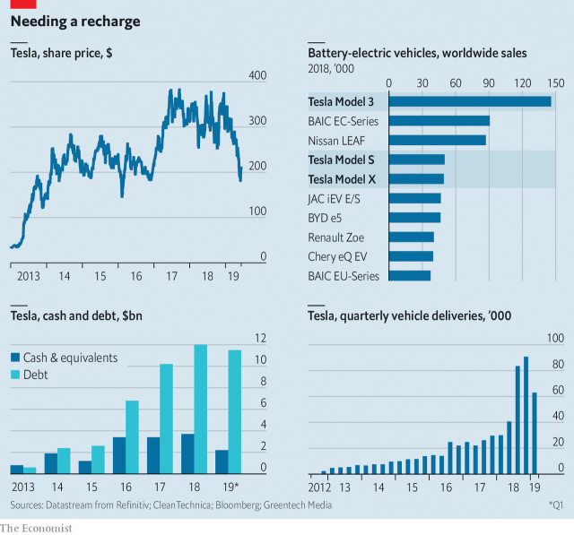

###### Electrical disturbance

# Tesla’s performance gives Elon Musk much to think about 

> print-edition iconPrint edition | Business | Jun 15th 2019 

 

AT TESLA'S ANNUAL shareholders meeting on June 11th Elon Musk was as ebullient as ever. But its shares, which started the year above $300, have plunged close to $200 and its bonds recently traded at an all-time low of close to 80 cents on the dollar. Deliveries of the Model 3, the firm’s mass-market electric vehicle (EV), fell by over a fifth in the first quarter compared with the previous quarter, casting doubt on the firm’s annual sales target. Tesla raised $2.7bn in convertible debt and stock in May, but questions remain about how much cash it can generate—it burned through over $900m in the first quarter. Tesla may have outsold competitors last year, but faltering demand and a phase-out of EV subsidies in America are tough new challenges it has to face.◼ 

