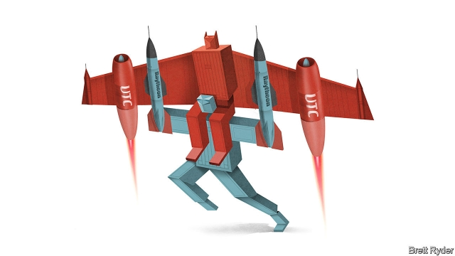

###### Schumpeter

# The UTC-Raytheon deal highlights the changing nature of war 

 

> print-edition iconPrint edition | Business | Jun 15th 2019 

WITH A DEEP voice and physique of a former American-football player, Greg Hayes, boss of United Technologies Corp (UTC), does not seem like the soft sort. But the ego is delicate. As he told Schumpeter in February while explaining his decision to carve UTC, a conglomerate dating back to the 1920s, into three parts, it was hard for him emotionally to accept that he may end up in charge of a smaller slice of the pie. Shed no tears, though. As he said those words, he was probably plotting a megamerger that could make him one of America’s biggest military-industrialists. 

On June 9th UTC, which is big in jet engines, and Raytheon, a prominent missile-maker, said they would join together to create America’s second-largest aerospace and defence company after Boeing, with a combined market value of $166bn. UTC shareholders will get 57% of the combined company, to be called Raytheon Technologies. The merger reflects two trends sweeping America: the reshaping of defence because of fears about China and the streamlining of industry because of shareholder activism. 

Neither firm’s share price reacted well to the news and feelings are mixed. Those who support the deal see it as a neat way of balancing UTC’s cyclical aerospace business, which mostly supplies Pratt & Whitney engines for passenger jets, with Raytheon’s more recession-proof defence capabilities, such as making Patriot missiles. Their combined $26bn net debt is manageable. As usual, they promise to return a ton of money to shareholders. 

Some critics say it bodes ill if two firms with apparently strong stand-alone businesses have to cling together for survival. Sceptics, besides worrying about the business logic, feel that Mr Hayes may be biting off more than he can chew. He aims to spin off UTC’s lift business, Otis, and temperature-control firm, Carrier, early next year before completing the merger. And UTC is still integrating a new avionics business after buying Rockwell Collins for $30bn last year. The promised gross annual cost savings of $1bn by 2024 are paltry—mostly from combining head offices. Mr Hayes and his Raytheon counterpart, Tom Kennedy, promise to give half of that back to customers, the biggest of which is America’s Defence Department. Nonetheless, President Donald Trump expressed concern about the impact of the deal on competition. 

From a different standpoint, however, the president would probably welcome the combination because the two trends it reflects may make America stronger. First defence. Amid rising geopolitical tensions, America is pouring money into high-tech armaments. The Trump administration, identifying a new era of “great power competition” with China and Russia, has boosted defence spending sharply this year and last, and hopes for a gargantuan $750bn budget in 2020. Many analysts expect spending to plateau after that, but given the global frictions, that is no certainty. 

The nature of spending is also changing, as fancy kit for intelligence, surveillance and other stealthy warcraft is given higher priority. Kara Frederick of the Centre for a New American Security, a think-tank, recalls that when she served as an intelligence officer in Afghanistan, for instance, the focus was terrorism; if you sent up a drone, there was little risk of having an enemy intercept its communications system. “The Taliban didn’t even have an air force.” But now America faces rivals, such as China, that match it technologically. For software, the Pentagon has urged Silicon Valley and other tech firms to overcome their ethical quandaries and help shield American forces from cyber-attacks, or develop machine learning to support them on the battlefield. 

UTC and Raytheon, by pooling their technologies, will be better able to develop the new types of hardware of interest to the Pentagon. Examples are hypersonic missiles, which combine velocity—travelling at five times the speed of sound—with pinpoint accuracy. The merged firm intends to invest $8bn a year in research and development on hypersonics and other systems, for instance by combining Raytheon’s missile expertise with UTC’s use of high-temperature materials and heat-management systems in engine turbines to stop the projectiles overheating. (In return, UTC hopes that Raytheon’s cyber-security skills can help it counter such threats in aerospace.) Hawk Carlisle, head of the National Defence Industrial Association, a lobby group, expects defence mergers to unite traditional weapons contractors with tech firms. 

Such combinations will be helped by the second trend that the merger underscores: the constant re-engineering of old-fashioned industrial structures, especially conglomerates. The motivation is partly to avoid attacks by activist investors and also to generate higher returns. Jorge Rujana of Bain, a consultancy, says managers who frequently streamline their portfolios by buying and selling assets have, over the past decade, returned far more to shareholders than those doing big one-off deals—or nothing. The fashion led two famous chemicals firms, Dow and DuPont, to merge in 2017 and simultaneously promise to split into three parts. 

The trouble is that reconfiguring conglomerates can be a nightmare. General Electric has been through endless, pointless, contortions. Shareholders in DowDuPont have not been well rewarded. And activists are unpredictable. The newly formed chemicals giant was pressured to rejig its rejigging after interventions by two activists, Nelson Peltz of Trian and Daniel Loeb of Third Point. Already some accuse Mr Hayes of the “reconglomeration” of UTC by merging with Raytheon. William Ackman of Pershing Square, a UTC investor, has written a letter urging him to call it off. “It does not seem consistent with the Greg Hayes we know.” 

Perhaps Mr Hayes is keen to stroke his own ego; he will be the new firm’s chief executive and, in 2022, become its chairman, too. But by grappling with the new dynamics of aerospace and defence, as well as the changing nature of the industrial firm, he is being proactive. It is better to fight the next war than the last one.◼ 

