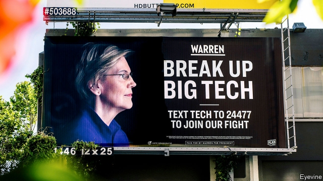

###### The break-up conversation

# Trust-buster talk tough in America 

 

> print-edition iconPrint edition | Business | Jun 15th 2019 

“IF WE WILL not endure a king as a political power, we should not endure a king over the production, transportation and sale of any of the necessaries of life.” Advocates of a muscular approach to antitrust often quote the words of John Sherman. In 1890 the senator urged Congress to pass the antitrust act that carries his name. On June 11th they were uttered by someone who many believed would be less keen on such action. Makan Delrahim, boss of the antitrust division of America’s Department of Justice (DOJ) used a speech in Tel Aviv to deliver the latest sign that America’s long-slumbering antitrust machine has woken up and is looking around threateningly, particularly at the country’s tech giants. 

Signs of renewed vigour in antitrust enforcement are growing. Last week it emerged that the Federal Trade Commission, another antitrust agency, and the DOJ had agreed to divvy up the work, with the former looking into Facebook and Amazon and the latter Apple and Google (an investigation of the search firm is reportedly imminent). On June 11th, a Congressional committee opened an investigation into the impact of big tech firms on the news industry. And more than a dozen state attorneys-general are soon expected to do something similar. In another sign that big business is under antitrust scrutiny, on the same day a group of states sued to block a $26bn merger between Sprint and T-Mobile, two big mobile operators. 

In laying out a case against big tech, Mr Delrahim has used some of the same arguments as many of the industry’s critics. Important digital markets, he explained, tend to be dominated by one or two firms, thanks to network effects. Such dominance is not necessarily bad for consumers. Even monopolies, such as that of Standard Oil, have led to lower prices. But price effects, he correctly argued, are “not the sole measure of harm to competition”. The view in antitrust circles is that only price matters. Web browsers, for instance, are free, but in the 1990s Microsoft’s bundling of one with its dominant Windows operating system hurt competition and innovation. The government’s successful case against Microsoft, he said, “arguably paved the way for companies like Google, Yahoo and Apple to enter the market.” 

Mr Delrahim also hinted at what will be scrutinised. One area is “exclusivity agreements”, where a dominant firm imposes deals on suppliers, for instance when Microsoft forced makers of PCs to give preference to its browser. The other is mergers and acquisitions. These can be good for competition, he said, but added that there is “potential for mischief if the purpose and effect of an acquisition is to block potential competitors, protect a monopoly.” 

Critics of big tech shouldn’t get their hopes up. Mr Delrahim stopped short of pointing to any specific case of how the big platforms may have run afoul of antitrust law, nor what he would do about it. And he seems intent to stay within established limits. Not only does he think that the law as it stands is fit for purpose, but he did not mention the role of data, which underpins much of the power of the tech titans. 

Rather than the start of a big antitrust push, the speech can be read as a reaction to mounting pressure to rein in big tech. Democrat politicians who want to be their party’s presidential candidate have found calls for breaking up the firms to be popular but Mr Delrahim’s speech is more likely a response to Republicans. They are increasingly worried that the growing efforts of platforms to moderate content produced by users limit free speech, particularly conservative voices. 

Then again, Mr Delrahim has the courage to act. In 2017 he went to court to block the megamerger of AT&T with Time Warner, though he lost the case on appeal. But if the Microsoft antitrust case is any guide, it will take years before a final decision in any potential case is handed down. America’s antitrust machine is revving loudly but it is unclear whether it will ultimately produce anything more than noise.◼ 

