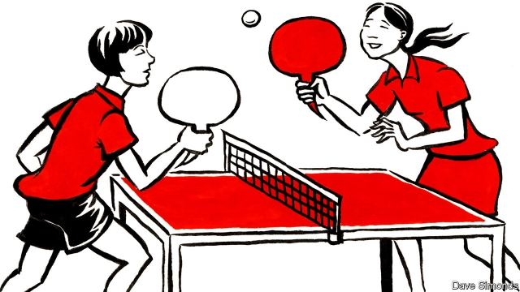

###### Out of the straitjacket

# Debating contests teach Chinese students an argument has two sides 

 

> print-edition iconPrint edition | China | Jun 15th 2019 

WHEN THE Chinese government first sent students to America in the late 19th century, it could not decide whether their goal should be to acquire specific technical knowledge or to absorb new ways of thinking. More than a century later, a third of a million Chinese students are enrolled at American schools and universities. Yet folks back home remain divided about what an American degree means. 

Attending an American university is a good career move. It is also scorned as a soft option for well-off kids, scared of the gaokao, China’s brutal university-entrance exams. Yet many bright Chinese youngsters explain the appeal of an American education in remarkably idealistic terms. One place to hear such dreams, on a recent smoggy Saturday morning, is an English-language debating tournament in the central city of Wuhan. It follows a format popular at high schools across America, known as “Public Forum Debate”. On this occasion 182 teenagers are taking part. 

At first sight, the event reeks of privilege. It uses the classrooms at a bilingual private boarding school in Wuhan with its own golf course and an ice-hockey team coached by imported Russians. But the debate is not for big-city elites. It is run by the National High School Debate League of China, a company founded by two young Americans in 2011. It stages contests in dozens of Chinese cities each year. This one has drawn pupils, aged 13-18, from nine cities. Many will never study overseas. 

The proposition is: “Countries should prioritise climate-change adaptation over mitigation.” Teams have had three weeks to prepare. An early round is won by a pair of 17-year-old girls who attend the international section (a bilingual school-within-a-school) of a state-run high school in Shenyang. In confident, rapid-fire English the duo argue that climate change should be treated with realism. They praise a sea wall being built in Jakarta and note the political lessons to be drawn from French gilets jaunes protests against a proposed fuel tax. The pair also had speeches arguing the opposite ready, in case the coin-toss had gone the other way. 

Chinese pupils are pushed to study relentlessly, says one. But American-style debate forces students to “brainstorm a lot of ideas in a short time”. Unlike America, where debating clubs are dominated by shouty, self-assured boys, most contestants in the Chinese league are girls. Of its 20 highest-ranked debaters, 16 are female. 

In a still-chauvinist society, the chance to argue forcefully and be applauded for it has a rare appeal, suggests Liam Mather, the league’s 20-something executive director. The winners in Wuhan are Joyce Yi and Erica Chen, from a state school in the southern boomtown of Shenzhen. Their swaggering first-round performance leaves two ill-prepared boys open-mouthed like fish. Ms Chen initially relished debating in English because “I’m kind of an argumentative person.” Then she realised the subtle effects of having to research both sides of an argument. Chinese education emphasises one correct answer to a question, she says. 

The debaters are not starry-eyed about America. They talk of gun violence, inequality and crumbling cities. At a practice camp some call the American way of arguing “very chaotic.” But debate can prevent “huge mistakes” because competing perspectives are heard, notes Angela Pan, a teenager from Beijing. The young Chinese assert—perhaps a little optimistically—that American college students are diverse, free and informed about the world. They long to cross the Pacific and meet some. ◼ 

