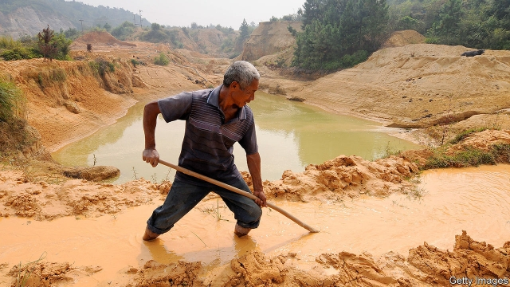
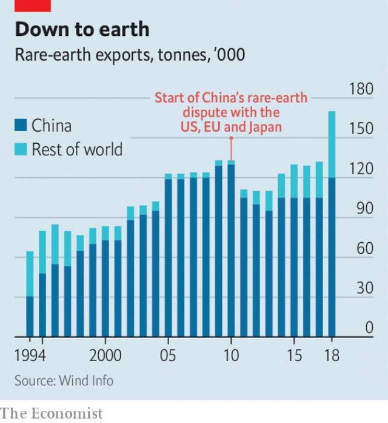

###### Magnetic attraction

# Rare earths give China leverage in the trade war, at a cost 

 

> print-edition iconPrint edition | China | Jun 15th 2019 

IT LOOKS AT first like a classic Chinese painting: water-soaked paddies nestled against endless green hills. But then the brown begins. Abandoned brown pits on the hilltops. Brown gashes down their sides. Brown sludge in the streams. Ganzhou, until a few years ago, was southern China’s mining country. The damage done in the name of economic growth involves an industry that has given China leverage in its trade war with America. The rocks extracted are rich in rare-earth minerals, used in everything from planes to smartphones. It is a dirty business that China dominates. 

Rare earths, covering 17 elements on the periodic table, are in fact common. But China holds two-fifths of global reserves. In 1992 Deng Xiaoping quipped that “the Middle East has oil, China has rare earths.” The chemicals used to extract them from the ore create toxic run-off, and for years China was more willing to bear that cost than other countries. By the early 2000s it accounted for almost all the world’s production. “There were no laws back then and everyone here was digging up the ground,” says Xie Yizhen, a local who worked in mining for 18 years. 

Crucially, China has translated its control of the raw materials into dominance of the valuable next steps: turning oxides into metals and metals into products. To extend Mr Deng’s comparison, it is as if the Middle East not only sat on most of the world’s oil but also, almost exclusively, refined it and then made products out of it. 

This is why rare earths now figure in the trade war. America can hobble Chinese tech giants by stopping American firms from selling them components such as semiconductors. But China could, in return, cut off their supplies of rare-earth products. The most important of these are specialised magnets for motors in electric vehicles, generators in wind turbines and missile-guidance systems. China produces more than 90% of the world’s output, according to Citigroup, a bank. Even the Pentagon, through its suppliers, is a client. 

China’s rare-earth power is not a new worry. In 2010 it restricted exports—in order, it said, to protect its environment. The World Trade Organisation ruled against the restrictions after America and others challenged them. But since then many countries have fretted about relying on China. 

So it is no surprise that in the past few weeks China has brandished rare earths as a possible weapon. State media have played up the threat. “China gears up to use rare-earth advantage” ran a headline in Global Times, a nationalist tabloid, on June 9th. 

 

But doing so is not so simple. After the scare in 2010 Japan lent money to Lynas, an Australian mining company with a refinery in Malaysia. Today, it can meet nearly a third of Japanese demand for rare earths. The Mountain Pass mine in California, which once supplied most of the world’s rare earths but which shut in the early 2000s, has reopened. And on June 11th America said it would help other countries to develop their reserves. China’s share of global rare-earth production fell from more than 95% in 2010 to 70% last year, and is likely to dip lower (see chart). 

China has much more leverage in downstream products. America last year bought about $250m of rare-earth magnets from China, and there are no easy alternative sources. “These magnets are the farthest thing from a commodity that we can imagine,” says Ryan Castilloux, of Adamas Intelligence, a rare-earths consultancy. They are made to exact specifications. And, says Mr Castilloux, the industry is small enough for China to be able to spot any American attempts to skirt a Chinese ban by importing magnets through other countries. 

The Pentagon would probably be able to cope. An industry joke has it that it can carry its annual supply of heavy rare earths (the kind used in its missiles) in a single suitcase. Businesses would find it harder. David Merriman of Roskill, a metals research firm, says it would disrupt the supply chain enough to put American car companies “at a competitive disadvantage”. 

But it is far from certain that China will block exports to America. Doing so would also hurt Chinese companies, which are often the ones that build the motors and batteries for American customers using rare-earth magnets. Longer term, a ban would encourage the same process that happened in mining. Foreign firms, perhaps with government support, will invest in facilities to make finished products. 

That would set back China’s grand strategy for rare earths, seen in the hills around Ganzhou. Over the past few years it has shut scores of unlicensed mines. At a huge cost, it is trying to clean up local rivers. The big state-owned mining firm in the area has started filling in some of its pits with grass and shrubs. China is still excavating plenty of rare-earth elements, especially in the north, but it has decided that it can buy much of what it needs abroad, and spare its own environment. Last year, it became a net importer of rare-earth concentrate. 

Instead, China has shifted its focus to rare-earth products, to increase its downstream advantage. In an industrial park on the edge of Ganzhou, the government is ploughing money into factories that make rare-earth magnets and alloys. This manufacturing is much cleaner than the mining, and captures more value. Tellingly, when Xi Jinping, China’s president, visited the city last month, news reports showed him at JL MAG, a magnet company, not a mine. 

At another company in Ganzhou, a manager shows off several of its products: little disc magnets, each containing about 30% rare earths. When the magnets are smaller than a fingernail, it is hard to pull them apart. When they are slightly bigger, just wider than a thumb, it is impossible to do so. That is a good metaphor for what China ultimately wants from rare earths, and for its economy more generally: to reach a size where no country, not even America, can pull away. Cutting America off now would undercut that ambition. ◼ 

