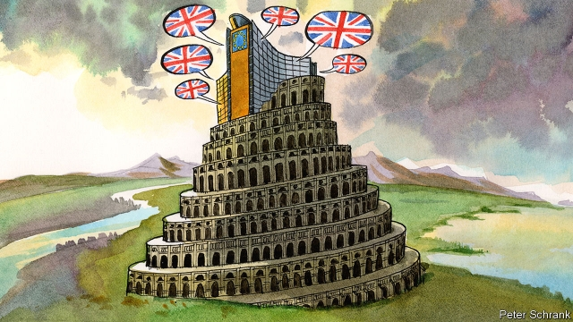

###### Charlemagne

# Brexit is the ideal moment to make English the EU’s common language 

 

> print-edition iconPrint edition | Europe | Jun 15th 2019 

FOR MOST of its life, the European Union had three main languages. German was its leading mother tongue. French was the preferred register of Brussels diplomacy. English was a widely used second language. But in recent years the rise of the internet and the accession of central and eastern European states have made English dominant. Today over 80% of the European Commission’s documents are written first in that language, then translated into the EU’s remaining 23 official tongues. 

That has raised some hackles. “English is not the only official language of the European Union,” huffed Jean-Claude Juncker, the European Commission president, last September. Some have hailed Brexit as a chance to re-establish French as the EU’s leading language, or at least remove English as an official language. “By what miracle will 450m citizens have to be governed in this future minority language?” fumed one French journalist at the EU’s failure to ditch the tongue of Boris Johnson and Nigel Farage. 

On the contrary, there has never been a better time for the EU to embrace English as its single official language. Britain’s exit makes the politics simpler. Philippe Van Parijs, a Belgian philosopher, argues that it will make English a neutral language within the EU (Ireland and Malta also speak it, but make up 1% of the remaining population) and thus ideal for exchange between Europeans of rival mother tongues. Given its Latinate and Germanic roots, he adds, embracing it would be an act of linguistic repatriation; returning the language to the European mainland. “We want our language back,” he jokes. Second, Europe is growing together politically. From anti-migrant protests to the “Fridays for Future” environmental demonstrations by school pupils, causes are crossing borders more than before. Turnout rose to a 25-year high in the European elections last month after a campaign in which leaders, from Matteo Salvini of Italy’s populist right to Emmanuel Macron of France’s liberal centre, made an impact beyond their own countries. The French president wants to introduce pan-EU lists of candidates at the next elections. In this more genuinely European political era, a universally accepted lingua franca makes all the more sense. English is the only logical candidate. 

Some fret that formalising its pre-eminence would entrench Anglo-Saxon culture and allow English-language publications (like The Economist) to dominate. In fact, several big continental media houses—including most of Germany’s major newspapers, Spain’s El País and Greece’s Kathimerini—now publish online English versions in order to take part in pan-European debates. Formalising English would merely encourage others to follow suit. The keenest proponents of an Anglophone EU are not Brits or Americans but Joachim Gauck, Germany’s former president, and Mario Monti, Italy’s former prime minister. 

Another complaint from the English-bashers is that other political entities, like America, Canada and Switzerland, manage without a single official language. But unlike the EU, they all have centuries of history as common polities and a strong majority tongue; by contrast, only 18% of EU citizens speak German as their first language. Polyglot India is the nearest international comparator to the EU, but there too debates rage over whether to adopt a sole official language to add coherence. 

The most compelling objection is that replacing Europe’s babel with a common discourse in English is elitist. Yet that is precisely why the EU should do more to promote it as the definitive language of European exchange. Its current agnosticism has created a Europe where a brahmin class of multilingual university graduates can breeze from country to country and dominate pan-European debates. A firmer commitment to English at European and national levels would help extend that skill to Europeans who currently lack it. 

The choice is ultimately not between an Anglophone Europe and a truly polyglot Europe but between wishful thinking and realism. Nicolas Véron, a French economist in Brussels, notes that English is already in effect the working language of the EU; a development that helped him and others set up Bruegel, one of the first genuinely pan-EU think-tanks, in 2005. Some 97% of 13-year-olds in the EU are learning English. The number of English-language university courses has risen from 725 in 2002 to over 8,000. Continent-wide political movements work overwhelmingly in English: the website and social-media accounts of Fridays for Future are in English, as are those of the right-populist Identitarian movement. At a rally of nationalist leaders in Milan before the European elections, Finnish, Danish, Dutch, Czech and German leaders all addressed the Italian crowd, to cheers, in English. 

Formally acknowledging such realities would enable the EU and national governments to focus more resources on spreading English skills. Resources—some perhaps freed by shrinking the EU’s mammoth translation operation—could go towards teaching the language to older and less-educated workers. It would spur more media organisations to publish in English and thus nurture the emergence of a genuinely pan-European media. 

The biggest barrier is symbolic. “The language of Europe is translation,” wrote Umberto Eco, an Italian author. The EU is proud of its everyday multilingualism, which becomes more fluent and accessible with every year as the use of machine translation tools grows. Yet the adoption of English as a common language should be seen not as a challenge but as a complement to this tradition. Europe is about diversity, and its patchwork of languages and dialects must be promoted and protected. But it is also about the sort of unity that is possible only with a common tongue, even imperfectly spoken. Universalising English while upholding the EU’s native languages would be not a betrayal of the cosmopolitan European ideal, but its affirmation. ◼ 

