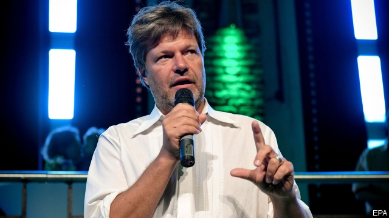
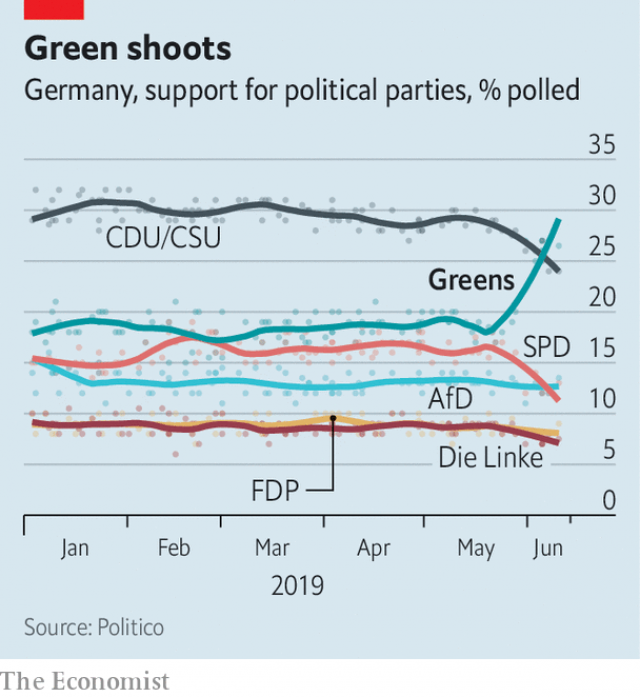

###### Of coal and coalitions

# German politicians are scrambling to respond to the Green Party’s surge 

 

> print-edition iconPrint edition | Europe | Jun 15th 2019 

THE TONE was measured, but the content alarming. Governments could “no longer close their eyes”, wrote Angela Merkel in the Frankfurter Allgemeine Sonntagszeitung, back in 1995. “Climate protection requires swift and energetic action.” Just four months into her job as Germany’s environment minister, Mrs Merkel went on to broker a deal among her peers at a climate conference in Berlin that paved the way for the Kyoto agreement two years later. 

Since then, at the global carousel of summits Mrs Merkel has kept up the advocacy that led some to dub her the “climate chancellor”. But at home, the urgency comes from elsewhere. At the European elections 48% of voters said climate change was their top concern. The Green Party came second in that election and now leads Mrs Merkel’s Christian Democratic Union (CDU) in polls. Every week “Fridays for Future” protests fill the heart of Berlin with marching schoolchildren. 

The change of mood among voters means “a wishy-washy policy course is no longer compelling,” says Ottmar Edenhofer, who directs the Potsdam Institute for Climate Impact Research. The CDU and its Bavarian sister party, the Christian Social Union (CSU), are scrambling to sharpen their climate profile. With their coalition partner, the Social Democrats (SPD), the parties must enshrine in law Germany’s commitment to ensure that by 2030 carbon emissions are 55% lower than their 1990 level. That the SPD is spoiling for a fight makes that harder. The CDU itself is divided. Some back a carbon tax, with revenues redistributed to those hit hardest. Others want to expand the EU’s emissions-trading scheme (ETS), a carbon market. Businesses want clarity. A decision will be taken by September, and legislation will follow. 

Much of the frustration comes from Germany’s sluggish performance. In the past decade it has spent a fortune rejigging its energy system while barely reducing emissions. This embarrassment comes with a price tag; under EU rules Germany could be liable for penalties worth tens of billions should it fail to meet its 2030 target. The 2020 goal is already abandoned. 

Two factors explain this. First is Germany’s ongoing dependence on coal, particularly lignite, the dirty brown sort. Thanks to hefty subsidies, renewables account for over 40% of electricity production. But Mrs Merkel’s sudden abandonment of nuclear power after a tsunami-induced meltdown at a Japanese reactor in 2011, and warped price signals that made gas-fired power uneconomical, meant that cheap coal has made up much of the rest. The last mine is due to be shuttered by 2038. Too late, say activists. 

Secondly, since 1990 Germany has failed to bring down its emissions from transport. Some cities have banned diesel-powered cars from their centres, and carmakers are rewriting business models to avoid being overtaken by Chinese upstarts. But a future in which Germans zip around in electric cars is some way off. Nor are the incentives yet in place for the mass refurbishment of Germany’s housing stock. 

 

The governing parties face dilemmas balancing climate protection with their traditional economic goals. The CDU wants to avoid harming industry, already smarting from high energy prices, and is wary of the powerful motorists’ lobby. The SPD fears for its industrial voter base. Many of the coal mines earmarked for closure lie in Germany’s east, where the hard-right Alternative for Germany is popular. 

All this bolsters the Greens, with their crystal-clear pitch, made from the safety of opposition. The party gains from voters’ climate worries, but also from their frustration with a fractious coalition. Yet its success in soaking up votes from across the political spectrum hints at shaky foundations. It cannot remain all things to all voters. “We know our support is fragile,” says Kerstin Andreae, a Green MP. The party’s influence, however, is not. ◼ 

