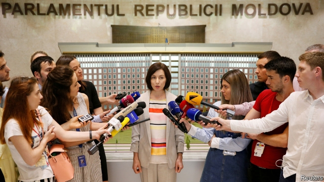

###### Vlad the unpopular

# Russia and America both want Moldova’s ruling oligarch to go 

 

> print-edition iconPrint edition | Europe | Jun 15th 2019 

ON JUNE 8TH Nicu Popescu was on his way to a party in London. When the train entered the Channel Tunnel at Calais he was a humble think-tanker, based in Paris. When it emerged in Britain he had become foreign minister of Moldova. Since an inconclusive election more than three months ago, Moldovan political life has been gridlocked. Now it is moving at breakneck speed. 

Moldova’s corrupt leaders have long played its location, sandwiched between Ukraine and Romania, to their advantage. They have demanded bounty from Moscow, Brussels and Washington, warning that if they did not get it they would seek it elsewhere. But Vlad Plahotniuc, an oligarch who has dominated Moldovan politics in recent years, is so unpopular that he has managed to unite all three against him. 

Elections in February produced a hung parliament. Subsequent negotiations failed to produce a new government, but the likeliest outcome seemed to be either new elections or a deal between Mr Plahotniuc’s Democratic Party and the Russia-friendly Socialists. Then on June 3rd envoys from Russia, America and the EU arrived. Encouraged by the Russians, the Socialists struck a deal with a new pro-Western party that holds the balance of power in parliament. Untainted by accusations of corruption, it is led by Maia Sandu, a popular former education minister. 

But Mr Plahotniuc is not giving up power easily. The constitutional court, still controlled by his Democrats, has moved to dissolve parliament and replace the Socialist president with an ally of Mr Plahotniuc’s. A TV station close to him broadcast a film of the old president apparently discussing illegal Russian party financing. He claims the words were taken out of context, but the old government is refusing to budge. Ms Sandu says that if it does not vacate government offices she will call her supporters onto the streets. Mr Popescu denies they are planning to storm the offices. “We are not commandos!” 

Lacking international support, Mr Plahotniuc is losing his grip on power. But many suspect that the Russian strategy may be to get rid of him first, then eliminate Ms Sandu and take Moldova firmly back into the Russian sphere of influence. Her plan is also to deal with Mr Plahotniuc first and then defeat the Socialists at a new election. “I’m very optimistic,” she says. 

