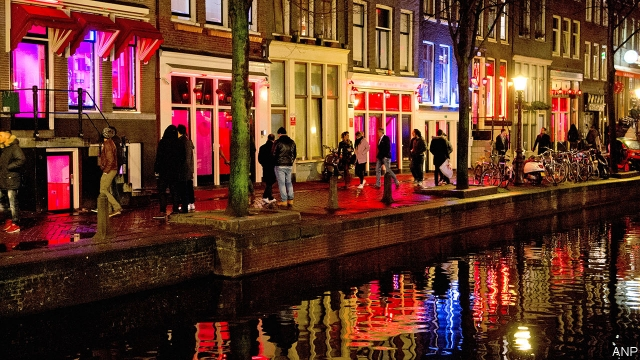

###### The new puritans

# The idea of criminalising prostitutes’ clients is spreading 

 

> print-edition iconPrint edition | Europe | Jun 15th 2019 

“ARE YOU getting enough satisfaction in your bedroom?” purrs the narrator of a recent advert for IKEA, a Swedish retailer. If not, the “IKEA Karma Sutra” has the solution: loft beds for those who “are not afraid to be on top”; lustrous duvet covers to bring “feelings of ecstasy”. Swedes have a reputation for being pro-sex. Yet Sweden’s prostitution laws are surprisingly illiberal—and increasingly being copied elsewhere. The Netherlands is the latest country to flirt with the Swedish model. 

In 1999 Sweden banned the purchase—but not the sale—of sex. A curious coalition of feminists and Christians backed the law. They argued that it would wipe out prostitution by eliminating demand, and that this would be a good thing because all sex work is exploitative. Anyone selling sex is a victim, even if she denies it. As for the men who pay for sex, they are predators who should be punished, campaigners believe. 

Over the past two decades the Swedish model has been taken up by nearby Norway and Iceland, and beyond, by Canada, France, Ireland, Israel and Northern Ireland. In 2014 the European Parliament urged EU members to adopt it. Spanish lawmakers are in the process of doing so. In America politicians in Maine and Massachusetts are calling for a similar approach. On July 3rd lawmakers in the Netherlands, where prostitution is legal and highly visible, are to start discussing such a law, as well as whether to ban pimps. As in Sweden, the crusade is cheered on by feminists and Christians with stern moral views. Exxpose, a Dutch organisation led by evangelical students, has gathered 40,000 signatures on a petition to criminalise the buying of sex. Parliament is unlikely to agree, in such a liberal country, but the campaign is spreading and there will doubtless be more attempts. 

Under current Dutch law, prostitution is regulated and taxed. The barriers to joining the profession are high: a licence to work as an individual prostitute can cost anywhere between €1,000 ($1,130) and €10,000 initially and must then be renewed periodically. About a quarter of municipalities refuse to issue any licences at all, and Amsterdam, the capital, has been trying to reduce the size of its red-light district, which locals complain attracts organised criminals and excessive drug use. 

Nationwide, the number of licensed sex businesses has fallen from 1,100 in 2006 to fewer than 700 in 2014. Many prostitutes work illegally, for various reasons. Some are coerced. (How many is hard to say, but estimates for the Netherlands put the figure around 10%.) Some are immigrants without work visas, or who cannot meet certain licensing rules, including one requiring the ability to speak Dutch. Some do not want to pay for a licence or be taxed. Some want to work from home, though this is harder than it could be, since advertising for such services online is illegal. 

Evidence that the Swedish approach either reduces demand for commercial sex or harm to prostitutes is scanty. After buying sex was criminalised in Sweden, the number of women selling it on the streets of Swedish cities fell, but soon began to creep up again. The number of Swedish men who tell pollsters that they pay for sex has fallen, but that may reflect a reluctance to admit that they have committed a crime, rather than a genuine change in behaviour. 

Other measures suggest that the sex business is still thriving. Between 2009 and 2012 the number of Thai massage parlours in Stockholm, which often double as brothels, nearly tripled to 250, according to the Swedish police. And growing numbers of sex workers ply their trade indoors or online, making them hard to count. 

Despite the ban, many men are still keen to pay for sex. When Astrid, a Swedish prostitute who works throughout Europe, returned to Stockholm for a couple of days, she says she received 67 inquiries from potential clients. She accepted just two. The others were unwilling to disclose their names or telephone numbers, perhaps because they feared arrest. 

Supporters of the Swedish model claim it protects prostitutes by giving them some power over clients, who will be worried about being shopped to the police. Prostitutes say it has the opposite effect. Face-to-face negotiations are more hurried. Kate McGrew of Sex Workers Alliance Ireland says that fewer sex workers are heeding what used to be red flags. For example, a trans woman was beaten up after taking on a client who asked if she was alone. Clients are more likely to insist on assignations in remote places. And because men refuse to reveal identifying information, prostitutes have little recourse if they are attacked. 

In a study of more than 500 sex workers in France, nearly 40% said their power to negotiate prices and insist on condoms had diminished since buying sex was banned in 2016. Nearly 80% said their earnings had fallen, and almost 90% did not support the law. In Ireland violence against prostitutes shot up by almost 80% in the year after buying sex was banned, according to Ugly Mugs, a group that encourages sex workers to report attacks. 

Yet the number of sex workers in Ireland who tell the police about such crimes has fallen. France has seen similar shifts. Sex workers are wary of contacting the cops for fear of being prosecuted for other things, such as immigration violations or brothel-keeping. Swedish-style laws are often used as a pretext to crack down on migrants, says Niina Vuolajarvi, a sociologist at Rutgers University. Norway introduced its law in part because voters objected to the sight of Nigerian sex workers on the streets. Since Ireland’s law has come into effect, police have picked up just one man for buying sex, but they have arrested 55 sex workers, most of them foreign. 

Natasja Bos, one of the leaders of Exxpose, claims that the Swedish model deters trafficking (ie, recruitment through force or deception) by discouraging both clients and pimps. But 15 years after the law was passed, Swedish police found no such decline. Men who might once have told police about women they feared had been trafficked become reluctant to do so. 

Advocates of a more liberal approach point to New Zealand, which treats selling sex like any other job. An official report says that “the vast majority” of sex workers are safer and healthier since prostitution was decriminalised in 2003. Those working on the streets report that their relationship with the police has improved. Likewise, in the Australian state of New South Wales, where selling sex is legal, prostitutes’ use of condoms is higher than in other Australian states where it is banned. 

No country has ever eliminated prostitution. Many people want more sex than they can get without paying. Sex workers meet that demand, and so long as the terms are freely negotiated, the law should not stop them, argue their unions. Police should concern themselves only with genuine cases of coercion. “Nobody wants a safer sex industry more than sex workers themselves,” says Fleur (not her real name), of the Prostitution Information Centre in Amsterdam. Perhaps Dutch lawmakers should listen to the experts. ◼ 

