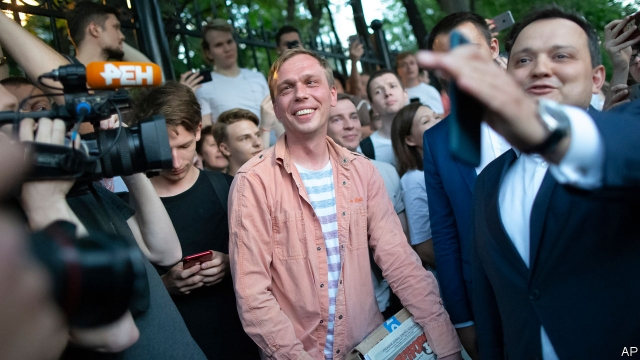

###### A rare Kremlin climbdown

# What Ivan Golunov’s ordeal reveals about Russia 

 

> print-edition iconPrint edition | Europe | Jun 13th 2019 

A  WEEK AGO few people had heard of Ivan Golunov, a freelance journalist who reports on corruption in Moscow. His work was published by Meduza, an independent news website that operates out of Latvia. Police and prosecutors ignored him. 

That changed on June 6th, when police arrested Mr Golunov in central Moscow, beat him up and charged him with the possession and distribution of drugs. They denied him access to his lawyer, and refused to conduct forensic tests. The case was clearly fabricated. Photos purporting to show a drugs lab in Mr Golunov’s flat were taken elsewhere, the police later admitted. 

Russian social media exploded. Hundreds of journalists and citizens queued up in front of police headquarters to stage “single pickets”, the only permitted form of protest, demanding Mr Golunov’s immediate release. Some were promptly bundled into police vans, further increasing the general outrage. 

The Kremlin had spent millions of dollars staging a summit in St Petersburg with Xi Jinping, the Chinese president, on the day of Mr Golunov’s arrest. In the event, the formerly obscure journalist overshadowed the powwow. The story of his arrest circulated widely; international and Russian media ran pictures and posted videos of him in tears inside a cage in a courtroom. Actors, singers and other public figures denounced his treatment. 

On June 10th three mainstream business dailies, none of them radical, came out with identical front pages, spelling out in large print: “We Are Ivan Golunov”. By 10am that day newsagents had sold out. Journalists announced a mass protest for June 12th, a holiday that marks Russia’s independence from the Soviet Union. But 24 hours before the march was supposed to start, something changed. The police abruptly dropped the case and cleared Mr Golunov of all charges. Almost simultaneously, and surely not coincidentally, a court in Chechnya released another victim of the police’s drug-planting tactics, Oyub Titiev, a human-rights campaigner. There is no doubt that the order to release both men came from the Kremlin. Yet Mr Putin is better known for encouraging rather than restraining his security services. So why the reversal? 

First, Mr Golunov’s release shows that the Kremlin is worried about losing its monopoly on force. An investigation by activists and supporters concluded that the journalist was nabbed by members of a corrupt group of FSB officers who work with the criminal underground, connections that Mr Golunov has exposed. Mr Titiev was arrested and jailed for crossing Ramzan Kadyrov, a strongman in Chechnya who commands a small army. But although neither arrest was sanctioned by the Kremlin, the gangs were only following the Kremlin’s example. Having observed their ultimate bosses act with impunity against their opponents, the police and local FSB men decided there was nothing stopping them from doing the same. 

By slapping them down, the Kremlin hopes to portray Mr Putin as the only true source of justice, a good tsar who can pardon and punish as he sees fit. This is no thaw. On June 12th the police broke up a peaceful rally against their tactics, detaining hundreds of protesters including some of the journalists who helped to get Mr Golunov freed. Alexei Navalny, Russia’s most prominent opposition leader, was also arrested, but later bailed. He said that the Kremlin’s actions only seemed illogical: “They are fantastically scared of consolidation in Golunov’s case, so they first need to break up the solidarity and then intimidate and jail those who persevere.” 

The outpouring of support for Mr Golunov shows the power of online media and a growing mood for protest. Five years of declining incomes, added to brazen corruption and injustice, make a combustible mix; the Kremlin is keen not to add a spark. But it is also keen not to let protesters seize the initiative. As Mr Putin prepares for his annual televised phone-in show on June 20th, and contemplates ways of retaining power after the end of his final presidential term under the constitution, he needs quiet on the streets. Mr Golunov’s case suggests he is unlikely to get it. ◼ 

