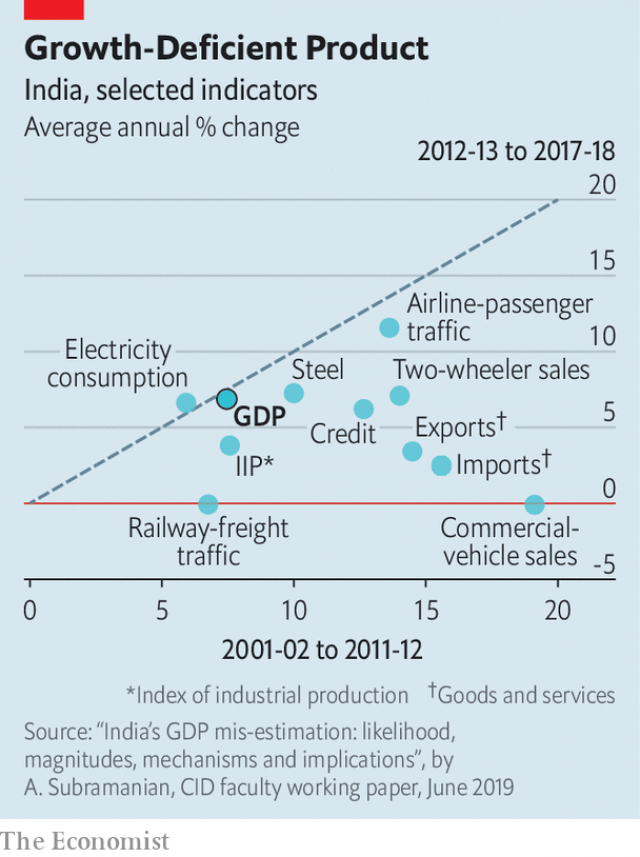

###### The Indian growth fable

# A former official casts doubt on India’s GDP figures 

 

> print-edition iconPrint edition | Finance and economics | Jun 15th 2019 

ALMOST TWO years ago Arvind Subramanian, then India’s chief economic adviser, published a little-noticed passage in the finance ministry’s annual economic survey. The previous two years posed a “puzzle”, he wrote. India had reported miracle growth in GDP (averaging 7.5%) despite miserable growth in investment, exports and credit. He looked for comparable examples elsewhere since 1991. He found none. No country had grown faster than 7% in such circumstances. None, in fact, had grown faster than 5%. India’s rapid expansion, he warned, might be hard to sustain. 

Or, indeed, hard to believe. Mr Subramanian’s official position meant he could not say that loudly then. But he is saying it now. In a paper published by Harvard University, where he is a visiting fellow, he argues that India’s growth figures have been greatly overstated. From the 2011-12 fiscal year to 2016-17, its economy officially expanded by about 7% a year, eventually outpacing China’s to become the fastest-growing big economy. That boast has helped entice over $350bn of foreign investment in the past seven years. But India’s true growth, Mr Subramanian thinks, is more like 4.5%. Rather than outperforming China, India has underperformed Indonesia. 

His paper starts by reporting a variety of indicators that have slowed sharply since 2011-12, even as growth has remained steady (see chart). He then tries to measure the size of the problem. Looking at more than 70 countries from 2002 to 2016, he estimates the typical relationship between GDP growth and four other indicators: the growth of credit, exports, imports and electricity. Before 2011 that relationship also held in India. But after it, India became an outlier. Its reported growth was over 7%, even as the weakness of imports, exports and credit suggested growth closer to 4.5%. 

 

If India’s statistics are overstated, who or what is to blame? Political meddling is an inadequate answer, although this government, under Narendra Modi, has done plenty to arouse suspicion. In November statisticians revised down growth figures from last decade, taking the shine off the previous government’s record. In January they revised up growth in 2016-18, the two fiscal years most affected by Mr Modi’s daft and disruptive decision to remove high-denomination bank notes from circulation. Both exercises raised eyebrows. 

But Mr Subramanian sidesteps these two recent controversies, excluding the latest revisions from his analysis. Instead he concentrates his fire on a more fundamental technical change: a new method of calculating GDP, from 2011-12 onwards, that was adopted in early 2015. Much of the preparation for this switch dated back to the previous government. And one of the new method’s strangest results was an upward revision of growth in the tumultuous year before Mr Modi took office, when the economy was reeling from high inflation and capital outflows. That contradicts the charge of political interference. Why would Mr Modi’s government fiddle the figures to flatter its hated predecessor? 

The new method may nonetheless suffer from other shortcomings. It may, for example, have failed to cope with the drop in oil prices in 2014. To illustrate: if an Indian company imports 10,000 rupees-worth of crude oil and adds 100 rupees of value to it, it might sell the refined product for 10,100 rupees. If the oil price subsequently halves, the company might try selling the same product for 5,110 rupees, boosting its margin. An unwary statistician might conclude that Indian prices have dropped dramatically. But the Indian part of the total (the only bit that matters for GDP) has increased in price (from 100 to 110 rupees). The confused statistician may then treat an increase in rupee profits as evidence of real growth, not merely higher prices. Such problems are less likely in more developed G20 countries, which keep better track of the prices of inputs. 

As a check on his results Mr Subramanian searched for other outliers—countries growing much faster than alternative indicators would suggest. A big example is China, a familiar target of statistical scorn. During India’s spells of real and imagined miracle growth, it has often aspired to be the next China. In the production of dubious data, it is catching up fast.◼ 

