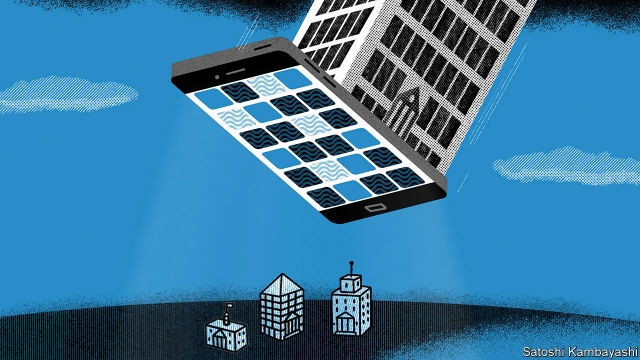
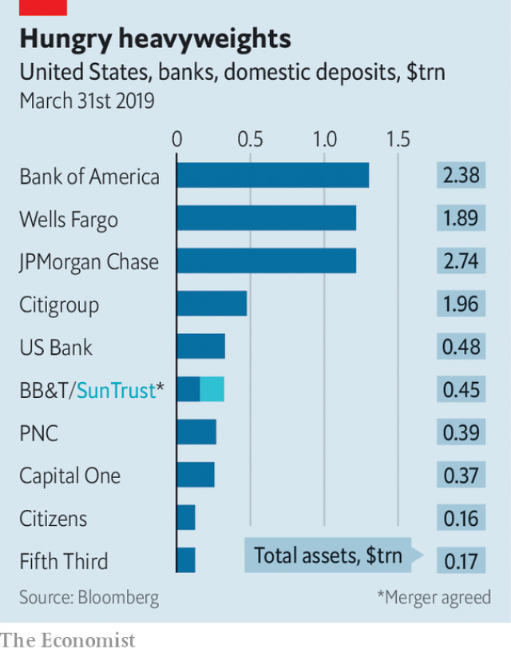

###### The giants are coming

# Digital technology will strengthen America’s biggest retail banks 

 

> print-edition iconPrint edition | Finance and economics | Jun 15th 2019 

BY ALMOST ANY measure, America’s biggest banks are behemoths. JPMorgan Chase’s balance-sheet weighs in at $2.7trn, Bank of America’s (BofA) at $2.4trn. Citigroup tips the scales at almost $2trn and Wells Fargo at $1.9trn. Their combined market value is nearly $1trn. Last year they raked in over $100bn after tax. 

Yet by one gauge, the titans are curiously tiny. Together that quartet holds only about a third of Americans’ deposits (see chart). The biggest names in other rich countries, from Canada to Sweden, have far larger shares. Perhaps only Germany’s market, with its hundreds of municipal and co-operative banks, is similarly fragmented. 

Despite years of mergers, including several mid-crisis in 2008-09, America still has over 5,300 banks. Almost 5,000 are “community” banks, mostly with assets below $1bn, which collectively hold 15% of deposits. Even the giants are still filling gaps, the fractured geography of their retail networks reflecting the genealogy of past mergers. BofA opened branches in Pittsburgh only last year and in Salt Lake City in January. The first Chase branches in Boston and Washington opened in late 2018. 

 

Digital technology is already reshaping the landscape. After 147 years of disdain for retail banking, in 2016 Goldman Sachs launched Marcus, a consumer bank. It has snared $35bn of deposits, helped by a posh brand and generous interest rates. “Our advantage is that we are unencumbered by legacy systems,” says Harit Talwar, Goldman’s global head of consumer business. Goldman built its platform in 11 months. 

Many reckon that banks, burdened with old IT and ever-emptier branches, will suffer the fate of retailers and taxi drivers. The closure of Finn, JPMorgan’s mobile brand for millennials, reported on June 6th, looks like further evidence that banks are not nimble enough for the digital age. 

Not surprisingly, they disagree. Fragmentation means that even the biggest have room to grow; they believe digitisation will help. Their advantages start with sheer firepower: JPMorgan Chase spends $11bn-odd a year on IT. They have tens of millions of customers and lots of data on their incomes and outgoings. Their brands are household names. Their funding costs are low, whereas financial-technology companies with no banking licences lack access to cheap, federally insured deposits. “They have to build something we already have,” says Dean Athanasia, president of BofA’s consumer bank—which in the past year has cut its cost-to-income ratio from an already decent 51% to 45%. Put all this together and, in the phrase of Mike Mayo, an analyst at Wells Fargo, “Goliath wins.” 

More surprisingly, most big banks still see branches as assets. Yes, they are closing lots. But to grow, they need to spread. The biggest cannot simply buy their way into new markets, because takeovers that create banks with more than 10% of all deposits are barred. So in the past few years BofA has also set up shop in Denver, Indianapolis and Minneapolis; Ohio’s big cities are next. JPMorgan Chase said in 2018 it would enter 20 markets and open 400 branches. It too is coming to Minneapolis this summer. Both are formidable competitors, aiming to reach the top three wherever they attack. 

“We go in digital first,” says Mr Athanasia. “But without the branch you can only get so far. Countless people have tried digital-only, and they never develop any scale.” Branches of Merrill Lynch, BofA’s investing arm, have also been a bridgehead. But technology makes it easier and cheaper to reach customers. “Plenty of people download the app,” says Jamie Dimon, JPMorgan Chase’s chief executive. “But, in America, they hardly ever open a bank account until we open a branch nearby.” 

By contrast Citi, whose branches are concentrated in half a dozen cities, sees little need to open many more. A vast fee-free ATM network and its huge credit-card business, which offers both own-branded cards and co-branded ones for American Airlines, Costco and others, mean it already has a mighty digital presence, says Stephen Bird, its global head of consumer banking. Citi hopes to persuade credit-card customers to open current (checking) and savings accounts, using extra card rewards as a lure. Drawing on its experience in Asia, it is offering digital lending products through its mobile app; people who would pay a credit-card bill at once may roll over a loan at a lower rate. 

As giant banks expand, who loses? Community banks may seem most at risk. The smallest are already vanishing at a rate of five per week, mainly through mergers. But as a class, local lenders are more resilient than they look, thanks largely to their expertise in small-business lending. “The CEO of a small business can talk to the CEO of a small bank,” says Aaron Fine of Oliver Wyman, a firm of consultants. “That value proposition is pretty solid.” 

Regional lenders, with neither the giants’ heft nor the community banks’ small-town appeal, may face a harder fight. This year BB&T and SunTrust, two south-eastern banks, agreed to merge, creating America’s sixth-biggest retail bank. More may bulk up to beat the behemoths. 

But the biggest regionals are not exactly surrendering. Betsy Graseck of Morgan Stanley notes that US Bank, based in Minneapolis, gained share in the year after BofA opened; Wells, the city’s other leading bank, gave up ground. US Bank, meanwhile, will this year open its first branch in Charlotte—by chance, BofA’s hometown. Tim Welsh, head of consumer and business banking, says that it already has an office serving thousands of mortgage, car-loan and credit-card customers there. 

American banking is unlikely ever to be as concentrated as in many other rich countries. But digitisation will help the biggest get bigger. Though giants are rarely nimble, it still takes a lot to fell them. ◼ 

