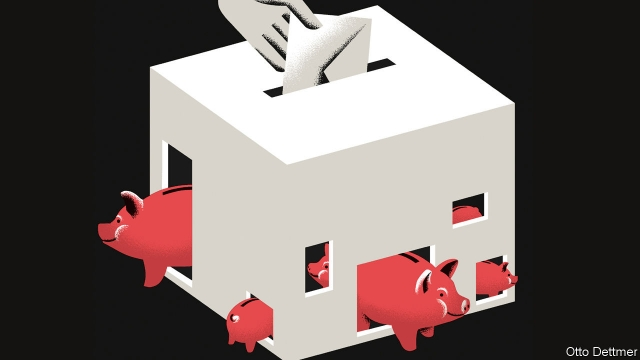

###### Free exchange

# How compatible are democracy and capitalism? 

 

> print-edition iconPrint edition | Finance and economics | Jun 13th 2019 

OF LATE THE world’s older democracies have begun to look more vulnerable than venerable. America seems destined for a constitutional showdown between the executive and the legislature. Brexit has mired Britain in a constitutional morass of its own. Such troubles could be mistaken for a comeuppance. In recent years political economists have argued that rising inequality in the Anglo-American world must eventually threaten the foundations of democracy; a book on the theme by Thomas Piketty, a French economist, has sold well over a million copies. That argument channels a time-worn view, held by thinkers from Karl Marx to Friedrich Hayek, that democracy and capitalism may prove incompatible. 

As powerfully as such arguments are made, the past century or so tells a different story. The club of rich democracies is not easy to join, but those who get in tend to stay there. Since the dawn of industrialisation, no advanced capitalist democracy has fallen out of the ranks of high-income countries or regressed permanently into authoritarianism. This is not a coincidence, say Torben Iversen of Harvard University and David Soskice of the London School of Economics, in their recent book, “Democracy and Prosperity”. Rather, they write, in advanced economies democracy and capitalism tend to reinforce each other. It is a reassuring message, but one that will face severe tests in years to come. 

Economists and political theorists have imagined all sorts of ways capitalist democracies might fail. The oldest is the worry that grasping masses will vote to expropriate the wealth (hard-earned or not) of entrepreneurs and landowners—and without secure property rights there can be no capitalism. Hayek thought that the governments of the early 20th century, in responding to the concerns of the masses, had over-centralised economic decision-making, a road that led eventually to totalitarianism. Other thinkers followed Marx in reckoning that it was the greed of the capitalists that would do the greatest harm. Joseph Schumpeter feared that as firms grew more powerful, they might push a country towards corporatism and clientelism, winning monopoly rights that would generate profits they could share with politicians. Mr Piketty and others say that inequality naturally rises in capitalist countries, and that political power becomes concentrated alongside economic power in an unstable way. Other economists, like Dani Rodrik, have argued that full participation in the global economy forces a country to give up a degree of either national sovereignty or democracy. Lowering barriers to trade means harmonising trade and regulatory policies with other countries, for instance, which reduces each government’s ability to accommodate domestic preferences. 

But if capitalism and democracy are such uneasy bedfellows, what explains their long co-existence in the rich world? Mr Iversen and Mr Soskice see capitalism and democracy as potentially mutually supporting, with three stabilising pillars. One is a strong government, which constrains the power of large firms and labour unions, and ensures competitive markets. Weaker countries find it harder to resist the short-term expediency of securing power by protecting monopolies. The second is a sizeable middle class, forming a political bloc that shares in the prosperity created by a capitalist economy. A bargain is struck in which the state provides mass higher education on generous terms, while encouraging the development of frontier industries that demand skilled workers. Middle-class households thus reckon that economic growth is likely to benefit them and their children. (Rising inequality is not a threat to capitalist democracies, the authors reckon, because middle-class voters care little about the poor and do not support broader redistribution that could raise their tax bills.) 

Providing the education, infrastructure and social safety net that support a prosperous middle class requires substantial tax revenue. For the system to hold a third pillar is needed: large firms that are not very mobile. Before recent rapid globalisation that was no problem. Yet even now firms are more rooted than commonly thought. Though multinationals are adept at shifting production and profits around the world, in a knowledge economy leading firms cannot break their connections to networks of skilled individuals like those in London, New York or Silicon Valley. Their complex business plans and frontier technologies require the know-how developed and dispersed through these local networks. That increases the power of the state relative to firms, and allows it to tax and spend. 

Quibble with the details, but the overarching story—immobile companies giving governments a degree of sovereignty, which they self-interestedly use to boost the middle classes—seems a plausible account of the stability of advanced capitalist democracies. It leaves plenty to be concerned about, however. It hinges on the middle classes feeling confident about the economy. A sharp slowdown in growth in real median incomes, as in America and Britain in recent years, might not send voters rushing to the barricades, but could strengthen the appeal of movements that threaten to disturb the status quo. Governments, too, are becoming less responsive to middle-class priorities. America’s is too dysfunctional, and Britain’s too distracted by Brexit, to focus on improving education, infrastructure and the competitiveness of markets. 

Demographic change might also take a toll: older and whiter generations may not much care whether a would-be middle class that does not look like them has opportunities to advance or not. Then, too, the authors may have underestimated the corrosive effect of inequality. Threatening to leave is not the only way the rich can wield power. They control mass media, fund think-tanks and spend on or become political candidates. Proud democracies may well survive this period of turmoil. But it would be a mistake to assume survival is foreordained.◼ 

