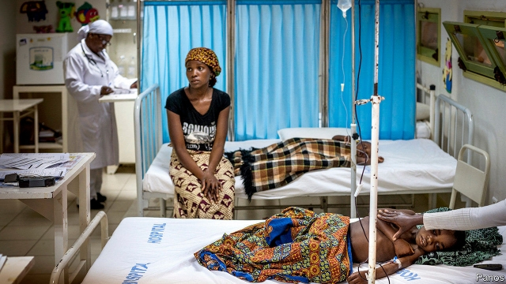

###### Open book

# How to stop governments borrowing behind their people’s backs 

 

> print-edition iconPrint edition | Finance and economics | Jun 13th 2019 

IN 2016 THE government of Mozambique confessed to secret debts of $1.4bn, or 11% of GDP, mostly as loan guarantees for state-backed companies. Growth faltered, the currency slumped and foreign donors pulled back. The results have been “devastating”, says Denise Namburete, a civil-society activist, describing health centres that have gone two years without medicines. American prosecutors are pursuing eight people involved in the scandal, including three foreign bankers and a former finance minister, on charges of money-laundering and fraud. 

The Mozambique case may be unusual—or not. Even the IMF is scratching its head about how much governments truly owe. In some places the mystery is loans from China and other emerging lenders. In others it is advance payments from oil traders, liabilities from public-private partnerships or hidden loans from commercial banks. The Institute of International Finance (IIF), a group of banks and financial institutions, has responded to mounting concern by drafting principles on debt transparency. Finance ministers of G20 countries endorsed them at a summit in Fukuoka, in Japan, on June 8th-9th. 

The IIF principles are voluntary and would apply only to lending from the private sector, not from states. Lenders would disclose any loans they make to low-income governments or state firms within 60-120 days of funds being released. Details would include the loan’s purpose and structure, and a range within which the interest rate falls. The data would be held by an international institution, perhaps the IMF or World Bank. 

The G20 countries could use their voting power at the IMF to insist it stores the data. Their endorsement will have weight with the private sector, says Sonja Gibbs of the IIF. Although lenders benefit from knowing more about government debts, some are reluctant to share information they consider commercially sensitive. They will need to be pressed to take part. “It will be a name and shame game,” says Mark Plant of the Centre for Global Development, a think-tank. “That sometimes works, it sometimes doesn’t.” 

How to give the scheme bite? One proposal is that sovereign-loan contracts that are not publicly disclosed within 30 days of signature should be unenforceable in court. Most international loans are made under New York or English law—as Mozambique’s dodgy deals were—so tweaking the rules in those two jurisdictions would be a good start. Case law and legal institutions are so well established that business would be unlikely to move elsewhere, argues Tim Jones of Jubilee Debt Campaign, the British charity behind the idea. Some 51 MPs have written to the British chancellor to support Jubilee’s proposal, among them former Labour and Conservative secretaries of state for international development. On June 5th the Labour Party said it would implement the idea if it wins power. 

Legal changes are not yet on the G20’s agenda. But rising debts are fuelling a sense of urgency. The IMF reckons that 44% of low-income countries are in debt distress or at high risk of it—even without more nasty surprises. The average developing country’s external-debt payments have risen from 6.6% of government revenue in 2010 to 12.2% in 2018, calculates Jubilee. Clandestine debts could mean the actual picture is even worse. ◼ 

