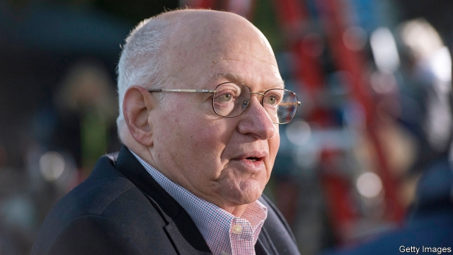

###### An economic institution

# Martin Feldstein was a pillar of American economics 

 

> print-edition iconPrint edition | Finance and economics | Jun 15th 2019 

FOR A HALF-CENTURY Martin Feldstein was everywhere you looked in American economics. He was an astoundingly prolific columnist, sometimes churning out several a week, for several newspapers, on the big economic stories of the day. He was a fixture at conferences and seminars and the teacher, for two decades, of Harvard University’s introductory economics course. He served presidents of both parties. In short Mr Feldstein, who died on June 11th aged 79, was an American economic institution. 

Born in New York City, he spent most of his life in Cambridge, Massachusetts, at Harvard, where he moved in 1967 after a doctorate at Oxford. His early career was remarkably productive. In 1974 he published an influential paper examining how Social Security, America’s public pensions system, affects saving patterns. Astonishingly, he concluded that the programme reduced personal saving by between 30% and 50%; throughout his life he was a staunch advocate for its reform. 

In work with Charles Horioka he identified one of the great enigmas in international economics, now known as the Feldstein-Horioka puzzle. Economists reckon that capital free to move should go where returns are highest. There should therefore be little correlation between a country’s savings and domestic-investment rates, since places with too little investment should offer investors higher returns, sucking in capital from abroad. In fact, they pointed out, the two rates are quite closely linked, an oddity that still motivates research. For his academic work Mr Feldstein was awarded the John Bates Clark medal in 1977, given (then every second year, now annually) to the top American economist aged under 40. 

His work earned him the attention and respect of politicians. As the chair of Ronald Reagan’s Council of Economic Advisers from 1982 to 1984, he helped shape the Tax Reform Act of 1986, which dramatically simplified the tax code and slashed tax rates. Two decades later he served Barack Obama as a member of the Economic Recovery Advisory Board, convened to gather ideas for addressing America’s worst economic crisis since the Depression. 

Yet Mr Feldstein’s most enduring contributions are likely to be to the profession of economics itself. For 30 years he led the National Bureau of Economic Research (NBER), helping to secure its place as an essential conduit for economic scholarship. He convened regular meetings of scholars to encourage collaboration, and built the NBER’s working-paper series into one of the world’s most respected vehicles for publicising new research. 

Just as important, he mentored and inspired scores of young economists, including some who became giants of the field and prominent public servants, among them Larry Lindsey, an adviser to George W. Bush, and Larry Summers and Jason Furman, who advised Mr Obama. For quite some time to come, Mr Feldstein’s influence will still be there, everywhere you look in American economics. ◼ 

