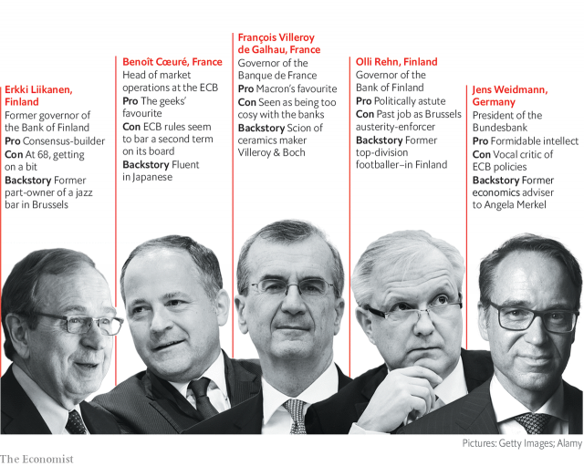

###### Triangulation

# The ECB presidency is distinct but not immune from backroom deals 

 

> print-edition iconPrint edition | Finance and economics | Jun 15th 2019 

“THE LONGEST lunch in history” is how Jonathan Powell, an adviser to Tony Blair, a former British prime minister, has described the appointment of the first head of the European Central Bank (ECB) in 1998. The French, keen to have their man in the job, had convinced the Germans that Wim Duisenberg, a Dutchman, should serve only half of his eight-year term before making way for a Frenchman. Mr Duisenberg resisted, giving in only after midnight. 

The choice in 2011 of the third and current president, Mario Draghi, an Italian, involved less drama. Even so, France and Italy fell out after Lorenzo Bini Smaghi, another Italian on the bank’s six-strong executive board, initially refused to give way to a French national. “What can I do? Shall I kill him?” Silvio Berlusconi, then Italy’s prime minister, asked Nicolas Sarkozy when his French counterpart complained. 

Mr Draghi departs in October. What tales will be told of his successor’s selection? The scope for theatrics is greater than ever. The choice is always political: national leaders make nominations and eventually agree on a name. But Mr Draghi’s term ends in the wake of European elections, as they are also deciding other top jobs. At a summit on June 20th-21st the European Council of leaders aspires to pull off a package deal covering the key roles. Succeed or no, the next few months will be a test of whether the process for choosing the next ECB leader has become any more sensible. 

No one knows precisely who is in the running: there is no formal nomination process. Among the five leading contenders, pictured above, is Jens Weidmann, the hawkish chief of the Bundesbank. As a former adviser to Angela Merkel he helped form her hard line on Greece during its sovereign-debt troubles. Olli Rehn, the head of the Bank of Finland and a former EU commissioner, is also seen as a candidate. 

Erkki Liikanen, Mr Rehn’s well-liked predecessor in Helsinki and also a former commissioner in Brussels, is in contention, as is François Villeroy de Galhau, the governor of the Banque de France. So is Benoît Cœuré, a Frenchman already on the ECB’s executive board, though the ECB’s rules seem unlikely to permit him a second term as a member. Klaas Knot, the Dutch central-bank head, Klaus Regling, the head of the EU’s bail-out fund, and Sylvie Goulard, deputy head at the Banque de France, are also mentioned. 

Officials in Berlin and Paris claim that they see the ECB presidency as distinct from the three more political jobs of the heads of the commission and European Council and the high representative, or the EU’s foreign-policy chief. They describe their approach as “3+1”, says Mujtaba Rahman of Eurasia Group, a consultancy. Perhaps Mr Draghi’s crucial role in keeping the currency union together during the sovereign-debt crises in 2010-12 has taught everyone that the bank’s president needs more than a modicum of competence. 

Looming economic threats should remind them why their decision matters. A trade slowdown is hammering the euro area’s economy. A row between Rome and Brussels over public debt risks unnerving investors. Market expectations of euro-zone inflation in five years’ time have drifted below the bank’s 2% target. On June 6th Mr Draghi said the bank would keep interest rates low for the next year, and raised the possibility of further asset purchases. 

Mr Weidmann is the most contentious candidate. His vocal opposition to ECB asset-purchase programmes was reportedly derided by Mr Draghi as “Nein zu allem”(“No to everything”). Appointing him would be a mistake, says Christian Odendahl of the Centre for European Reform, a think-tank: the bank would be less activist in downturns and less supportive of fiscal easing. That prospect could lose him the support of countries keen on further integration, such as France and Spain, in which case Germany might instead plump for another northerner, perhaps one of the Finns. 

But the decision cannot be divorced entirely from the EU’s tiresome preoccupation with balance of various sorts. Despite their noble talk about “3+1”, leaders still want national balance on the bank’s six-strong executive board, which, together with the 19 governors of national central banks, constitutes its policymaking body. Having had an Italian at its helm for eight years, and a Spanish vice-president, the received wisdom is that the ECB presidency now belongs to a northerner—if not to Germany, which has yet to hold the post. 

Such calculations, surprisingly, are the reason Mr Weidmann seems to have support from Italy, even though it is the country most likely to benefit from the unconventional policies he has spoken against so forcefully. Its finance minister, Giovanni Tria, has said that he would be “open” to Mr Weidmann as president. The reason seems to be that once the top job is allocated, any compatriots already on the board tend to step down. If the job goes to a Frenchman or German, that would leave a gap for Italy to claim. Italian economists suspect further Machiavellian plotting: if the ruling populists were to elevate an official at the Bank of Italy to the ECB, that in turn gives them a chance to install one of their own at the bank in Rome, realising their ambition to gain influence over it. 

The obsession with balance extends across European institutions. Leaders want to ensure that nationalities, genders and party affiliations are well-represented across the top jobs. Emmanuel Macron, France’s president, sees the commission presidency as the prize, says Mr Rahman. The price could be a German at the ECB. 

All this means that expertise is not the sole criterion for replacing Mr Draghi. And until the commission presidency is decided, there are plenty of permutations. A drawn-out process raises the risk that the job is traded for other positions. Other names could emerge. A fudge, with the 68-year-old Mr Liikanen doing half a term and giving way for someone else, is not impossible. Just as a break with the past cannot yet be ruled out, nor can a reversion to it. ◼ 

