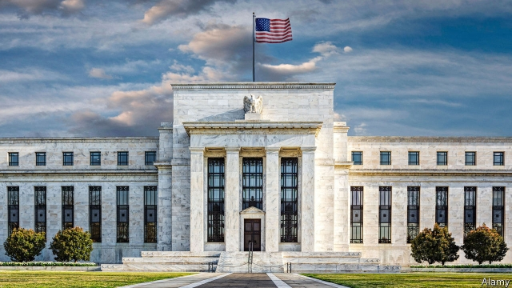

###### Monetary policy

# The market believes the Fed will cut rates by September. Should it? 

 

> print-edition iconPrint edition | Finance and economics | Jun 13th 2019 

THE FEDERAL RESERVE is changing direction. In December it predicted that it would raise the federal funds rate twice in 2019, to 2.75-3.0%. In March it thought it would hold rates steady instead. Investors now think there is a one-in-five chance that it will cut rates at its meeting on June 19th, and a 95% chance that it will do so by September (see chart). Jerome Powell, the Fed’s chairman, has said it is “ready to act”. 

The reason for the change is a darkening world economy, caused primarily by the failure of America and China to strike a deal to bring their trade war to an end. Yet for all the ructions, the visible impact on America’s hard economic data has so far been relatively small. True, American firms hired only 75,000 workers in May, on first estimate, well below the recent monthly average. But jobs data are volatile, and the unemployment rate is a very low 3.6%. 

Where the pain of the trade war has shown up is mainly in financial markets. The ten-year Treasury yield, for instance, was 2.5% in early May but has since fallen to 2.1% as investors have rushed to safety and anticipated rate cuts. Large moves like these raise an uncomfortable question for the Fed. Should it yield to the market, thereby risking the appearance that monetary policy is set by traders? Or should it consider only backward-looking economic data, which move slowly? 

 

Markets provide the aggregated wisdom of a crowd of individuals with money on the line. In most contexts their forecasts will outperform those of a financially disinterested committee, even one made up of experts. But there are other reasons why an apparent discrepancy between the two may endure. 

The first is that there is not really a discrepancy at all. Suppose the Fed and the market make the same judgment about the risk of an economic shock such as a trade war. “The Fed has the luxury of more time,” says Torsten Slok, an economist at Deutsche Bank. It can wait to see what happens before changing policy, whereas investors must hedge their bets immediately to account for even unlikely events. 

The second is that markets agree with the central bank about the economic outlook, but are confused about how it will act. “The Fed might have failed to communicate well,” says Frederic Mishkin, a former rate-setter. 

Only if these possibilities can be ruled out can central bankers conclude that markets are telling them something they need to hear about growth and inflation. Discerning this signal becomes trickier the more the Fed appears to respond to the market. To see why, suppose that the Fed ignores market movements completely, and instead sets policy in an entirely predictable way, responding only to hard data on growth and inflation. Any change in market expectations about Fed policy would then reflect only changes in investors’ perception of the outlook for those variables. “If Fed policy is clear and systematic,” says Charles Calomiris of Columbia University, “policymakers can glean useful information from markets.” The more the Fed responds to the market, however, the more it is “looking in the mirror”, as Alan Greenspan, a former Fed chairman, supposedly once quipped. 

If monetary policy were entirely automated, however, the information embodied in markets would be useful but unused. What is more, reacting only to real data is like driving while looking only in the rear-view mirror. Central bankers often say that monetary policy works only with a lag of 18 months or two years. Many economists believe that flat-footedness at the Fed has been to blame for numerous post-war American recessions. 

If the Fed wants to glean useful information from markets, it cannot pander to them. “The Fed needs to be the dog that wags the tail,” says Mr Mishkin. But when market movements have a fairly clear cause—in today’s case, the trade war—and the reaction is severe, it is likely that a rate cut will eventually be necessary. The short-term risk of moving in anticipation of events is that the outlook brightens and the rate cut then sparks inflation. Yet to the extent that economic data are telling a clear story, it is that inflation is contained. Consumer-price inflation, for example, slowed to 1.8% in May. That suggests it would be better for the Fed to get on with the rate cuts that the market expects. ◼ 

