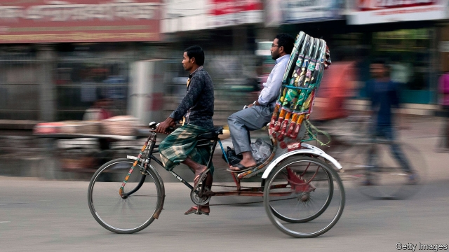

###### More is less

# Why an anti-poverty programme in Bangladesh failed 

 

> print-edition iconPrint edition | Finance and economics | Jun 15th 2019 

A YEAR AND a half ago The Economist wrote about a promising approach to cutting poverty in Bangladesh (“On their bikes”, January 27th 2018). RDRS, a charity, was offering small loans to more than 100,000 poor farmers on the condition that they migrated temporarily to a city for work. Everything seemed to be set fair. Smaller randomised controlled trials had shown that many men could be persuaded to move while the rice crop is growing, when there is not much work to be done at home. Although the migrants found only low-paid jobs, as rickshaw drivers, building labourers and the like, their fortunes had greatly improved. It looked like a true poverty cure. 

Sadly, things soon began to go wrong. Evidence Action, the charity overseeing the scheme, heard rumours that somebody involved with the project may have sought to bribe a government official, though it could not substantiate them. More damningly, as the data came in, it became clear that in 2017 few men had been persuaded to migrate. On June 6th Evidence Action announced it was shutting down the scheme. What looked like a miracle cure for poverty now seems like a warning about the pitfalls of development projects. 

Do-gooding schemes that work brilliantly in trials often fail when they are scaled up, says Justin Sandefur of the Centre for Global Development, a think-tank. Trials are often overseen by determined PhD students. When large charities or government officials take over, as they must if a project is to be done at scale, much changes. Rules and regulations multiply; bad behaviour becomes more likely. Big schemes can attract hefty opposition. 

One charity in Kenya had shown that hiring teachers on fixed-term contracts improved pupils’ test scores. So the government rolled out the contracts across the country. But a political backlash meant that the contracted teachers were promised trade-union representation, just like ordinary teachers. Not surprisingly, an evaluation by Mr Sandefur and others found that the government’s reform had no effect. 

In Bangladesh the problem may have been targets. Many of the “migration organisers” who fanned out to villages, offering to subsidise journeys to cities, seem to have been expected to sign up 450 migrants each. They may have done what anybody would do in that situation: approach men who had migrated before or were especially eager to travel. Because most of those men would have made the journey anyway, the project had little effect. 

Mushfiq Mobarak of Yale University, who helped develop the Bangladesh migration project, says that the episode shows how important it is to keep collecting and analysing data as schemes grow. But, as he points out, it is possible that exactly the opposite lesson will be learned. Rigorous, ongoing analysis of development projects is slow, expensive, hard—and, as researchers keep discovering, liable to turn up uncomfortable facts. It is much easier just to assume that your project is doing good.◼ 

