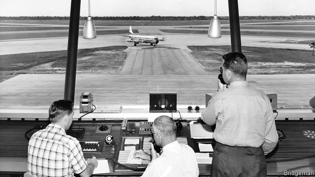
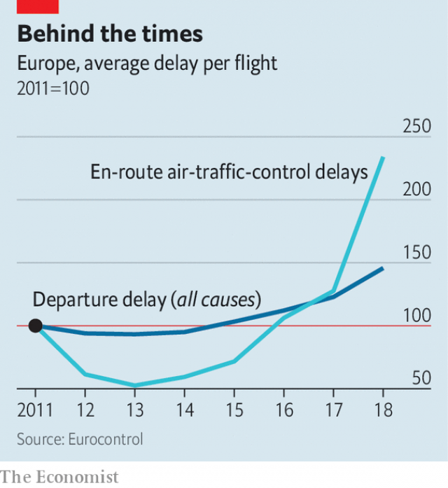

###### Losing control

# Air-traffic control is a mess 

 

> print-edition iconPrint edition | International | Jun 15th 2019 

AT FIRST GLANCE, the industrial estate near Maastricht’s out-of-the-way airport, hardly appears the future of civil aviation. But it houses the Maastricht Upper Area Control Centre (MUAC), where up to 100 air-traffic controllers work at a time to ensure that planes flying high above Belgium, Luxembourg, the Netherlands and north-western Germany do not bump into each other. Covering one of Europe’s busiest air spaces, every day its controllers guide 1,200 planes through a 16km (10-mile) gap in Belgium between two military no-flight zones—without any near misses. 

Founded in 1972 by Eurocontrol, an intergovernmental agency, MUAC was the world’s first attempt to pool controllers between countries. Still the only such venture, it is one of the most modern and cost-efficient control centres in Europe. That is partly thanks to its use of technology. Pilots and controllers at MUAC, for instance, communicate through digital messages—much faster than speaking over a two-way radio. “Here is the future,” beams John Santurbano, MUAC’s director. It is a future few countries are embracing, though rising congestion is making flight delays and cancellations more common across the world. 

MUAC’s control room, alas, is far from typical. Most air-traffic controllers still rely on technologies used in the second world war. Planes are located by radar, though global-positioning satellites are cheaper and more accurate. Information is exchanged by voice radio instead of by data link. And—hard to credit in the digital age—in America controllers still hand each other slips of paper to track aircraft. Meanwhile, small drones—invisible to radar and impervious to voice messages—are proliferating and flying higher. 

The system cannot cope with demand. And across the world, heavier traffic and constrained control capacity are leading to big increases in flight delays and cancellations. In America the length of delays caused by air-traffic control problems soared by 69% between 2012 and 2017. In China the average delay per domestic flight spiked by 50% in 2017 and remains at an average of 15 minutes per flight. In Europe things are worsening faster than anywhere (see chart). Last year, according to Eurocontrol, the length of delays due to en route air-traffic-flow problems grew by 105%. Over 60% of those delays were because of a lack of capacity or staff, 25% were weather-related and 14% caused by strikes by controllers and others. Eamonn Brennan, boss of Eurocontrol, expects things to be as bad, if not worse, this year. 

 

The cost of this is huge. Eurocontrol estimates that the delays and cancellations caused by air-traffic-flow problems cost the European economy €17.6bn ($20.8bn) last year, up by 28% on 2017. Holding planes in the air and making them fly farther wastes fuel. More efficient air-traffic control could bring fuel savings of 5-10% per flight, reckons Graham Spinardi of the University of Edinburgh. Moreover, public confidence has been shaken by several near-misses. In 2017 an Air Canada jet carrying 140 people misunderstood the controllers’ instructions and nearly landed on a taxiway where four aircraft were parked. In 2016 an Eva Air flight from Los Angeles flew perilously close to a mountain peak after an air-traffic controller’s instructions confused right with left. 

This is just what controlling air traffic is intended to avoid. The current system developed in the 1950s after a series of deadly mid-air collisions. In 1956 two aircraft collided over the Grand Canyon, killing all 128 on board. Soon after, in 1958, America gave the FAA the power to manage air traffic over its territory. Other countries soon set up their own air-traffic-control systems. 

The market for air-traffic services is worth over $14bn, according to Markets and Markets, a research firm. But unlike airlines and airports, air-traffic control is, with few exceptions, still run by national governments. Of the EU’s 28 member states the air-traffic services of only two—Britain and Italy—have private shareholders. 

The drawbacks to the present system of managing air traffic were evident even in the 1950s. In 1960 Britain, France, Germany and the Benelux countries set up Eurocontrol, intending to merge their airspaces. In 2001 the goal of creating a “Single European Sky” became official EU policy. The hope was that it would boost efficiency and that economies of scale would save money. A single air-traffic regulator could carve the continent into blocks based on traffic flows rather than national borders. 

But, apart from the small area covered by MUAC, virtually no progress has been made since 1960. One reason is that Britain and France want to retain sovereignty over their skies for military reasons. But opposition also comes from the controllers themselves. Last October ATCEUC, an umbrella group for controller unions in Europe, attacked the idea of setting targets for improving air-traffic services as “a waste of time and effort”. Trade unions see a merger as a backdoor for introducing new technology. That would cut costs for airlines and passengers—and threaten controllers’ jobs. The ATCEUC insists that “humans have to remain at the core of air-traffic management”. Moreover, unions and national politicians do not want a single regulator moving well-paid jobs to places in eastern Europe with cheaper labour. 

Razvan Bucuroiu, Eurocontrol’s head of network strategy, says that, blocked from fully integrating national systems, Eurocontrol is trying to reduce delays by encouraging airlines and national air-traffic managers to divert flights to less busy routes. It has also redesigned flight paths as far away as Malmö in Sweden to accommodate the new airport in Istanbul, which fully opened in April. 

But these measures will only “stop the bleeding for one summer”, explains Thomas Reynaert of A4E, an airline-trade body based in Brussels. The extra capacity they produce will be gobbled up by rising demand for air travel. And the longer flights the plans entail will waste even more fuel. 

So the EU is changing tack, releasing a report in April calling for the creation of a “Digital European Sky”. Instead of merging each country’s air-traffic manager, the focus is on cutting costs by, for example, setting a common standard for digitisation to ensure each country invests in compatible systems. A reform of licensing, which limits controllers to working only in one region, would also encourage them to move to where they are needed. 

This reflects a realisation in Brussels that merging air-traffic-control services would not be a magic bullet. After all, America and China, continent-sized countries with single air-traffic control services, still endure rising congestion. 

In many places, options are limited by the closure of air space for military purposes. In China four-fifths of air space is reserved for military use, according to the Centre for Asia Pacific Aviation, a consultancy. So the thin corridors open to civil aircraft are congested. Britain has dealt with this by closing military air space only during air-force exercises, instead of all the time as in the rest of Europe and China. 

That governments run air-traffic systems themselves adds to the problems. In America for instance, the FAA, a government agency, is vulnerable to budget cuts from Congress and cannot borrow to invest in new technology to boost productivity. As a result, in 2017 the cost for each flight-hour controlled was almost a third less in Canada than in America, where Nav Canada is an independent company allowed to borrow. For instance, it has replaced paper slips with digital ones, and is licensing that technology to other control systems around the world. Public ownership may also encourage excessive pay demands from trade unions. In 2010 the Spanish government found that at least ten controllers were paid over €810,000 ($1.1m) a year. Today the average Spanish controller takes home more than €200,000 a year—over seven times the average salary in the country and more than pilots earn. France’s militant air-traffic controllers spent the equivalent of nearly nine months on strike between 2004 and 2016, according to a report by a finance committee of the French Senate—mainly because of sympathy strikes for other public-sector workers. 

Nonetheless, airlines argue that privatisation alone is not the answer. Air-traffic services can charge extortionate prices whether or not they are in public hands, notes Kenny Jacobs of Ryanair, Europe’s largest low-cost carrier. MUAC, for instance, made a profit margin of 70% in 2017. Air-traffic-control services should have to compete against each other to lower costs, argues Andrew Charlton of Aviation Advocacy, a consultancy based in Switzerland. If different private companies had franchises for different blocks, they could offer airlines competing prices and services to attract flights. And governments could encourage competition by holding auctions for these contracts every five or ten years. 

Nowhere has yet gone that far. But some countries do already contract out control of their upper-air space. Australia, Fiji and New Zealand have long run the upper-air space over Pacific islands for the islands’ governments. HungaroControl, Hungary’s forward-thinking air-traffic-control service, has done the same for Kosovo since 2014. It is also a pioneer of remote air-traffic-control towers for airports, hoping eventually to use its cheaper local labour to offer control-tower services to other airports from its base in Budapest. 

Even so, real reform that will stop air-traffic-control failures from wrecking millions of holidays each summer is unlikely without more political will, says David McMillan of the ATM Policy Institute, a think-tank in Geneva.EU officials privately concede that in the short term they have given up hope of merging air-traffic services in the way Eurocontrol originally intended. Similarly, in America, a tentative proposal to split air-traffic-control services from the FAA into a separate entity, as in the rest of the developed world, was last year grounded in Congress. Although big airlines, airports and controller unions supported the proposals, the business-aviation lobby opposed them, worried that private jets might eventually be forced to pay for the air-traffic services they currently get free, thanks to American taxpayers. 

And so, back at MUAC in Maastricht, Mr Santurbano jokes that if he had to advise a young person today on how to find a well-paid job unlikely to be disrupted by automation for decades to come, he would suggest air-traffic control. “That’s how well reform is going in this industry.”◼ 

