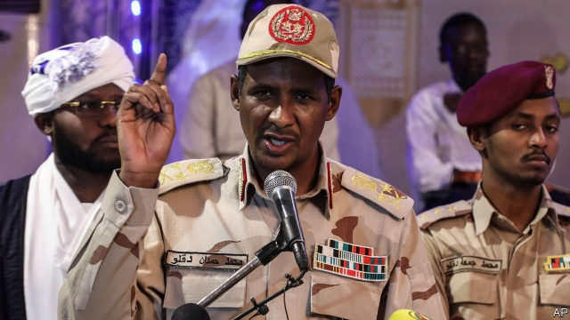

###### Crisis in Khartoum

# How to stop Sudan sliding into war 

 

> print-edition iconPrint edition | Leaders | Jun 15th 2019 

THE BURST of optimism in Sudan did not last long. In April, after months of mass protests, a tyrant was deposed. President Omar al-Bashir, who had ruled for 30 years, was ousted in a bloodless coup. No one was sorry to see him go. Mr Bashir had unleashed genocide in the western region of Darfur, his violent oppression drove the southern third of his vast country to secede, and he presided over a regime of exceptional cruelty and avarice. Alas, the joyful crowds who gathered in Khartoum to serenade his departure and paint their faces the colours of the Sudanese flag have been tragically let down. 

The Transitional Military Council, a junta that took over, has no intention of holding free or fair elections, as the crowds demand. To underline this point, on June 3rd a paramilitary group called the Rapid Support Forces (RSF) started slaughtering peaceful protesters (see article). They shot and killed at least 100, probably far more. Some were thrown howling from bridges. Since then the RSF, which grew out of the Janjaweed, a militia notorious for village-burning in Darfur, has terrorised the capital. Militiamen barge into shops and steal goods. Both men and women are raped. The clear aim is to intimidate civilians into giving up hope of a say in who rules them. 

The junta, however, is far from united. The RSF reports to Muhammad Hamdan Dagalo, its deputy head, a warlord who goes by the nickname Hemedti. Although theoretically junior to the junta’s chairman, General Abdel Fattah al-Burhan, Mr Dagalo has become the most powerful man in Sudan. By letting his hired killers rampage through Khartoum, he appears to be signalling that he wants to be president, and will deal firmly with anyone who gets in his way. Other members of the junta are unhappy with this. Officers of the regular army are hostile to Mr Dagalo’s ambitions and furious that an ill-disciplined militia is looting the capital. This divide risks descending into civil war.  

Sudan is a mosaic of feuds. One ended when the mostly non-Muslim and black African south split from the Muslim and Arab-dominated north in 2011. But South Sudan took most of the oil, leaving less cash for Khartoum to buy off the many northern factions. Mr Bashir stayed on top for three decades by setting these factions against each other. Hoping to coup-proof his regime, he divided power between the army, the RSF and the intelligence service. All now dislike and distrust one another. In April, when Mr Bashir ordered the intelligence services to fire on protesters and clear the streets, soldiers of the regular army protected the crowds. To prevent a civil war, the generals teamed up with Mr Dagalo to depose Mr Bashir. Now they are falling out. 

Outsiders complicate the picture still further. Egypt, Saudi Arabia and the United Arab Emirates (UAE) support the junta and have promised it $3bn in cash. But within the junta they back different forces. Egypt supports the army, perhaps because Egypt’s president is also an army man. Egypt wants stability and hates the idea of a bloodthirsty militia with Islamist ties ruling its neighbour. Saudi Arabia and the UAE, by contrast, back Mr Dagalo with guns and money, because his militia has provided thousands of footsoldiers for their pointless war in Yemen. 

Pro-democracy demonstrations keep breaking out in Sudan, despite the regime’s repression. Discipline in the armed forces is said to be breaking down: soldiers are demanding weapons to protect Khartoum from the RSF. Some predict open war, or even a Syrian-style implosion that sucks in outside powers. 

To avert such a disaster, Sudan needs a power-sharing agreement, led by civilians but with representatives of the armed forces—an arrangement that worked reasonably well after a revolution in Burkina Faso in 2014. Outsiders should press for it. The African Union has made a good start by suspending Sudan and threatening sanctions on Sudanese military chiefs unless they hand over to civilians. The United States needs to persuade its Gulf allies and Egypt that they share a common interest in keeping Sudan stable (not least to keep out their regional rivals, Iran, Qatar and Turkey). The Trump administration should urge them to set aside their differences and work together to defuse the time-bomb in Khartoum. Donors should be poised to help any plausible effort to move towards election and civilian rule. 

Sudan is wobbling on a cliff-edge above an inferno. A concerted international effort might just pull it back from the brink. It would be unforgivable not to try.◼ 

