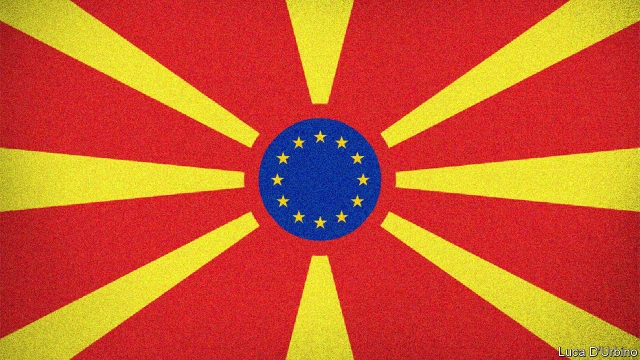

###### A Balkan betrayal

# The EU must keep its promise to North Macedonia 

 

> print-edition iconPrint edition | Leaders | Jun 13th 2019 

ENLARGING THE European Union long ago fell out of fashion. No country has joined since Croatia became the 28th member, in 2013. As the leaders of Hungary and Poland attack the independence of their judiciaries it seems quaint to argue, as many once did, that negotiating membership would instil democratic habits in countries with long memories of dictatorship. How much harder to make the case in the Balkans: Kosovo and Serbia are at daggers drawn, and Bosnia is an ungovernable mess. 

But a happier story is unfolding in the country known, since February, as North Macedonia. After years of authoritarian misrule the new government, led by Zoran Zaev, has started tackling corruption and reforming the judiciary. In an unhappy region, the country’s Slavic majority and Albanian minority enjoy good relations. And last year Mr Zaev’s government signed the Prespa agreement with Greece, ending a destabilising dispute over the country’s name. (Greece insists that “Macedonia” can refer only to a Greek region, but has grudgingly accepted “North Macedonia”.) 

Recognising all this progress, the European Commission wants the EU’s governments to open membership talks with North Macedonia. It was the promise of accession to the EU (and to NATO, which is going ahead) that helped Mr Zaev push through Prespa at home. In June 2018 his bid to start talks was kicked down the road for a year. Now, alas, further delay is likely. 

Opposition to the talks has come in part from France’s president, Emmanuel Macron, who argues that the EU should concentrate on deeper integration rather than adding new members. History, however, suggests that there is not necessarily a trade-off between these goals. On the contrary, previous waves of widening have in the view of many required more deepening. Anyway, now that the European elections are over Mr Macron’s opposition seems to have lessened: he probably feared the issue would help Marine Le Pen, his nationalist rival. 

Other opponents of widening argue against admitting more eastern European countries in which democracy and the rule of law are weak. Bulgaria’s accession, it is said, has allowed its numerous criminal gangs free access to the union. That is a fair objection for Albania, with which the commission is also proposing membership talks after its progress in other areas. But not for North Macedonia which has been doing well under Mr Zaev. 

The commission’s original hope was for ministers to approve the two candidates’ EU bids at a meeting on June 18th. But resistance from MPs in Angela Merkel’s Christian Democratic Union makes that improbable: she needs a mandate from parliament before she can agree. A special summit could be called in July were North Macedonia’s bid sure to pass. But the Bundestag will soon begin its summer break, and another opportunity will not arise until October. By then the habit of delay may have become ingrained. 

Such treatment would be shabby, and dangerous. North Macedonia’s opposition is ready to pounce at any sign of failure. And by autumn Greece may well have a new centre-right government that will face strong pressure from anti-Prespa voters to stall the talks. More broadly, for the EU to break its promise to one Balkan state will boost leaders in others who say the Europeans cannot be trusted, and other powers sniffing around, from Russia to China to Turkey, will take note. Conversely, opening talks with North Macedonia will strengthen the hand of pro-European reformers throughout the Balkans. Starting talks does not commit anyone to concluding them, as Turkey knows only too well. To reject North Macedonia without even trying to reach an agreement would be cruel, self-defeating and wrong. ◼ 

