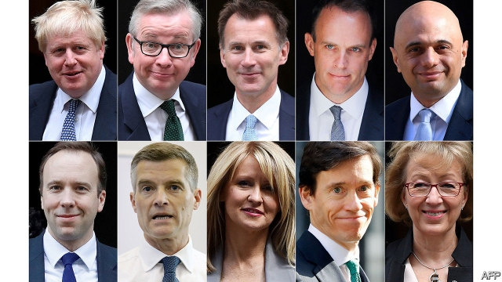
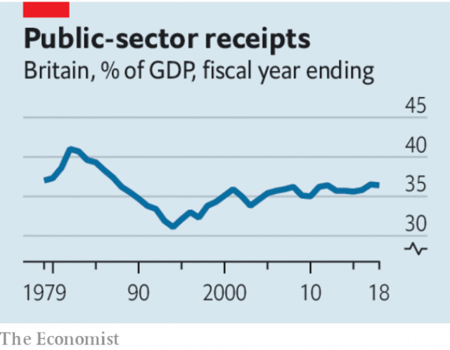

###### A Conservative clown show

# The Tories are throwing away their reputation for economic prudence 

 

> print-edition iconPrint edition | Leaders | Jun 15th 2019 

BRITAIN’S CONSERVATIVES like to think they are the party of economic competence. Although they have overseen some debacles in recent decades, they have typically had a clear vision for the British economy. In the 1980s, under Margaret Thatcher, they deregulated markets, privatised state-run industries and encouraged home ownership. In the 2010s their defining idea has been fiscal rectitude. By cutting spending and slightly raising taxes they have contained the rise of Britain’s public debt. 

Competence has turned to chaos. This week Tory MPs nominated ten candidates to replace Theresa May as leader of the party, and thus as prime minister (see article). In a triumph of chest-thumping over economic reason, most say they are prepared to see the country crash out of the European Union without a deal. And, between them, the candidates are championing tax policies that are reckless, unjust and ill-informed. 

Britain is a third of the way through the Brexit breathing space that the EU gave it in April. By the time a new prime minister is in place, there will be only three months to go—hardly enough time to renegotiate the deal Mrs May already struck with the EU, even were Brussels prepared to budge. Yet several Tory contenders, including Boris Johnson, the front-runner, promise that Britain will leave on October 31st come what may. The threat of a disorderly rupture with the EU hangs over Britain’s economy, which appears to have shrunk in March and April, in part because carmakers halted production after the original Brexit deadline. 

 

You might think that risking the biggest disruption to the economy since wartime was enough incompetence for one party. You would be wrong. Amid creaking public services—on which two-thirds of voters want more spending, even if it means higher taxes—the candidates are proposing huge tax giveaways, often directly to their supporters. Mr Johnson pledges to hand an average of £2,000 ($2,550) a year to the top 10% of earners. Jeremy Hunt wants to slash corporation tax from 19% to 12.5%. Dominic Raab has suggested cutting the main rate of income tax by a barely credible five percentage points. Michael Gove would replace VAT with a lower sales tax. 

These proposals range from unwise to extraordinarily bad. Mr Johnson’s tax cuts would be both a waste of scarce resources and grossly unfair. He would reduce their cost by raising national-insurance contributions, a payroll tax. As a result the biggest beneficiaries would be well-off pensioners, because payroll taxes fall only on those in work. The policy is a shameless bribe to the elderly and prosperous Tory party members who choose the leader. Wealthy pensioners have already been coddled during Britain’s period of austerity, enjoying protected benefits (such as free access to the BBC, taken away this week to much bleating) even as working-age welfare has been slashed. Many are homeowners who have also benefited from the soaring property prices that are locking youngsters out of ownership. 

Mr Gove rightly condemns “one-club golfers”, like Mr Johnson and Mr Raab, who want to cut taxes no matter the circumstances. But Mr Gove’s plan to scrap VAT is a bogey. The tax distorts the economy less than most levies. It is also less regressive than is often claimed, because of exceptions for basic goods. And because it is paid by businesses throughout a supply chain, with each claiming back the tax paid earlier, it is hard to avoid. Mr Gove’s sales tax might be simpler, but it would create a single point of failure where avoidance would be lucrative: the final sale to consumers. Every rich-world economy has a VAT except America, which should have one. Where are Mr Gove’s wonks? 

Among the most-fancied candidates, Mr Hunt’s plan is the least bad of a dire bunch. Corporation tax deters investment and is increasingly unsuited to a modern economy of digital, cross-border sales. Yet cutting it so deeply would be odd given the pressures on the budget and the fact that the rate has already fallen from 28% to 19% this decade. It would be better to overhaul the tax to target cashflows rather than profits—as proposed by Sam Gyimah, an MP who wanted to be leader but could not persuade enough of his colleagues to nominate him. 

The sum total is a mix of ideas that smack of desperation and panic. Entertaining a no-deal Brexit is a reckless attempt to hold back Nigel Farage’s Brexit Party at the ballot box. Mr Johnson’s tax cut is a beggarly plea for party members’ votes based on self-interest, but with little appeal to the broader electorate. Mr Gove seems anxious to find a benefit in Brexit (the EU requires that member states levy VAT). 

Panic produces poor policy (see article). The Tories should be focused on an orderly Brexit while confronting economic questions that predate the referendum. For the party’s market liberals, that should mean deciding how to promote a small-state philosophy in an already deregulated and privatised economy. For moderate “one nation” Tories, it should mean finding policies to help left-behind places and reduce regional inequality. For all of them, it should mean honesty about the fact that, in the long run, spending cannot go up as taxes are cut. 

At the moment the Tories are leaving the big thinking on economics to Jeremy Corbyn, the hard-left leader of the Labour Party. They are failing to make the best argument against putting him in Downing Street—that he is a unique threat to British prosperity. Losing that debate is the greatest risk of all. ◼ 

