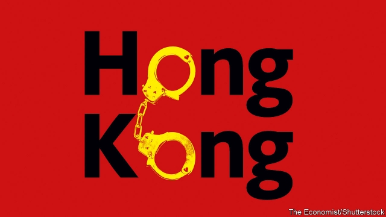

###### People v power

# The rule of law in Hong Kong 

 

> print-edition iconPrint edition | Leaders | Jun 13th 2019 

THREE THINGS stand out about the protesters who rocked Hong Kong this week. There were a great many of them. Hundreds of thousands took to the streets in what may have been the biggest demonstration since Hong Kong was handed back to China in 1997. Most of them were young—too young to be nostalgic about British rule. Their unhappiness at Beijing’s heavy hand was entirely their own. And they showed remarkable courage. Since the “Umbrella Movement” of 2014, the Communist Party has been making clear that it will tolerate no more insubordination—and yet three days later demonstrators braved rubber bullets, tear gas and legal retribution to make their point. All these things are evidence that, as many Hong Kongers see it, nothing less than the future of their city is at stake. 

On the face of it, the protests were about something narrow and technical (see article). Under the law, a Hong Kong resident who allegedly murdered his girlfriend in Taiwan last year cannot be sent back there for trial. Hong Kong’s government has therefore proposed to allow the extradition of suspects to Taiwan—and to any country with which there is no extradition agreement, including the Chinese mainland. 

However, the implications could not be more profound. The colonial-era drafters of Hong Kong’s current law excluded the mainland from extradition because its courts could not be trusted to deliver impartial justice. With the threat of extradition, anyone in Hong Kong becomes subject to the vagaries of the Chinese legal system, in which the rule of law ranks below the rule of the party. Dissidents taking on Beijing may be sent to face harsh treatment in the Chinese courts. Businesspeople risk a well-connected Chinese competitor finding a way to drag them into an easily manipulated jurisdiction. 

That could be disastrous for Hong Kong, a fragile bridge between a one-party state and the freedoms of global commerce. Many firms choose Hong Kong because it is well-connected with China’s huge market, but also upholds the same transparent rules that govern economies in the West. Thanks to mainland China, Hong Kong is the world’s eighth-largest exporter of goods and home to the world’s fourth-largest stockmarket. Yet its huge banking system is seamlessly connected to the West and its currency is pegged to the dollar. For many global firms, Hong Kong is both a gateway to the Chinese market and central to the Asian continent—more than 1,300 of them have their regional headquarters there. If Hong Kong came to be seen as just another Chinese city, Hong Kongers would not be the only ones to suffer. 

The threat is real. Since he took over as China’s leader in 2012, Xi Jinping has been making it clearer than ever that the legal system should be under the party’s thumb. China must “absolutely not follow the Western road of ‘judicial independence’,” he said in a speech published in February. In 2015 Mr Xi launched a campaign to silence independent lawyers and civil-rights activists. Hundreds of them have been harassed or detained by the police. The authorities on the mainland have even sent thugs to other jurisdictions to abduct people, including a publisher of gossipy books about the party, snatched from a car park in Hong Kong and a tycoon taken from the Four Seasons hotel in 2017. The message is plain. Mr Xi not only cares little for the rule of law on the Chinese mainland. He scorns it elsewhere, too. 

The Hong Kong government says the new law has safeguards. But the protesters are right to dismiss them. In theory extradition should not apply in political cases, and cover only crimes that would incur heavy sentences. But the party has a long record of punishing its critics by charging them with offences that do not appear political. Hong Kong’s government says it has reduced the number of white-collar offences that will be covered. But blackmail and fraud still count. It has said that only extradition requests made by China’s highest judicial officials will be considered. But the decision will fall to Hong Kong’s chief executive. That person, currently Carrie Lam, is chosen by party loyalists in Hong Kong and answers to the party in Beijing. Local courts will have little room to object. The bill could throttle Hong Kong’s freedoms by raising the possibility that the party’s critics could be bundled over the border. 

It is a perilous moment. The protests have turned violent—possibly more violent than any since the anti-colonial demonstrations in 1967. Officials in Beijing have condemned them as a foreign plot. Ms Lam has been digging in her heels. But it is not too late for her to think again. 

In its narrowest sense, the new law will not accomplish what she wants. Taiwan has said that it will not accept the suspect’s extradition under the new law. Less explosive solutions have been suggested, including letting Hong Kong’s courts try cases involving murder committed elsewhere. Anti-subversion legislation was left to languish after protests in 2003. There is talk that the government may see this as the moment to push through that long-shelved law. Instead Ms Lam should take it as a precedent for her extradition reform. 

The rest of the world can encourage her. Britain, which signed a treaty guaranteeing that Hong Kong’s way of life will remain unchanged until at least 2047, has a particular duty. Its government has expressed concern about the “potential effects” of the new law, but it should say loud and clear that it is wrong. With America, caught up in a trade war with China, there is a risk that Hong Kong becomes the focus of a great-power clash. Some American politicians have warned that the law could jeopardise the special status the United States affords the territory. They should be prudent. Cutting off Hong Kong would not only harm American interests in the territory but also wreck the prospects of Hong Kongers—an odd way to reward its would-be democrats. Better to press the central government, or threaten case-by-case scrutiny of American extraditions to Hong Kong. 

But would this have any effect? That is a hard question, because it depends on Mr Xi. China has paid dearly for its attempts to squeeze Hong Kong. Each time the world sees how its intransigence and thuggishness is at odds with the image of harmony it wants to project. When Hong Kong passed into Chinese rule 22 years ago, the idea was that the two systems would grow together. As the protesters have made clear, that is not going to plan. ◼ 

