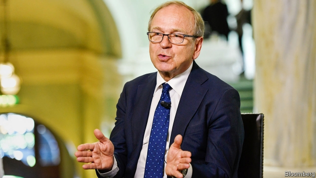

###### Presidential credentials

# Why Erkki Liikanen should be the ECB’s next boss 

 

> print-edition iconPrint edition | Leaders | Jun 15th 2019 

ONE OF THE biggest jobs in Europe is up for grabs: head of the European Central Bank (ECB). It sets interest rates across much of the continent, supervises banks and underwrites the euro, used by 19 countries with 341m citizens. The ECB’s outgoing boss, Mario Draghi, who steps down in October after eight years in charge, has done a sterling job in difficult circumstances. His tenure illustrates what is at stake. After a sovereign-debt crisis in 2010-12 threatened to sink the euro, it was Mr Draghi who ended the financial panic by pledging that the ECB would do “whatever it takes” to stop the euro zone from breaking up. 

Although he saved the euro, Mr Draghi leaves behind problems. The economy is faltering; a recession at some point in the next eight years is possible. There is little prospect of fiscal easing—Germany doesn’t want to borrow more and southern Europe can’t afford to. So monetary policy is the main lever to stimulate growth. Unfortunately interest rates are close to zero. And the risk of another debt crisis bubbles away. Italy’s populists have been ignoring demands from the European Commission to take control of the public debt, now 132% of GDP. 

Europe’s political leaders will gather on June 20th and 21st to divide up the top jobs in Europe, including the ECB presidency. The temptation will be to make the central-bank position part of the horse-trading, picking the new chief on the basis of nationality. Instead, for Europe’s sake, the selection should be determined by three tests: economic expertise, political talent and sound judgment. 

Technical competence matters. Interest rates are so low that the bank’s toolbox may need to be expanded in creative ways. Political nous is more important than at other big central banks such as the Federal Reserve. The new boss must build support in the bank’s 25-strong rate-setting body, and across 19 national governments and their citizens. The bank must also make the case for further reform to the euro zone, without which banking and sovereign-debt crises are a constant danger. And, if a crisis does strike, sound judgment becomes paramount. If the markets sniff equivocation or muddle from the ECB president, the financial system could rapidly spiral out of control, as panicky investors dump the bonds of weaker banks and countries. 

When Mr Draghi was appointed in 2011, he was already a strong candidate. Since then he has passed the three tests. He expanded the ECB’s toolkit by standing ready to buy up unlimited amounts of sovereign debt, known as outright monetary transactions, or OMTs (the promise was enough to reassure investors and the policy has never been implemented). He put his personal authority on the line and marshalled support outside the ECB. 

None of today’s leading contenders is as impressive (see article). Some risk undermining the bank’s hard-won credibility. Jens Weidmann, the head of the Bundesbank, opposed OMTs. In a crisis, markets might worry that he would be prepared to let the euro zone collapse. Olli Rehn, the newish head of the Bank of Finland, could invite doubt, too. In a previous role in Brussels he was an enforcer of austerity on southern European countries, which might in the future need the ECB’s help. Benoît Cœuré, the head of the ECB’s market operations, is clever and impressive. But the bank’s fuzzy rules appear to bar him from a second term on its board. 

Erkki Liikanen, a former boss of Finland’s central bank, has the best mix of attributes for the role. Although he is less technically strong than some other candidates, Philip Lane has recently taken over as the ECB’s chief economist: the bank will not lack intellectual clout. Mr Liikanen was a vocal advocate of unconventional tools. His political skills have been tested both as a commissioner in Brussels and as finance minister in Helsinki. Mr Draghi has transformed the ECB, but 21 years after its creation, there are still nagging doubts about its strategy and firepower. With Mr Liikanen at its helm, they might be put to rest at last.◼ 

