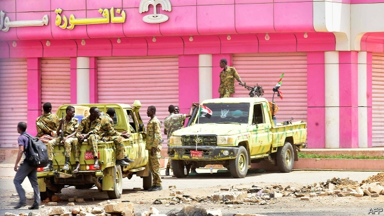

###### Crisis in Khartoum

# A struggle for power in Sudan could lead to civil war 

 

> print-edition iconPrint edition | Middle East and Africa | Jun 15th 2019 

SAMAHIR MUBARAK, a 29-year-old pharmacist, points to a television in the corner of her living room. On the flickering screen a presenter warns viewers not to pick up the weapons that litter the streets of Sudan’s capital, Khartoum. “Peaceful, always peaceful,” urges the presenter of “Sudan of Tomorrow”, a new TV channel. 

For Ms Mubarak, the channel is a source of hope. She is an organiser of the peaceful protest movement that prompted the army to oust Sudan’s murderous dictator, Omar al-Bashir, in April. On June 3rd, however, security forces killed more than 100 peaceful demonstrators, including 19 children. Since then, the capital has been in lockdown. The internet has been switched off and hundreds have been arrested. Many activists have gone into hiding. Television, Ms Murabak explains, is now one of the few ways to mobilise people against the Transitional Military Council, the junta that replaced Mr Bashir and is refusing to hand power to civilians. “If you look at people’s faces there is anger,” she says. “How can we accept military rule now?” 

There is little open rebellion. Most people stay at home, afraid of the Rapid Support Forces (RSF). This paramilitary group of perhaps 30,000 men, which is rampaging through the capital, grew out of the Janjaweed, a genocidal militia that has terrorised Darfur for two decades. On June 9th security forces ransacked the University of Khartoum and killed at least four of the few protesters brave enough to man the remaining barricades. A strike called by the opposition has paralysed the city. Nearly all shops, restaurants and small businesses are shuttered. Wild dogs roam Khartoum’s normally bustling streets. 

Talks between the junta and the protesters broke down last month when it said it would not allow civilians to lead a transitional government. Relations have worsened further since the massacre, which the generals blamed on criminals and “organised groups paid by certain parties”. International mediators including Abiy Ahmed, Ethiopia’s prime minister, have tried to broker peace. But trust in the junta was further undermined when it arrested several opposition leaders a day after they had met with Abiy. 

The mixed signals coming from the junta—negotiating one day and making arrests the next—may reflect splits within it. The main fracture line is between generals in the regular armed forces and Muhammad Hamdan Dagalo (widely known as Hemedti), who controls the RSF. Although the junta is headed by Abdel-Fattah Burhan, an army general, power has steadily shifted towards Mr Dagalo, his deputy, whose militiamen are now riding around the capital in gun trucks. 

The RSF’s brutality may be Mr Dagalo’s undoing. Many officers regard it as an ill-disciplined mob. Residents of the capital, who weeks ago cursed the army, now look to it for protection from the “Janjaweed 2”, as they have dubbed the RSF. “We need a military presence on the streets,” says a nervous businessman. “If they left we’d be another Libya.” 

Some think further atrocities by the RSF could spark fighting with the army. If that were to happen the RSF would “loot and shoot and kill anything”, says a UN official. “No creature will be spared, not even a donkey.” Those who can have quietly begun leaving the country. 

There are also grumblings in the National Intelligence and Security Service, which had remained faithful to Mr Bashir until the end. Its leader, Salah Gosh, resigned shortly after the coup. It is not clear where the spies’ loyalties now lie, but they are thought to loathe the RSF for its betrayal of Mr Bashir, who used to call Mr Dagalo “Hemayti” (“my protector”) and who elevated the RSF into a praetorian guard. “The leader right now should be from the army,” says a former intelligence official. 

Yet even the generals are divided about how to pull back from the brink of chaos. Many think that a political settlement with protesters is the junta’s best hope of gaining legitimacy and forestalling a civil war. But “there are elements within the junta which want to turn back the clock” and impose military rule “based on coercion not consent”, says Murithi Mutiga of the International Crisis Group, a watchdog. 

International pressure may help convince them otherwise. On June 6th the African Union suspended Sudan until the generals give way to a civilian-led government. America has sent Tibor Nagy, its senior diplomat for Africa, to Sudan and has asked the junta’s main backers—Egypt, Saudi Arabia and the United Arab Emirates (UAE)—to use what influence they have to restrain the generals. Perhaps in response to the pressure, on June 12th the army said it would release political prisoners. The opposition movement called off its general strike in order to resume talks. 

But there is little common ground. The generals still insist on having a military man in charge of the interim government. Leaders of the protest movement are demanding an international investigation into the massacre. They also want RSF troops to withdraw from Khartoum and other cities. Some, like Ms Mubarak, say no transitional government can include any of those responsible for atrocities. 

One thing that ought to unite generals and opposition is that the longer the stalemate continues, the greater the risk of a civil war. That would not only be disastrous for the country, but could also suck in outside powers such as Qatar and Turkey, which have lost influence since the fall of Mr Bashir, or Iran, which has proved adept at filling vacuums. 

Alex de Waal of Tufts University likens Sudan’s situation to that in Yemen, where regional powers have fought a proxy war since 2015. They could, he suggests, “do to Sudan what they’ve done to Yemen”. ◼ 

