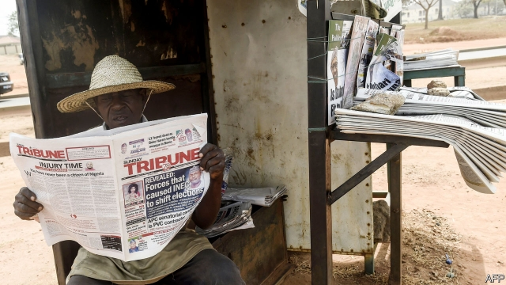

###### Don’t gag me

# An attack on free speech in Nigeria 

 

> print-edition iconPrint edition | Middle East and Africa | Jun 15th 2019 

NIGERIA’S PRESIDENT, Muhammadu Buhari, once described press freedom as a “sound democratic ideal”. At the time he was on the presidential campaign trail, keen to prove himself a democrat and to jettison the baggage of his 20 months as military ruler in the 1980s. He told bosses of media companies that, if elected, he would uphold the constitution and respect freedom of speech. 

Four years on—and just weeks into his second term in office—that promise is wearing thin. Earlier this month the Nigerian Broadcasting Commission (NBC) switched off transmission from Nigeria’s oldest private television channel and from radio stations owned by Raymond Dokpesi, a member of the opposition People’s Democratic Party, for “inciting broadcasts and media propaganda against the government”. Within 24 hours they were back on air after a federal high court overturned the suspension. 

Mr Buhari has not commented, but one of his aides praised the blackout. “Kudos to the NBC,” she tweeted. Mr Buhari’s supporters insist the suspension had nothing to do with politics. Critics note that the head of the NBC, who was appointed by Mr Buhari, is a member of the ruling party. 

The brouhaha is an uncomfortable reminder of Decree Number 4, a media-gagging rule imposed by Mr Buhari when he was a military ruler. It criminalised the publication of “any message, rumour, report or statement” that brought the government or any public officer “to ridicule or disrepute”—ie, any journalism feistier than a weather report. 

Nigeria has vibrant and critical media. And unlike several other African leaders, Mr Buhari has never tried to shut down the internet to silence critics. But repression is on the rise. The Nigerian Guild of Editors called the closure of the stations a “barbaric crackdown” on free speech and pointed out that the government has closed several other radio and television stations over the past year. In January soldiers raided the offices of one of the country’s leading newspapers, the Daily Trust, and arrested reporters. In March a journalist who had previously been held without access to a lawyer for two years was rearrested. In both cases, national security was cited as justification. The Committee to Protect Journalists, a watchdog in New York, has also recorded multiple instances in which security forces have beaten and arrested journalists, including an attack on a reporter by police on June 5th. 

The lyrics of a musician Mr Buhari’s old military regime once jailed, the late Fela Kuti, still resonate as powerfully as ever. “Je’nwi temi” (“Don’t gag me”), he crooned in Yoruba. ◼ 

