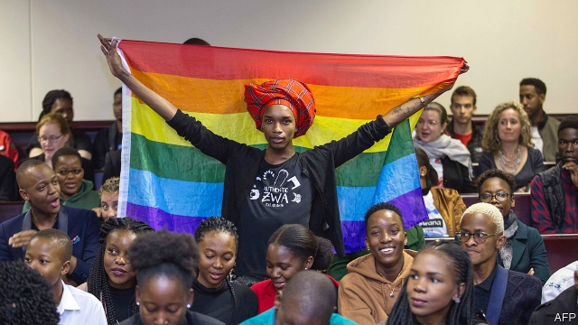

###### Love and the law

# Botswana legalises gay sex 

 

> print-edition iconPrint edition | Middle East and Africa | Jun 15th 2019 

IN ZIMBABWE “SODOMY” can land you in prison for a year. In Zambia “carnal knowledge against the order of nature” could mean seven or more years behind bars. Uganda passed a law in 2013 punishing gay acts with life imprisonment, though a court later struck it down. 

Botswana’s high court decided that such laws “deserve a place in the museum or archives and not in the world”. Judge Michael Leburu, who read out a unanimous verdict when the court struck down the country’s ban on gay sex, said: “It is not the business of the law to regulate private consensual sexual encounters.” This ruling follows the unbanning of gay sex in Angola in January and in Mozambique in 2015. So far, South Africa is the only sub-Saharan country that allows gay marriage. 

However, gay people are still persecuted by law in more than 30 African countries. In some, such as Sudan and Somalia, their love is punishable by death. Although such laws are seldom enforced, they leave people open to extortion and abuse. 

Anti-gay laws also reinforce a culture of intolerance in many countries. In May religious conservatives rejoiced when Kenya’s High Court upheld a law that criminalises gay sex. Judges found that it did not violate a constitutional guarantee of freedom from discrimination, though it plainly discriminates against gay people. (Kenya’s constitution also promises everyone “adequate housing”, so perhaps the framers did not expect it to be taken literally.) 

Botswana is a conservative place, too. Hereditary chiefs advise parliament, rather like hereditary lords do in Britain. But views about gay people are evolving. Discriminating against them at work has been illegal since 2010—despite the ban on their bedroom activities. And younger people in Botswana are more tolerant than their elders. Some 76% of 50-64-year-olds would object to a gay neighbour; only 48% of 18-29-year-olds would.◼ 

