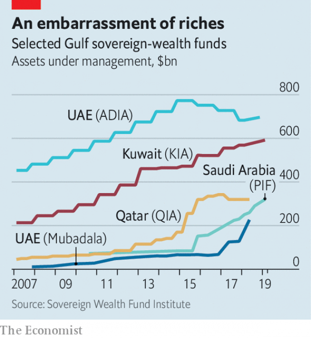

###### Sovereign wealth, sovereign whims

# Gulf states are becoming more adventurous investors 

 

> print-edition iconPrint edition | Middle East and Africa | Jun 15th 2019 

A DECADE AGO, few people in Silicon Valley had heard of Uber or the Public Investment Fund (PIF). The former had not provided its first ride. The latter, a Saudi sovereign-wealth fund, was a small entity with investments in local industry. But when the ride-sharing firm went public in May the PIF was among its five largest shareholders. It had bought a 5% stake in 2016 when Uber was valued at $49 per share. It started trading at $42. On paper, Saudi Arabia took a $200m loss. 

The world’s sovereign-wealth funds control $8trn in assets. More than a quarter of that is held by four Gulf countries: Kuwait, Qatar, Saudi Arabia and the United Arab Emirates (UAE). In decades past this was a dull business. The Saudi central bank parked the nation’s oil wealth in Treasury bonds and other low-risk, low-return assets. Kuwait had one of the first stand-alone sovereign-wealth funds. It too invested in bonds and blue-chip companies. 

No longer. All six Gulf sovereign-wealth funds are growing more adventurous. A few act like venture capitalists. Others use their billions to cement political alliances. The rest are trying to give a leg-up to local businesses and industries. 

Gulf economies need to modernise and diversify away from oil and gas. Saudi Arabia, especially, needs to create good jobs for its swelling number of underemployed citizens. Sovereign-wealth funds can help. Some were originally set up to do little more than smooth the flow of revenue arising from bumps in commodity prices. Now, they are being given more ambitious goals. The princes who call the shots in the Gulf want to make their countries’ savings work much harder. Others fret that the princes themselves are part of the problem—that tens of billions of dollars should not change hands on a royal whim. 

 

Saudi Arabia is the most aggressive risk-taker of the lot. Though the central bank still holds $500bn in assets, it is being eclipsed by the PIF, a pet project of the crown prince. Five years ago the fund had $84bn under management. Today it has $320bn. It has become an unexpected patron of Silicon Valley, with big stakes in Tesla and Lucid Motors, a rival electric-car manufacturer, as well as Virgin Galactic and Magic Leap, a maker of virtual-reality headsets. Another $45bn went into a high-tech fund managed by SoftBank, a Japanese conglomerate. These deals could be lucrative—if the firms ever turn profits. Uber never has. The tie-up with SoftBank made the kingdom an investor in WeWork, a property startup that is posting huge losses as it pursues rapid growth. 

Qatar, by contrast, seems to use its fund as an adjunct to diplomacy. It has a tiny population and the world’s third-largest gas reserves, so its rulers worry little about short-term investment returns. “We don’t have unemployment. All Qataris can find a job,” says Ahmed al-Sayyed, a former director of the Qatar Investment Authority (QIA), which holds $1m in assets for each of the emirate’s 300,000 citizens. 

In its early days it ploughed money into swanky investments in Europe: QIA owns a large chunk of London, including the Harrods department store. A subsidiary owns the Paris Saint-Germain football club. 

Lately its investments have taken on a political tinge. Last year it secured a 19% stake in Rosneft, a Russian energy giant. The emir also pledged to invest billions in Turkey (though Qatar has not yet done so). Both countries are important partners. Russia’s military intervention in Syria made it a power in the region. Turkey has troops stationed in Qatar. No one questions these deals. The chairman of QIA and his deputy are relatives of the emir. 

Bahrain and Oman lack the oil and gas wealth of their neighbours, and their holdings are an order of magnitude smaller. But they seem determined to use them as tools to modernise their economies. Bahrain’s fund, Mumtalakat, was founded in 2006 with 8bn dinars ($21bn) in assets. Its early investments were domestic. It bought a stake in Gulf Air, the state telecoms firm and other national champions. Just 3% of assets went abroad. Today the figure is 30%. Instead of risky tech firms, it focuses on companies offering services such as education and health care. It hopes to convince some to open regional offices in Bahrain, which positions itself as a services hub for the Gulf. 

Other Gulf states are making similar attempts at state-directed capitalism. Abu Dhabi’s Mubadala has made big investments in renewable energy, building solar and wind farms across the country. A $200m subsidiary of Oman’s main sovereign-wealth fund wants to bring high-tech firms to the sultanate. “The agenda is to develop the local ecosystem, not just to have capital flow to Britain or America,” says Ali Qaiser, an Omani venture capitalist. 

All could do well to look at the world’s wealthiest sovereign, Norway, which manages about $1trn in its oil-surplus fund. Parliament oversees its investments. A recent decision to dump oil and gas stocks and pour money into renewables was the subject of long public debate. 

Funds in the Gulf lack such transparency. Some do not even publish regular financial statements. Each is controlled by a few officials close to the monarch. Qatar has bought assets that look more like vanity projects than sound investments. Saudi Arabia may regret gambling on tech firms beset with regulatory and managerial problems. Khadem al-Qubaisi, the former director of an Abu Dhabi fund, was arrested for his dealings with 1MDB, a defunct Malaysian development fund that was a cesspit of corruption. 

Governments in the Gulf urge citizens not to worry about the future: when oil and gas revenue stops flowing, sovereign-wealth funds will pick up the slack. Those promises mean little if the funds are run like personal fiefs. ◼ 

