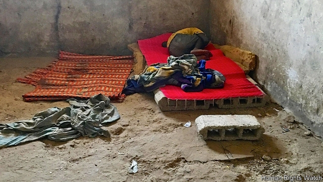

###### Chained to tradition

# Thousands of children are abused in Senegal’s religious schools 

 

> print-edition iconPrint edition | Middle East and Africa | Jun 13th 2019 

MBAR LIFTS up his trousers and points at the marks where the chains wore his skin away. He was 11 when his father sent him from his village to a religious school on the outskirts of Senegal’s holy city of Touba. His teacher made him recite passages from the Koran in the morning. Then Mbar (not his real name) was sent out to the streets to beg for money for his master until night fell. If he misbehaved, he was beaten or starved. 

After two years Mbar ran home. But his father sent him to another school. This time he was not made to beg. Instead, he was chained to a wall. “I couldn’t move. They used to bring me a bucket to pee in,” says Mbar, in a cracked voice. 

Senegal is one of Africa’s more successful countries. It is peaceful. Its government functions relatively well and the economy is growing at 7% a year. But along the old boulevards of Dakar, the capital, thousands of talibé—the “seekers” attending nearby religious schools—beg for change. Some boys are as young as four. Many families send their sons to such schools, or daaras, where they memorise the Koran. Some do so for religious reasons but, for many, daaras offer the only opportunity for children to get a basic education. Many marabouts, or religious teachers, respect children’s rights. And begging has long been accepted as a way of teaching talibés humility and funding their education. 

But the system is almost completely unregulated, and rackets flourish. A new report by PPDH, a coalition of Senegalese rights groups, and Human Rights Watch in New York, documents some of the abuse suffered by the estimated 100,000 children who are forced to beg. 

Isolated and far from home, dozens of boys sleep in filthy rooms. They are given just enough food to survive. If they fail to meet their begging quota of about $1 per day, or try to escape, they may be beaten, starved or chained for weeks at a time. Many are sexually abused. According to a psychologist at Samu Social, a centre working with boys in Dakar, many children try to kill themselves or hurt themselves deliberately so they will need medical attention and can get out of the daaras. From 2017 to 2018, researchers recorded at least 16 incidents in which children died from beatings, neglect or poor conditions. 

Most of the boys come from farms or villages in Senegal, but some are also trafficked from the Gambia, Guinea Bissau and Mali. Agents go to rural areas and promise parents that the boys will study at the best religious schools in Senegal. The costs for the traffickers are minimal. They pay border guards about $1 a child to smuggle them in from Gambia, says Issa Kouyaté, who runs Maison de la Gare, a talibé shelter in Saint-Louis, a city in northern Senegal. 

Government officials have repeatedly pledged to deal with the problem, but their attempts have been half-hearted. The daaras are powerful and the marabouts can influence the way people vote in elections. Politicians compete for their support. 

In 2013 a law setting minimum standards for daaras was drafted. It has yet to be passed by parliament. In 2016 President Macky Sall spoke about taking the children off the streets and jailing those who forced them to beg. But official figures show that only about 300 children were helped in 2018. Children often beg openly outside police stations. The marabouts who abuse them rarely face justice. 

All this may be storing up trouble for Senegal. “You have a large population of impoverished, abused children, isolated away from their families. I can’t think of a more perfect target population for criminals,” says Jeffrey Bawa of the United Nations Office on Drugs and Crime, a UN agency, adding that the boys were also likely to be future targets for jihadist recruiters. 

Mbar was chained to the wall for a month. An older, stronger boy kept the keys for the chains in his robe and disciplined the children when the marabout was away. One night he left his robe on the floor near Mbar, who found the keys and unlocked himself from the wall. He couldn’t find the key for the chains around his ankles but it was enough. He jumped out of the window. Strangers helped him out of his chains and took him to a shelter in Dakar. After almost a year of eating good food, he is beginning to grow again and dreams of becoming a footballer. ◼ 

