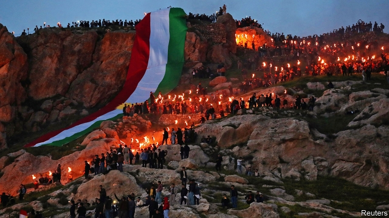

###### Comeback Kurds

# Two years after a disastrous referendum, Iraq’s Kurds are prospering 

 

> print-edition iconPrint edition | Middle East and Africa | Jun 15th 2019 

THE MONITOR recording the descent of a drill beneath the green hills of Khor Mor, in Iraqi Kurdistan, flashes 3,044—or just over 3km. In a caravan next to a roaring derrick a Canadian oilman and his team from Crescent Petroleum, a company based in the United Arab Emirates, watch for the first signs of gas. Other wells in the area are already meeting 80% of the electricity needs of Kurdistan. Capacity at an adjoining processing plant is set to double. The Kurds could begin supplying the rest of Iraq with gas by next year, says Falah Mustafa, the foreign minister for the Kurdish Regional Government (KRG). Exports of gas to Europe via Turkey could follow in 2022. 

Such confidence signals an about-turn for Iraq’s Kurds, who enjoy relative autonomy from the rest of Iraq. In 2017 the enclave’s leaders reached for more, recklessly holding a referendum on independence, which passed overwhelmingly. The central government in Baghdad responded by booting Kurdish militias, known as the Peshmerga, out of oil-rich Kirkuk. It ended budgetary support for the regional government and, with the help of Turkey and Iran, closed its airspace and some border crossings. Western leaders abandoned the Kurds; foreigners fled the region. Masoud Barzani, Kurdistan’s humiliated president, resigned and left a power vacuum. Independence did not happen. 

But, like its gas, Kurdistan is rising. On June 10th politicians from the central government converged on Erbil, the Kurdish capital, for the inauguration of Nechirvan Barzani, Masoud’s nephew, as the new president of the KRG. Turkey and Iran sent representatives. Kurdish opposition politicians, who protested against the government’s poor handling of the situation in 2017, will join the new government. Iraq’s prime minister, Adel Abdul-Mahdi, congratulated the younger Barzani. “Let’s have harmony with each other from now on,” said the president, from a podium festooned with Iraqi as well as Kurdish flags. 

The Kurds owe their comeback, in part, to the national elections held last year. Turnout was low and the Kurds did well, becoming kingmakers in the new parliament. They helped Mr Abdul-Mahdi, who had fought with the Peshmerga in his youth, to become prime minister. In return Mr Abdul-Mahdi made Fuad Hussein, a close adviser to Masoud Barzani, his finance minister and restored budgetary support for the region (amounting to over 12% of the central government’s budget). 

Lately Kurdistan’s economy has been booming. In March public employees received their full salaries for the first time in three years. Flush with cash, families pack restaurants and malls. Payments have resumed to contractors. Workers are again building motorways. Kurdistan’s airspace has reopened. Threats by the national government to take control of Kurdish border crossings (and impose its convoluted visa process) never materialised. Trade with Iran, Turkey and north-eastern Syria, which is held by Syrian Kurds, is flourishing. Although the central government took control of Kirkuk and its oilfields, it exports much of the black stuff via the KRG’S pipeline, paying transit fees. 

The Kurds played a big role in repelling Islamic State (IS) in 2014-16, seeing off 16 assaults by the jihadists on Kirkuk. But attacks by IS in and around the city are increasing again—and the national security forces are again looking to the Kurds for help. The Kurdish Asayish, or gendarmes, have kept their bases and are reviving their networks in the city; one of its commanders says he leads 2,000 men. In northern Kirkuk, it is as if the Kurds never left. Shopfronts are painted with Kurdish flags. Kurds in the city complain of Arabisation, but a huge statue of Jalal Talabani, a Kurdish leader and former president of Iraq, who died in 2017, still rises out of the hills above the northern entrance to the city. 

The Kurds have become good at playing off regional rivals against each other. Iran and Turkey, which vie for influence in Kurdistan, have encouraged their merchants to return. Sanction-squeezed Iran needs outlets for exports; its oil trucks cram the roads of Iraqi Kurdistan. But America also sees the Kurds as a potential ally in its campaign to squeeze Iran, just as they were an ally in the battle against Saddam Hussein, Iraq’s former dictator, and IS. 

For all the optimism, Kurdistan still faces challenges. Economic ties with the rest of Iraq are not what they were before the referendum. A chicken farmer says his sales inside Iraq, which fell by over half after the referendum, have only slightly recovered. Foreigners are returning to Kurdistan—but in smaller numbers. The government still wastes money on a bloated bureaucracy. Corruption is a problem. The Barzani and Talabani dynasties continue to dominate Kurdish politics, which would benefit from fresh faces. 

Even though relations have improved, there is lingering distrust between the central government and the KRG—for good reason. The Kurds have not stopped dreaming of independence. Arabic is Iraq’s official language, but it has been three decades since it was properly taught in Kurdish schools. Courts refuse to accept Arabic documents without a Kurdish translation, says a businessman. Officials refer to the referendum as a step towards independence. “It is our title deed for a state,” says an official. “We will never give it up.” ◼ 

