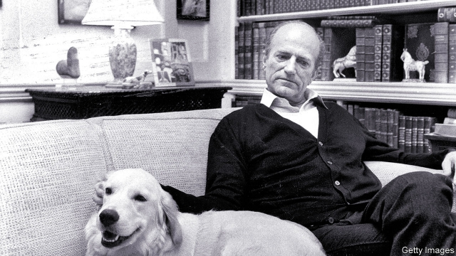

###### Did he or didn’t he?

# Obituary: Claus von Bülow died on May 25th 

 

> print-edition iconPrint edition | Obituary | Jun 15th 2019 

IN EVERY PERSON’S life, Claus von Bülow said once, there remained a big question mark. A shadow of doubt. It remained even if they had been convicted of a crime, and even if they had been acquitted. He had been both. His glitter-laden trials, among the first to be televised, caused a sensation in America. They left half the country thinking one thing, and half thinking another. 

He was convicted in 1982 of the attempted murder of his wife, Sunny, by injecting her with insulin. In 1980 she had been found unconscious on the marble floor of the master bathroom of their mansion, Clarendon Court, in Newport, Rhode Island. Soon she was in a coma from which she did not emerge. She had low blood sugar, and he knew too much insulin would kill her. He had the motive: he wanted to leave her for his mistress, Alexandra Isles, a TV actress, but divorce would cut him off from Sunny’s fortune. He also apparently had the means. A small black travel-bag had been found by Sunny’s maid in his closet; it contained a bottle of insulin and a needle encrusted with it. The maid also testified that Sunny had fallen ill before from too much insulin, and her husband had refused for four hours to call a doctor. He called his mistress then to say that he was watching his wife die. The evidence was overwhelming; he was given 30 years. 

But then he was acquitted. In 1984 his conviction was overturned, because the black bag had been taken without a search warrant and the first investigator’s notes had not been turned over to the prosecution and the defence. The next year, in a second trial, every piece of the medical and forensic evidence was taken apart by his new million-dollar team of lawyers. Sunny, they showed, was psychologically fragile, heavily dependent on drink and drugs. On that night in 1980 she had binged on sweets, tranquillisers and a giant eggnog containing 12 fresh eggs and a whole bottle of bourbon. The culprit was not insulin. Nor was it the needle in the black bag, which would not have been encrusted after withdrawal from the skin. Nor, therefore, was the culprit her husband. 

At the “Not guilty” verdict, he sank his head into his hands. Yet speculation roared on. He had not testified at either trial, so press and public could only look at his life to establish which verdict might be right. And he would add to their confusion, first by refusing after 1987 to speak about the case (the result of an agreement with Sunny’s children by her first marriage, though he had already written 300 pages of his version), and second by showing that there was more than one Claus von Bülow; maybe several. 

The “von Bülow” itself was slightly misleading. His father’s side was Danish; his mother, whose name was Bülow, had distant German nobility. His English upbringing endowed him with a Cambridge degree and a call to the bar, but the aristocratic “von” had been added when he and Sunny married, in 1966. He was the one who collected Chippendale and ormolu furniture, but she was the one who had Clarendon Court, as well as a 14-room apartment on Fifth Avenue in Manhattan, in which to put it. Opera and theatre were his passions, and he loved to drop classical allusions as well as names; back in Newport during his second trial, greeted by his labradors, he felt “like Ulysses returning”. But it was Sunny, whose first marriage had been to an Austrian prince, who brought most of the dukes, diamonds and gala nights into his life. 

As an aristocrat, tall in his double-breasted suits, he could do stiffly jut-jawed one moment, warm and charming the next: a study in inscrutability, or a witty ornament to the highest social tier of Newport or New York. He also had an outrageous side. When he worked for John Paul Getty, the oil tycoon, in London in his bachelor days he fell in with the Clermont set, including John Aspinall and Lord Lucan (who had hoped to murder his wife, but killed the nanny), and hosted their illegal gambling parties. During his second trial he posed for Vanity Fair in zippered black leather, tight blue jeans and a devilish grin, with a new, thrice-divorced mistress in tow. He liked unsettling jokes, telling them in his best dark voice. “What is another name for fear of insulin? Claus-trophobia.” 

His feelings for Sunny changed in different lights. They had been happy early on and had a daughter, Cosima, whom he adored. He and Sunny fell out because she did not like him working; she did not mind his mistresses, as long as he was discreet. In sum she was a fair and decent human being who would, he thought, have been his strongest defender. He wore his wedding ring at the trials, though he had to get it back from Ms Isles. He spoke of wanting to visit Sunny, who lay comatose for 28 years until she died, but he moved to London by agreement with the stepchildren, giving up too any claim to her fortune. In Knightsbridge his life revolved round amusing dinner parties, theatre reviewing and quiet acts of charity. He complained that “Reversal of Fortune”, a film of his trials made in 1990, did not tell the truth in dozens of small ways. He did not say what the truth actually was. In the end, the film had left the verdict open. He preferred to be seen as he generally was in London, as the victim of a miscarriage of justice. 

He did not make that claim himself; he had agreed not to mention the case. Instead, he saw it as a tragedy that satisfied “all of Aristotle’s definitions”. Everyone was wounded. As for him, he was a tragic hero straight out of the “Poetics”: neither a villain nor a virtuous man, but someone in between. His misfortune had occurred not because of depravity, but by some error, some ambiguous action. It was hardly surprising that there could be no catharsis. ◼ 

