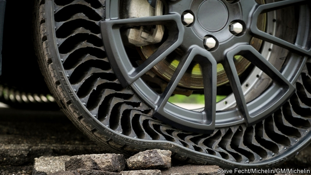

###### Flat out useful

# An airless, puncture-proof car tyre takes to the road 

 

> print-edition iconPrint edition | Science and technology | Jun 15th 2019 

PUNCTURES ALWAYS seem to strike at the most irksome times. Scrambling around on the ground to change a wheel in the wet on the side of a busy road is a sure way to ruin any journey. And punctures can be extremely dangerous, especially if a tyre blows out at high speed on a motorway. For decades carmakers have sought various solutions, but with new materials and novel manufacturing methods, a genuinely puncture-proof car tyre has finally appeared. 

This summer Michelin and General Motors (GM) will begin testing a prototype airless tyre on a fleet of Chevrolet Bolt electric cars. Although it does not need to be inflated, the self-supporting tyre is said to produce the ride and handling of a standard pneumatic tyre. And being airless, it is thus immune from punctures. The French tyremaker and the American car giant call the tyre Uptis (for “unique puncture-proof tyre system). Provided the trials in Michigan go well, the two partners reckon Uptis tyres could be available for cars by 2024. 

At first sight the Uptis (see picture) resembles the diminutive, airless rubber-spoked wheels already used on some small machines, such as golf carts, lawnmowers and certain all-terrain vehicles. There is a similarity, although the Uptis is designed to take the greater weight of a car and cope with high-speed manoeuvring. Uptis tyres are also different from “run-flat” tyres, which use beefed-up sidewalls to remain upright if punctured and must be driven at reduced speeds for a limited distance only. 

The Uptis uses an integrated wheel and tyre that comes in one piece. The wheel part consists of an aluminium assembly in the centre, from which emerge spokes made from a new composite material described as “resin-embedded fibreglass”. The spokes are fitted to a conventional-looking tread around the outside of the wheel. Michelin has filed some 50 patents on the technology. 

The company reckons that as 200m tyres have to be scrapped worldwide every year because of punctures or the uneven wear caused by incorrect air-pressure, the Uptis will be more environmentally sustainable than standard tyres. It would also save weight, as vehicles will no longer have to carry a spare wheel, a jack, a puncture-repair kit or need to be fitted with a tyre-pressure monitoring system. 

But an Uptis will still wear out, like a conventional tyre. When that happens it will need a new tread—one way Michelin and GM hope to do that is using a 3D printer to create a new outer shell for the tyre. That could open up new motoring possibilities, including having seasonal treads printed on your wheels: a summer one for faster roads and a winter tread for increased grip in the wet and snow. 

