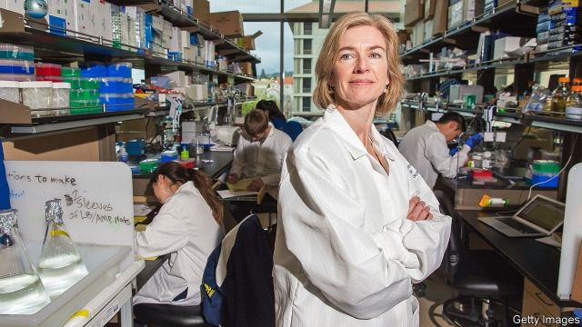

###### Jump start

# Gene editing is back in the spotlight 

 

> print-edition iconPrint edition | Science and technology | Jun 15th 2019 

AS FAR AS experts are concerned, the technology of gene editing is nowhere near ready to be used to create gene-edited babies. This, of course, is separate from the question of whether it is morally right to do so. Nevertheless, around the world, would-be baby tinkerers have failed to get the memo. This week a Russian scientist announced his ambition to repeat a Chinese scientist’s gene-editing experiment on human embryos, which lead to the birth of two babies with modified CCR5 genes last year. The Chinese effort was roundly condemned on grounds of safety and ethics. Moreover, at the start of June evidence emerged that the genetic mutation in the gene CCR5, one that offers protection against infection from HIV, is also associated with slightly earlier death. 

The finding highlights the need to understand far more about how alterations in a cell’s DNA translate into changes in how it functions. There are also a variety of concerns about the basic technology that need to be dealt with before it can be used widely in treatments for the sick—let alone to tinker with healthy embryonic humans. 

CRISPR-Cas genome-editing systems, often just known as CRISPR, are molecular machines that can be programmed to home in on specific sections of DNA in the genome and cut both strands of the double helix molecule. This system allows genes to be knocked out or, in some cases, added. 

It is not a perfect mechanism. One concern, for example, is that editing can alter DNA in places it isn’t supposed to and that these “off-target” effects could trigger cancers. A second worry is that the cell can fill gaps with random DNA when it is making repairs. These could silence genes that the organism may need. A third concern is that although CRISPR successfully hunts down and cuts out faulty DNA, it is harder to get it to insert the right new genes. 

Firms involved in developing CRISPR editing for use in medicines have downplayed concerns. Perhaps that was inevitable as they depend on investors’ optimism. Rapid advances in many areas have supported the optimists’ case that the gremlins in the new techniques can be overcome in time. “Yesterday’s problems are not necessarily tomorrow’s,” observes Helen O’Neill, a molecular geneticist at University College London. 

In that vein come two papers describing a way to improve CRISPR. The first from a team led by Feng Zhang of the Broad Institute in Cambridge, Massachusetts, was published on June 6th, in Science. The second comes this week in Nature from Samuel Sternberg’s team at Columbia University in New York. 

Both teams made use of “jumping genes” or transposons (often called selfish genes), which are pieces of DNA that seem to hop around genomes with little more purpose than to proliferate. They were thought to do so aimlessly but, in 2017, it was discovered that some contained gene-editing systems that were very good at recognising specific DNA sequences. These were able to control where the jumping genes landed. That, in turn, led to the idea, says Dr Sternberg, that it might be possible to harness jumping genes in gene editing. 

Dr Zhang and Dr Sternberg have now demonstrated programmable CRISPR-Cas gene-editing systems that do just this by harnessing a protein encoded by a jumping gene known as Tn7. Dr Sternberg says that instead of making a double-stranded cut to DNA, and waiting for the cell to repair itself, in the new system the act of insertion happens at the same time a cut is made. 

Because the transposon method of gene editing does not need a cell’s own repair mechanisms to conduct and make good the edit, it offers a mechanism for adding genes into a wider variety of cells. This includes neurons and, most critically, cells that are not currently replicating in a suitable way for CRISPR to work. Although the new papers only demonstrate that jumping-gene editing works in bacteria, scientists have high hopes that it might work in human cells. 

The news is welcome in a field where the potential applications in medicine seem to grow by the day. Verve Therapeutics, a biotech firm in Cambridge, Massachusetts, recently said that it wanted to use genetic editing to protect patients from coronary heart disease. CRISPR Therapeutics, based in Zug, Switzerland, wants to edit beta cells, which produce insulin, so that they can be transplanted into diabetics without rejection. In all these therapies, regulators will have to assess the risks and benefits. That will be easier when small risks of mistakes are set against the benefits of curing a fatal disease. But if CRISPR is to be used more widely and safely, more understanding will be needed of how genetic changes actually relate to differences in how a cell functions. 

That effort got a boost this week. Jennifer Doudna (pictured) of the University of California, Berkeley, who discovered CRISPR-Cas gene editing and is a leading scientist in the field, will collaborate with GSK, a drugs firm based in London, to elucidate the basic science of gene editing. The new Laboratory for Genomic Research, based in San Francisco, is a $67m five-year collaboration that may ultimately be useful for drug development and would-be gene editors—whether they seek to make changes to adults or embryos. ◼ 

