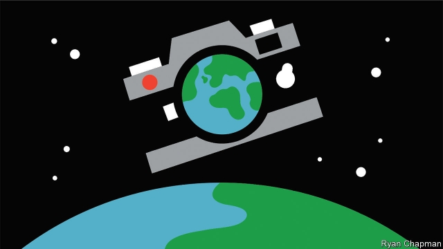

###### In high detail

# Using AI to speed up the processing of space images 

 

> print-edition iconPrint edition | Science and technology | Jun 15th 2019 

MUCH OF THE information that is beamed back from space is useless. Pictures taken by satellites orbiting the Earth might take days to download, only to show lots of cloud obscuring the area of interest. The subject matter may also be surrounded by irrelevant information. All this uses up a lot of valuable bandwidth. 

Processing data in space, before transmission, would reduce clutter, but this can be tricky. Cosmic rays randomly flip the ones and zeroes that computers operate on, introducing unpredictable errors. High levels of radiation can also damage electronic circuits. KP Labs, based in Gliwice, Poland, is building a satellite to overcome some of these problems. Their device, called Intuition-1, is controlled by a neural network, a form of artificial intelligence modelled on the human brain. The satellite is what is known in the trade as a 6U CubeSat, which means it is composed of six standard-sized 10x10x11.5cm modules. 

Intuition-1 will be equipped with a hyperspectral imager, which takes 150 pictures of every scene it looks at. Each picture is at a different spectral frequency, so contains different information. The neural network stitches these together using powerful graphics chips hardened against radiation. The developers have also built error correction into their software. 

Intuition-1 will view a 15km-wide swathe of Earth at a resolution of 25 metres per pixel. This will be able to reveal details such as how well crops are growing or allow the number of trees in a forest to be counted. 

But instead of transmitting back every last bit of image data, the satellite will summarise what the user requests as useful information. This might, for instance, be a heat-map showing areas of weeds in a field or the location of a forest fire. Reducing the data load means that some of this information can be transmitted live. 

The satellite will be used to prove that a hardened neural network can survive in space. This could pave the way for other space applications. For example, the Curiosity rover on Mars was successfully upgraded in 2016 with a set of algorithms to detect “interesting” rocks for investigation, instead of picking them randomly. A neural network could provide future rovers and deep-space probes with a better ability to make decisions. 

The neural network and hyperspectral imager have already been built and tested by KP labs. The kit will go into a satellite body being constructed by Clyde Space, a satellite producer based in Scotland, and launched in 2022. After that there will be more intelligence in space. 

