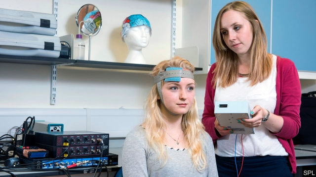

###### Spark of genius

# Zapping the brain improves creativity 

 

> print-edition iconPrint edition | Science and technology | Jun 15th 2019 

PAUL MCCARTNEY famously took the melody for “Yesterday” from a dream, while Thomas Edison argued that his best ideas came from hard work. Others have looked to coffee, drugs or love. But what if creativity could be turned on with a flick of a switch? 

Elisabeth Hertenstein at the University of Freiburg, Germany, and her colleagues have done just that, using a technology known as transcranial direct current stimulation (tDCS). Their insights could help creatives to stay at the top of their game. 

tDCS uses electrodes attached to the scalp to pass a tiny electrical current through the brain. Neuroscientists think the current makes the brain cells underneath the positive electrode (anode) work harder, while the negative electrode (cathode) has the opposite effect and calms activity in nearby neurons. In a paper published in Brain Stimulation, the scientists reported that 22 minutes of tDCS significantly improved the performance of university students on three standard tests used by psychologists to measure aspects of creativity. 

The first test is called the Alternate Uses Task and measures conceptual expansion: typically by asking people to think of as many possible uses for an everyday object, such as a brick or a paperclip. The second, the Compound Remote Associate Task, asks for words that work as common prefixes or suffixes for unrelated terms. So the answer to “age; mile; sand” is stone. And the third, the Wisconsin Card Sorting Task, has long been used to track how well volunteers can adapt to changing circumstances by getting them to match pictures by shape, colour or number of objects, and then changing the rules of the game. 

The student volunteers performed the best when the anode was attached above the right side of their inferior frontal gyrus (IFG)—part of the frontal cortex and a region associated with problem solving and spontaneity—and the cathode fitted above the left side of the IFG. The researchers were trying to increase activity in the right side and reduce activity in the left. 

Christoph Nissen, a member of the research group, says the students given tDCS performed 10-20% better on the three tasks than those given a sham stimulation, in which the electrodes were put in place but the current was turned off. And when the electrode positions were reversed, the scientists saw a corresponding decrease in measured creativity compared with the sham group. 

Exactly how tDCS has this effect on the brain is not clear. The left side of the IFG works according to a more rigid interpretation of the world based on concrete features like language comprehension. Inhibiting that under the cathode, while encouraging activity in the more free-thinking right-hand side of the IFG with the anode, perhaps helped the students to think outside the box. 

Dr Nissen says most of his team are looking for new ways to help patients with mental disorders, such as breaking patterns of repetitive negative thinking by encouraging cognitive flexibility. But his study’s insights can be applied to work and jobs outside the lab or clinic. The Alternate Uses Task, for example, assesses the creative skills required to brainstorm new products or see previously untapped potential in an everyday object. ◼ 

