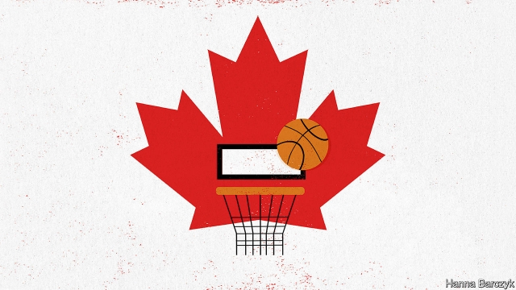

###### Slam dunk, eh?

# Canadians are embracing basketball 

 

> print-edition iconPrint edition | The Americas | Jun 15th 2019 

PROFESSIONAL BASKETBALL got off to an inauspicious start in Canada. The first game in what would later become the National Basketball Association was played in 1946 at Maple Leaf Gardens between the New York Knickerbockers and the Toronto Huskies. The rules had to be explained to ticket-holders. The Knicks were stopped on their way to the game by a customs officer, who supposedly told them they would not “find many people up this way who’ll understand your game”. The Huskies folded the next season. 

That has not been a problem this year for the Toronto Raptors, who became the city’s first NBA team in 1995. As The Economist went to press, the team was preparing for their penultimate game of the NBA championship. If they win, they would take the cup, which would be a first for a Canadian team. Fans have filled the 19,800-seat Scotiabank Arena; tens of thousands more have camped outside. Canada’s usual game is ice hockey, a sport so loved that it can provoke riots among a people famous for saying “sorry” when others tread on their toes. But could basketball edge it out? 

The Raptors benefit from good marketing. They appointed Drake, a rapper who has tattoos of the Toronto area code 416 and the CN Tower, as their “global ambassador” in 2013. His courtside antics are now part of the spectacle. It also helps that Torontonians, 46% of whom are immigrants, are better reflected by the multiracial Raptors than the nearly-all-white Toronto Maple Leafs, an ice hockey team. The Raptors’ biggest fan is a turbaned Sikh who has been to every home game in their 24-year history. 

But probably the best explanation for the new fandom is the sweet taste of victory. No Canadian ice hockey team made the National Hockey League finals this year. The Raptors have made the playoffs of the NBA every year since 2014. Kawhi Leonard, an American who joined the team last year, has pushed them to unexpected heights. 

According to the most recent census, ice hockey is still the sport Canadians are most likely to play. Basketball came fifth. But fans with a sense of history know that it was a Canadian, James Naismith, who invented basketball. Perhaps it is time for the game to come home?◼ 

