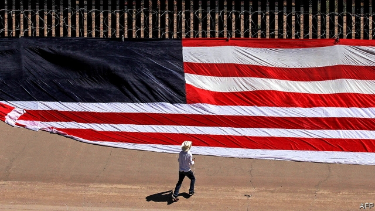

###### Chatting over the fence

# How Mexico and Canada are trying to bypass Donald Trump 

 

> print-edition iconPrint edition | The Americas | Jun 15th 2019 

A FEW DAYS before Donald Trump announced that he was not going to act on his threat to impose a 5% tariff on Mexico’s exports to the United States, a group of Mexican and American businessmen had dinner with two American politicians, one local and one national, in a Republican-voting state. The Mexicans produced economic data showing what the cost of such a tariff on the state and counties might be. The next day both politicians made public statements of concern about the levies. 

Since June 7th, when the proposed tariffs were “indefinitely suspended”, the focus has been on the work done by Mexico’s negotiators in Washington. They agreed to send 6,000 national guardsmen to Mexico’s southern border and to host asylum-seekers as they await news of their claims from the United States. Mr Trump later claimed to have a second “secret” deal with Mexico, waving a sheet of paper in front of photographers. It appeared to show a promise that there would be “burden-sharing” of processing refugees. 

But the kind of work done in the American restaurant helps, too. Many in Mexico think their best chance of curbing Mr Trump’s worst instincts is by persuading friends who can appeal to his self-interest. In 2017 the president reportedly reversed a decision to terminate the North American Free Trade Agreement (NAFTA) on his 100th day in office after his agriculture secretary, Sonny Perdue, dashed to his office with a map showing that the states he won in the election in 2016 would be worst hit by its demise. 

In the lead-up to the introduction of NAFTA in 1994, Mexico and Canada paid American lobbying firms lots of money to woo politicians. But the “NAFTA coalition” decayed in the years before Mr Trump’s rise. Now both countries are again trying to court people of influence—lawmakers and governors, particularly Republican ones, as well as business groups. Mexico especially is hoping that the lobbying effort will help dampen Mr Trump’s wrath if the number of Central American migrants approaching the United States does not fall. 

Hours before the tariff threat was lifted, Andrés Manuel López Obrador, Mexico’s president, gave a speech at the first-ever Summit of North American Mayors, a seaside talkfest in the sunny resort town of Los Cabos. Some 120 mayors from three countries attended the event arranged by Marcelo Ebrard, Mexico’s foreign secretary. (Mr Ebrard missed his own party, as he was trapped in Washington negotiating.) 

Such summits are popping up with growing frequency. The associations of Mexican and American governors and Canadian premiers now meet each year. A meeting of Mexican and American CEOs held in Mexico in April was attended by Wilbur Ross, America’s commerce secretary. Last year’s elections in Mexico were the first in which senators were allowed to stand for a second term (until 2014, lawmakers could serve only one). That should help links between Mexican and American politicians to deepen over time. 

In Washington, the Canadian and Mexican embassies trade tips on which American senators are pliable and which are tepid on trade (both worry about the trade-scepticism of newly-arrived Democrats). And each has painstakingly collected state- and even county-level economic data to be presented in one-on-one meetings. They pounce when lawmakers leave the capital for their home states, where their schedules tend to be emptier. “If there is a barbecue, we’ll go there,” says one official. Most American lawmakers are said to be surprised when told how much trade their district does across the Mexican and Canadian borders. 

What is the effect of all this? One diplomat jokes that it is like advertising. It gets through half the time, but no one knows which half: “You know that speaking to 20 influential people at a time, something will work.” Canada and Mexico both share borders with important states that helped Mr Trump win the presidency. Along the Mexican border, where there are large Mexican-American populations, not everyone shares Mr Trump’s antipathy to their southern neighbour. Mexico’s new ambassador to the United States, Martha Bárcena Coqui, has visited four states won by Mr Trump in her first five months. 

The aim for now is to ensure that Congress will be quick to approve the United States-Mexico-Canada Agreement, Mr Trump’s revamp of NAFTA. And perhaps some lobbying will also work its way up the chain to Mr Trump. But even if it does not change his mind, this new diplomacy could also outlast the president. Efforts by North America’s regions to build links across borders have been “accelerated by our national leadership”, says Eric Garcetti, the Spanish-speaking mayor of Los Angeles, who will host the mayors’ summit next year. Those links will last. ◼ 

