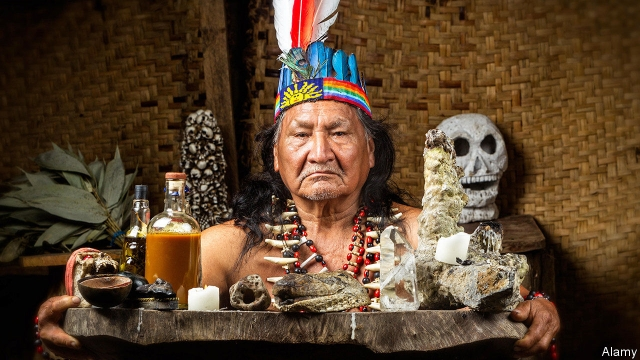

###### Bad trip

# Indigenous Colombians fear losing their hallucinogenic brews 

 

> print-edition iconPrint edition | The Americas | Jun 15th 2019 

IT IS A wet evening deep in the Amazon rainforest when members of the Koreguaje, a tribe of indigenous Colombians, line up to receive brews of ayahuasca, a hallucinogenic potion made from vines. They are handed out by taitas, or shamans, who have travelled in by boat along a river to reach the jungle. As the brew kicks in, the participants’ stomachs rumble—diarrhoea and vomiting are the vine’s other main effects. The taitas play a harmonica tune as some people go outside in search of relief; others lie back in their hammocks. The ceremony ends with the taitas singing to participants and patting their backs with dried leaves. At dawn, the ground around the shack is littered with used toilet paper. 

For centuries ayahuasca has been taken in ceremonies like this one by several tribes inhabiting the Amazon region. In Colombia, consuming the brew is as much a political symbol as a cultural rite. Under the country’s constitution, indigenous groups, who have long been persecuted by cocaine smugglers and others, are entitled to special rights such as collective land ownership and self-governance. But given that most people in Colombia have some Amerindian ancestry, claiming that status is difficult. Because ayahuasca has been used by these tribes since before the Spanish arrived in the 16th century, it is one of the few ways in which indigenous groups can prove to the government that they are culturally distinct. Tribe members have testified in court to its importance. 

But now they face a new irritation: tourists and city-dwellers who are increasingly keen to try the potion for themselves. Some of them are excited by studies that suggest its active component, N,N-dimethyltryptamine, or DMT, may help with addiction and post-traumatic stress disorder. Others just want a trip. 

The new trippers create demand for hallucinogenic services. Many new ayahuasca shamans have started touring Colombia giving yagé (another term for the brew) to enthusiasts. They charge anything up to 200,000 pesos ($60) for ceremonies that gather up to 100 people. New shamans are modifying the traditional ayahuasca rituals. Insensitive backpackers can now combine it with distinctly non-Amazonian Indian elements, such as sweat lodges (North American Indian) or yoga (Indian Indian). 

Commercialisation is giving ayahuasca a bad reputation. Some dodgy shamans are said to infuse the drink with borrachero, a plant that contains hyoscine, a drug that can make people vulnerable. Reports of sexual abuse have become common. Colombians were shocked last month when Orlando Gaitán, a popular (non-indigenous) shaman and a celebrated peace activist (his organisation won the Swedish Right Livelihood Award in 1990) was found guilty of sexually abusing three under-age girls. At least one foreign tourist has died after taking part in a ceremony. 

Without ayahuasca tribes are “nothing”, says Ernesto Evanjuanoy, the president of UMIYAC, an organisation created by elders and medicine men from the five tribes most closely associated with the hallucinogen, who are uncomfortable with its use by others. In an effort to take back control, UMIYAC has created a code of ethics around the use of ayahuasca. Member shamans must be approved by their community, and promise not to scam or sexually abuse their clients. The group hopes these measures will help prevent the brew from being stigmatised or criminalised. 

But Alhena Caicedo, an anthropologist at Los Andes University in Bogotá, says it will be hard to stop people from selling ayahuasca. Most are extremely poor and lack other skills. The more money there is to be made, the harder it will be to enforce the code, which has no legal status. Ms Caicedo worries that if ayahuasca’s popularity continues to spread, it could follow the same trajectory as coca, the plant used to make cocaine. Coca was once also considered sacred by certain Colombian indigenous tribes. But as cocaine consumption rose and cartels started killing people, the tribes lost control of the plant. Anyone growing coca today is treated as a criminal.◼ 

