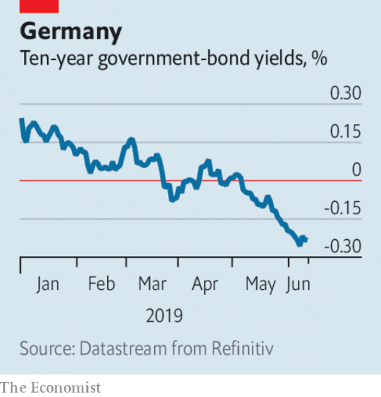

###### People v power

# Business this week 

> Jun 15th 2019 

The proposed merger of T-Mobile and Sprint, first floated in April last year, faced a fresh hurdle as a group of American states led by California and New York launched a lawsuit to block it. The states are challenging the deal because it is “exactly the sort of consumer-harming, job-killing mega-merger our antitrust laws are designed to prevent”, according to Letitia James, New York’s attorney-general. See article. 

Antitrust concerns were also voiced when United Technologies Corporation announced its intention to merge its aerospace business with Raytheon, creating a $166bn behemoth in the industry. UTC provides electronics and communications systems mainly to commercial airlines and Raytheon sells defence equipment, including the Patriot missile system, to the Pentagon. They hope the civil/military split of their interests will satisfy competition regulators. Donald Trump has already waded in, suggesting that the new “big, fat, beautiful company”, will raise costs for America’s armed forces. 

The trade dispute between America and China was the hot topic at Foxconn’s first investor conference. The Taiwanese contract electronics manufacturer said customers were concerned about uncertainties surrounding trade arrangements, but it assured Apple that it could move production of the iPhone and other devices away from its factories in China if need be. Around 25% of Foxconn’s capacity is based in factories outside China. Foxconn also rejigged its management in preparation for Terry Gou’s departure as chairman to run for president of Taiwan. 

Worries over trade continued to unsettle global markets. “The rising threat of protectionism” was citied by Mario Draghi, the president of the European Central Bank, as one factor in its decision on June 6th to postpone further rises in interest rates until at least the middle of 2020. Mr Draghi pledged to use “all instruments” under his control to avert an economic setback in the euro zone. See article. 

 

Market jitters caused investors to flee to safe assets. The German government sold ten-year Bunds at a yield of -0.24%, meaning the buyers will lose money if they hold the bonds until they mature. It was the bond’s lowest yield on record in a direct auction. 

Jean-Dominique Senard, Renault’s chairman, admitted that relations with Nissan, the French carmaker’s alliance partner, were tense, but said that they could rebuild trust. Mr Senard was speaking at his first shareholders’ meeting since taking up his position in January, after Carlos Ghosn’s arrest in Tokyo for alleged financial misdeeds at Nissan. The French government, which holds a 15% stake in Renault, has undermined Mr Senard recently, most spectacularly by thwarting the company’s attempt to merge with Fiat Chrysler Automobiles. Mr Senard said he had been “saddened” by the state’s meddling. 

Volkswagen ended its association with Aurora, a self-driving-vehicles startup, clearing the way for it to work with Argo, a similar outfit that Ford, which launched a partnership with vw this year, has invested in. This week Argo expanded testing of its fleet of autonomous cars to Detroit, the historic home of carmaking. 

Salesforce, a highly acquisitive cloud-based software company, struck its biggest deal to date when it offered $15.7bn for Tableau, a provider of computer-graphics for data bods. 

Insys, which makes a fentanyl-based painkiller spray, filed for bankruptcy protection, days after it settled with the federal government for its marketing of the product. Many of the pharmaceutical companies blamed for America’s opioid crisis face potentially large legal claims; they stand accused of pushing the drugs. 

In what it described as an “unprecedented action”, the British government ordered Whirlpool to recall up to 500,000 tumble dryers over safety concerns. The American maker of white goods issued a warning in 2015 that certain brands of dryers might catch fire, but rather than issue a recall it tried to fix them. 

Beyond Meat had a rollercoaster week on the stockmarket. The American fake-meat company’s already buoyant share price soared after its first earnings report since going public in May revealed a boom in sales. But investors lost their appetite when an analyst warned that the stock was overpriced, sending the price down by a quarter. 

Elliott Management, a hedge fund, agreed to acquire Barnes & Noble in a $683m deal. Elliott also owns Waterstones, a British chain of bookstores that is thriving despite predictions that Amazon would kill it off. James Daunt, who, as managing director, is credited with reviving Waterstones is also to run Barnes & Noble, where he will hope to turn the page on the American bookseller’s declining fortunes.◼ 

